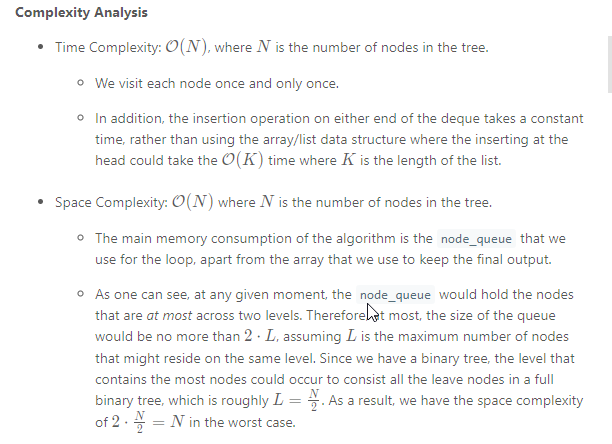
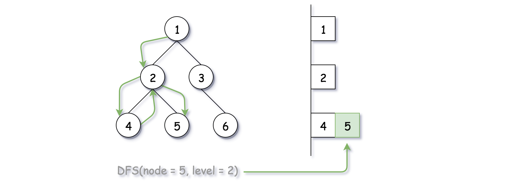
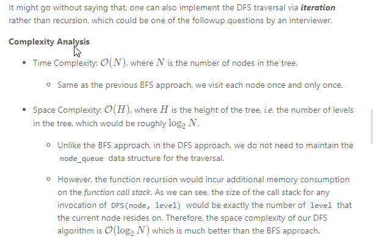

### Solution

#### Approach 1: BFS (Breadth-First Search)
**Intuition**

Following the description of the problem, the most intuitive solution would be the BFS (Breadth-First Search) approach through which we traverse the tree level-by-level.

The default ordering of BFS within a single level is from left to right. As a result, we should adjust the BFS algorithm a bit to generate the desired zigzag ordering.

> One of the keys here is to store the values that are of the same level with the deque (double-ended queue) data structure, where we could add new values on either end of a queue.

So if we want to have the ordering of **FIFO** (first-in-first-out), we simply append the new elements to the tail of the queue, i.e. the late comers stand last in the queue. While if we want to have the ordering of **FILO** (first-in-last-out), we insert the new elements to the head of the queue, i.e. the late comers jump the queue.


**Algorithm**

There are several ways to implement the BFS algorithm.

* One way would be that we run a two-level nested loop, with the outer loop iterating each level on the tree, and with the inner loop iterating each node within a single level.
* We could also implement BFS with a single loop though. The trick is that we append the nodes to be visited into a queue and we separate nodes of different levels with a sort of **delimiter** (e.g. an empty node). The delimiter marks the end of a level, as well as the beginning of a new level.
Here we adopt the second approach above. One can start with the normal BFS algorithm, upon which we add a touch of zigzag order with the help of deque. For each level, we start from an empty deque container to hold all the values of the same level. Depending on the ordering of each level, i.e. either from-left-to-right or from-right-to-left, we decide at which end of the deque to add the new element:


* For the ordering of from-left-to-right (FIFO), we append the new element to the tail of the queue, so that the element that comes late would get out late as well. As we can see from the above graph, given an input sequence of `[1, 2, 3, 4, 5]`, with FIFO ordering, we would have an output sequence of `[1, 2, 3, 4, 5]`.

* For the ordering of from-right-to-left (FILO), we insert the new element to the head of the queue, so that the element that comes late would get out first. With the same input sequence of `[1, 2, 3, 4, 5]`, with FILO ordering, we would obtain an output sequence of `[5, 4, 3, 2, 1]`.

```Java
/**
 * Definition for a binary tree node.
 * public class TreeNode {
 *     int val;
 *     TreeNode left;
 *     TreeNode right;
 *     TreeNode(int x) { val = x; }
 * }
 */
class Solution {
  public List<List<Integer>> zigzagLevelOrder(TreeNode root) {
    if (root == null) {
      return new ArrayList<List<Integer>>();
    }

    List<List<Integer>> results = new ArrayList<List<Integer>>();

    // add the root element with a delimiter to kick off the BFS loop
    LinkedList<TreeNode> node_queue = new LinkedList<TreeNode>();
    node_queue.addLast(root);
    node_queue.addLast(null);

    LinkedList<Integer> level_list = new LinkedList<Integer>();
    boolean is_order_left = true;

    while (node_queue.size() > 0) {
      TreeNode curr_node = node_queue.pollFirst();
      if (curr_node != null) {
        if (is_order_left)
          level_list.addLast(curr_node.val);
        else
          level_list.addFirst(curr_node.val);

        if (curr_node.left != null)
          node_queue.addLast(curr_node.left);
        if (curr_node.right != null)
          node_queue.addLast(curr_node.right);

      } else {
        // we finish the scan of one level
        results.add(level_list);
        level_list = new LinkedList<Integer>();
        // prepare for the next level
        if (node_queue.size() > 0)
          node_queue.addLast(null);
        is_order_left = !is_order_left;
      }
    }
    return results;
  }
}

```


---

#### Approach 2: DFS (Depth-First Search)
**Intuition**

Though not intuitive, we could also obtain the BFS traversal ordering via the DFS (Depth-First Search) traversal in the tree.

> The trick is that during the DFS traversal, we maintain the results in a global array that is indexed by the level, i.e. the element array[level] would contain all the nodes that are at the same level. The global array would then be referred and updated at each step of DFS.



**Algorithm**

Here we implement the DFS algorithm via recursion. We define a recursive function called `DFS(node, level)` which only takes care of the current node which is located at the specified level. Within the function, here are three steps that we would perform:

* If this is the first time that we visit any node at the level, i.e. the deque for the level does not exist, then we simply create the deque with the current node value as the initial element.

* If the deque for this level exists, then depending on the ordering, we insert the current node value either to the head or to the tail of the queue.

* At the end, we recursively call the function for each of its child nodes.

```Java
/**
 * Definition for a binary tree node.
 * public class TreeNode {
 *     int val;
 *     TreeNode left;
 *     TreeNode right;
 *     TreeNode(int x) { val = x; }
 * }
 */
class Solution {
  protected void DFS(TreeNode node, int level, List<List<Integer>> results) {
    if (level >= results.size()) {
      LinkedList<Integer> newLevel = new LinkedList<Integer>();
      newLevel.add(node.val);
      results.add(newLevel);
    } else {
      if (level % 2 == 0)
        results.get(level).add(node.val);
      else
        results.get(level).add(0, node.val);
    }

    if (node.left != null) DFS(node.left, level + 1, results);
    if (node.right != null) DFS(node.right, level + 1, results);
  }

  public List<List<Integer>> zigzagLevelOrder(TreeNode root) {
    if (root == null) {
      return new ArrayList<List<Integer>>();
    }
    List<List<Integer>> results = new ArrayList<List<Integer>>();
    DFS(root, 0, results);
    return results;
  }
}
```


