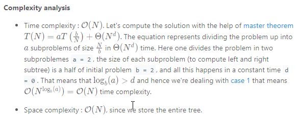

### Solution

How to traverse the tree
There are two general strategies to traverse a tree:

* Breadth First Search (BFS)

    We scan through the tree level by level, following the order of height, from top to bottom. The nodes on higher level would be visited before the ones with lower levels.

* Depth First Search (DFS)

    In this strategy, we adopt the depth as the priority, so that one would start from a root and reach all the way down to certain leaf, and then back to root to reach another branch.

    The DFS strategy can further be distinguished as preorder, inorder, and postorder depending on the relative order among the root node, left node and right node.

On the following figure the nodes are numerated in the order you visit them, please follow `1-2-3-4-5` to compare different strategies.


#### Approach 1: Recursion
**Tree definition**

First of all, here is the definition of the TreeNode which we would use.

```java
// Definition for a binary tree node.
public class TreeNode {
  int val;
  TreeNode left;
  TreeNode right;

  TreeNode(int x) {
    val = x;
  }
}
```

**Algorithm**

As discussed above the preorder traversal follows `Root -> Left -> Right` order, that makes it very convenient to construct the tree from its root.

Let's do it. The first element in the *preorder* list is a root. This root splits inorder list into left and right subtrees. Now one have to pop up the root from preorder list since it's already used as a tree node and then repeat the step above for the left and right subtrees.

```java
class Solution {
  // start from first preorder element
  int pre_idx = 0;
  int[] preorder;
  int[] inorder;
  HashMap<Integer, Integer> idx_map = new HashMap<Integer, Integer>();

  public TreeNode helper(int in_left, int in_right) {
    // if there is no elements to construct subtrees
    if (in_left == in_right)
      return null;

    // pick up pre_idx element as a root
    int root_val = preorder[pre_idx];
    TreeNode root = new TreeNode(root_val);

    // root splits inorder list
    // into left and right subtrees
    int index = idx_map.get(root_val);

    // recursion 
    pre_idx++;
    // build left subtree
    root.left = helper(in_left, index);
    // build right subtree
    root.right = helper(index + 1, in_right);
    return root;
  }

  public TreeNode buildTree(int[] preorder, int[] inorder) {
    this.preorder = preorder;
    this.inorder = inorder;

    // build a hashmap value -> its index
    int idx = 0;
    for (Integer val : inorder)
      idx_map.put(val, idx++);
    return helper(0, inorder.length);
  }
}
```



