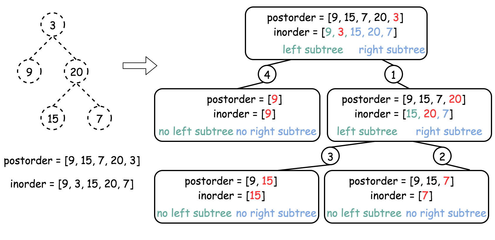
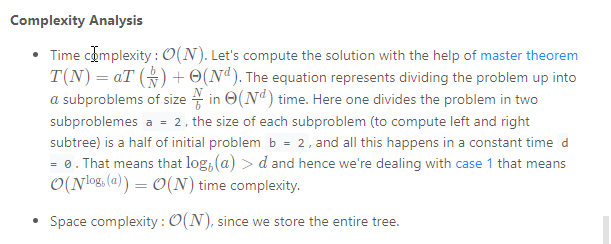

### Solution

How to traverse the tree
There are two general strategies to traverse a tree:

* Breadth First Search (BFS)

    We scan through the tree level by level, following the order of height, from top to bottom. The nodes on higher level would be visited before the ones with lower levels.

* Depth First Search (DFS)

    In this strategy, we adopt the depth as the priority, so that one would start from a root and reach all the way down to certain leaf, and then back to root to reach another branch.

    The DFS strategy can further be distinguished as preorder, inorder, and postorder depending on the relative order among the root node, left node and right node.

On the following figure the nodes are numerated in the order you visit them, please follow `1-2-3-4-5` to compare different strategies.


> In this problem one deals with inorder and postorder traversals.

----

#### Approach 1: Recursion
**How to construct the tree from two traversals: inorder and preorder/postorder/etc**

Problems like this one are often at Facebook interviews, and could be solved in O(N) time:

* Start from not inorder traversal, usually it's preorder or postorder one, and use the traversal picture above to define the strategy to pick the nodes. For example, for preorder traversal the first value is a root, then its left child, then its right child, etc. For postorder traversal the last value is a root, then its right child, then its left child, etc.

* The value picked from preorder/postorder traversal splits the inorder traversal into left and right subtrees. The only information one needs from inorder - if the current subtree is empty (= return None) or not (= continue to construct the subtree).



**Algorithm**

* Build hashmap `value -> its index` for inorder traversal.

* Return helper function which takes as the arguments the left and right boundaries for the current subtree in the inorder traversal. These boundaries are used only to check if the subtree is empty or not. Here is how it works `helper(in_left = 0, in_right = n - 1)`:

    * If `in_left > in_right`, the subtree is empty, return None.

    * Pick the last element in postorder traversal as a root.

    * Root value has index index in the inorder traversal, elements from `in_left` to `index - 1 `belong to the left subtree, and elements from `index + 1` to `in_right` belong to the right subtree.

    * Following the postorder logic, proceed recursively first to construct the right subtree `helper(index + 1, in_right)` and then to construct the left subtree `helper(in_left, index - 1)`.

    * Return `root`.

```Java
class Solution {
  int post_idx;
  int[] postorder;
  int[] inorder;
  HashMap<Integer, Integer> idx_map = new HashMap<Integer, Integer>();

  public TreeNode helper(int in_left, int in_right) {
    // if there is no elements to construct subtrees
    if (in_left > in_right)
      return null;

    // pick up post_idx element as a root
    int root_val = postorder[post_idx];
    TreeNode root = new TreeNode(root_val);

    // root splits inorder list
    // into left and right subtrees
    int index = idx_map.get(root_val);

    // recursion 
    post_idx--;
    // build right subtree
    root.right = helper(index + 1, in_right);
    // build left subtree
    root.left = helper(in_left, index - 1);
    return root;
  }

  public TreeNode buildTree(int[] inorder, int[] postorder) {
    this.postorder = postorder;
    this.inorder = inorder;
    // start from the last postorder element
    post_idx = postorder.length - 1;

    // build a hashmap value -> its index
    int idx = 0;
    for (Integer val : inorder)
      idx_map.put(val, idx++);
    return helper(0, inorder.length - 1);
  }
}
```


