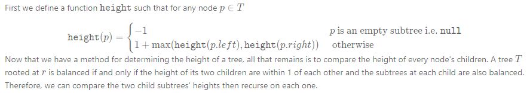

### Solution

Given the definition of a balanced tree we know that a tree T is not balanced if and only if there is some node p\in Tp∈T such that |\texttt{height}(p.left) - \texttt{height}(p.right)| > 1∣height(p.left)−height(p.right)∣>1. The tree below has each node is labeled by its height, as well as the unbalanced subtree highlighted.


> The balanced subtree definition hints at the fact that we should treat each subtree as a subproblem. The question is: in which order should we solve the subproblems?

#### Approach 1: Top-down recursion

**Algorithm**



```
isBalanced(root):
    if (root == NULL):
        return true
    if (abs(height(root.left) - height(root.right)) > 1):
        return false
    else:
        return isBalanced(root.left) && isBalanced(root.right)
```

```Java
class Solution {
  // Recursively obtain the height of a tree. An empty tree has -1 height
  private int height(TreeNode root) {
    // An empty tree has height -1
    if (root == null) {
      return -1;
    }
    return 1 + Math.max(height(root.left), height(root.right));
  }

  public boolean isBalanced(TreeNode root) {
    // An empty tree satisfies the definition of a balanced tree
    if (root == null) {
      return true;
    }

    // Check if subtrees have height within 1. If they do, check if the
    // subtrees are balanced
    return Math.abs(height(root.left) - height(root.right)) < 2
        && isBalanced(root.left)
        && isBalanced(root.right);
  }
};
```


---

#### Approach 2: Bottom-up recursion

**Intuition**

In approach 1, we perform redundant calculations when computing \texttt{height}height. In each call to \texttt{height}height, we require that the subtree's heights also be computed. Therefore, when working top down we will compute the height of a subtree once for every parent. We can remove the redundancy by first recursing on the children of the current node and then using their computed height to determine whether the current node is balanced.

Algorithm

We will use the same \texttt{height}height defined in the first approach. The bottom-up approach is a reverse of the logic of the top-down approach since we first check if the child subtrees are balanced before comparing their heights. The algorithm is as follows:

>Check if the child subtrees are balanced. If they are, use their heights to determine if the current subtree is balanced as well as to calculate the current subtree's height.

```Java
// Utility class to store information from recursive calls
final class TreeInfo {
  public final int height;
  public final boolean balanced;

  public TreeInfo(int height, boolean balanced) {
    this.height = height;
    this.balanced = balanced;
  }
}

class Solution {
  // Return whether or not the tree at root is balanced while also storing
  // the tree's height in a reference variable.
  private TreeInfo isBalancedTreeHelper(TreeNode root) {
    // An empty tree is balanced and has height = -1
    if (root == null) {
      return new TreeInfo(-1, true);
    }

    // Check subtrees to see if they are balanced.
    TreeInfo left = isBalancedTreeHelper(root.left);
    if (!left.balanced) {
      return new TreeInfo(-1, false);
    }
    TreeInfo right = isBalancedTreeHelper(root.right);
    if (!right.balanced) {
      return new TreeInfo(-1, false);
    }

    // Use the height obtained from the recursive calls to
    // determine if the current node is also balanced.
    if (Math.abs(left.height - right.height) < 2) {
      return new TreeInfo(Math.max(left.height, right.height) + 1, true);
    }
    return new TreeInfo(-1, false);
  }

  public boolean isBalanced(TreeNode root) {
    return isBalancedTreeHelper(root).balanced;
  }
};
```

**Complexity Analysis**

* Time complexity : 
    $$
    \mathcal O(n)
    $$
    For every subtree, we compute its height in constant time as well as compare the height of its children.

* Space complexity : 
    $$
    \mathcal O(n)
    $$
    . The recursion stack may go up to   if the tree is unbalanced.

