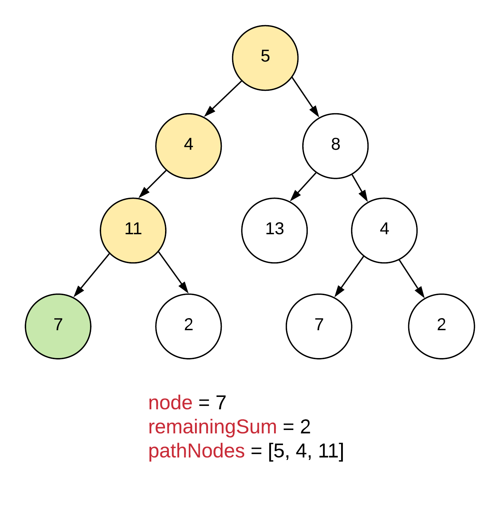
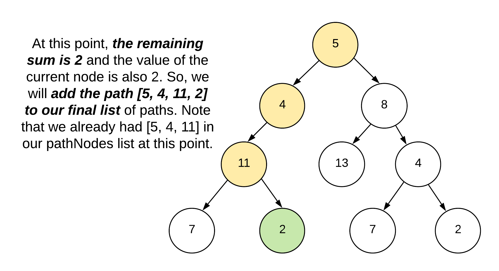
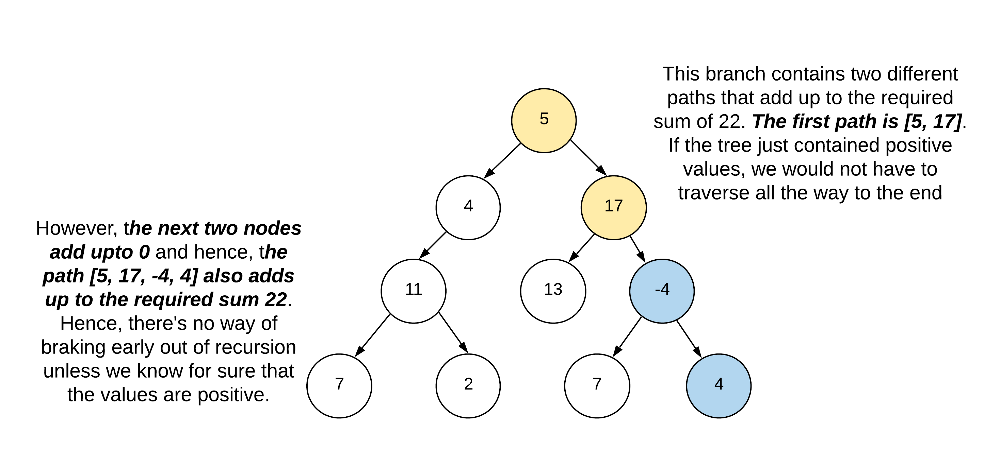

### Solution

#### Approach: Depth First Traversal | Recursion
Intuition

The intuition for this approach is pretty straightforward. The problem statement asks us to find all root to leaf paths in a given binary tree. If you simply consider the depth first traversal on a tree, all it does is traverse once branch after another. All we need to do here is to simply execute the depth first traversal and maintain two things along the way:

1. A running sum of all the nodes traversed till that point in recursion and
2. A list of all those nodes

If ever the sum becomes equal to the required sum, and the node where this happens is a leaf node, we can simply add the list of nodes to our final solution. We keep on doing this for every branch of the tree and we will get all the root to leaf paths in this manner that add up to a certain value. Basically, these paths are branches and hence the depth first traversal makes the most sense here. We can also use the breadth first approach for solving this problem. However, that would be super heavy on memory and is not a recommended approach for this very problem. We will look into more details towards the end.

**Algorithm**

1. We'll define a function called recurseTree which will take the following parameters

    * node which represents the current node we are on during recursion
    * remainingSum which represents the remaining sum that we need to find going down the tree. We can also pass the current sum in our recursive calls. However, then we'd also need to pass the required sum as an additional variable since we'd have to compare the current sum against that value. By passing in remaining sum, we can avoid having to pass additional variable and just see if the remaining sum is 0 (or equal to the value of the current node).
    * Finally, we'll have to pass a list of nodes here which will simply contain the list of all the nodes we have seen till now on the current branch. Let's call this pathNodes.
    * The following examples assume the sum to be found is 22.
  
  

  2. At every step along the way, we will simply check if the remaining sum is equal to the value of the current node. If that is the case and the current node is a leaf node, we will add the current pathNodes to the final list of paths that we have to return as a result.



3. The problem statement here specifically mentions root to leaf paths. A slight modification is to find all root to node paths. The solutions are almost similar except that we'd get rid of the leaf check.

    * An important thing to consider for this modification is that the problem statement doesn't mention anything about the values of the nodes. That means, we can't assume them to be positive. Had the values been positive, we could stop at the node where the sum became equal to the node's value.
    * However, if the values of the nodes can be negative, then we have to traverse all the branches, all the way up to the roots. Let's look at a modified tree for reference.



4. We process one node at a time and every time the value of the remaining sum becomes equal to the value of the current node, we add the pathNodes to our final list. Let's go ahead and look at the implementation for this algorithm.

```java

/**
 * Definition for a binary tree node.
 * public class TreeNode {
 *     int val;
 *     TreeNode left;
 *     TreeNode right;
 *     TreeNode(int x) { val = x; }
 * }
 */
class Solution {
    
    private void recurseTree(TreeNode node, int remainingSum, List<Integer> pathNodes, List<List<Integer>> pathsList) {
        
        if (node == null) {
            return;
        }
        
        // Add the current node to the path's list
        pathNodes.add(node.val);
        
        // Check if the current node is a leaf and also, if it
        // equals our remaining sum. If it does, we add the path to
        // our list of paths
        if (remainingSum == node.val && node.left == null && node.right == null) {
            pathsList.add(new ArrayList<>(pathNodes));
        } else {
            
            // Else, we will recurse on the left and the right children
            this.recurseTree(node.left, remainingSum - node.val, pathNodes, pathsList);
            this.recurseTree(node.right, remainingSum - node.val, pathNodes, pathsList);
        }
        
        // We need to pop the node once we are done processing ALL of it's
        // subtrees.
        pathNodes.remove(pathNodes.size() - 1);
    }
    
    public List<List<Integer>> pathSum(TreeNode root, int sum) {
        List<List<Integer>> pathsList = new ArrayList<List<Integer>>();
        List<Integer> pathNodes = new ArrayList<Integer>();
        this.recurseTree(root, sum, pathNodes, pathsList);
        return pathsList;        
    }
}

```
**Complexity Analysis**

* Time Complexity: O(N^2)where NN are the number of nodes in a tree. In the worst case, we could have a complete binary tree and if that is the case, then there would be N/2 leafs. For every leaf, we perform a potential O(N) operation of copying over the pathNodes nodes to a new list to be added to the final pathsList. Hence, the complexity in the worst case could be O(N^2).

* Space Complexity: O(N). The space complexity, like many other problems is debatable here. I personally choose not to consider the space occupied by the output in the space complexity. So, all the new lists that we create for the paths are actually a part of the output and hence, don't count towards the final space complexity. The only additional space that we use is the pathNodes list to keep track of nodes along a branch.

    We could include the space occupied by the new lists (and hence the output) in the space complexity and in that case the space would be O(N^2). There's a great answer on [Stack Overflow](https://cs.stackexchange.com/questions/83574/does-space-complexity-analysis-usually-include-output-space) about whether to consider input and output space in the space complexity or not. I prefer not to include them.

**Why Breadth First Search is bad for this problem?**

We did touch briefly on this in the intuition section. BFS would solve this problem perfectly. However, note that the problem statement actually asks us to return a list of all the paths that add up to a particular sum. Breadth first search moves one level at a time. That means, we would have to maintain the pathNodes lists for all the paths till a particular level/depth at the same time.

Say we are at the level 10 in the tree and that level has e.g. 20 nodes. BFS uses a queue for processing the nodes. Along with 20 nodes in the queue, we would also need to maintain 20 different pathNodes lists since there is no backtracking here. That is too much of a space overhead.

The good thing about depth first search is that it uses recursion for processing one branch at a time and once we are done processing the nodes of a particular branch, we pop them from the pathNodes list thus saving on space. At a time, this list would only contain all the nodes in a single branch of the tree and nothing more. Had the problem statement asked us the total number of paths that add up to a particular sum (root to leaf), then breadth first search would be an equally viable approach.
