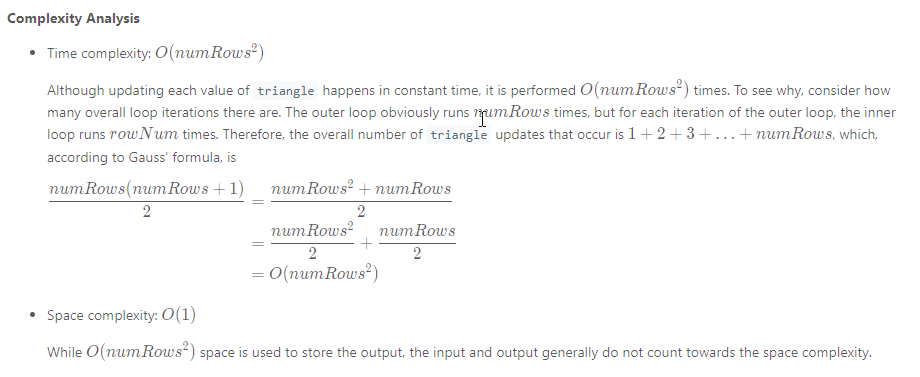

### Solution
---
Approach 1: Dynamic Programming
Intuition

If we have the a row of Pascal's triangle, we can easily compute the next row by each pair of adjacent values.

**Algorithm**

Although the algorithm is very simple, the iterative approach to constructing Pascal's triangle can be classified as dynamic programming because we construct each row based on the previous row.

First, we generate the overall triangle list, which will store each row as a sublist. Then, we check for the special case of 0, as we would otherwise return [1]. Since *numRowsnumRows* is always greater than 0, we can initialize *triangle* with [1] as its first row, and proceed to fill the rows as follows:

```java
class Solution {
    public List<List<Integer>> generate(int numRows) {
        List<List<Integer>> triangle = new ArrayList<List<Integer>>();

        // Base case; first row is always [1].
        triangle.add(new ArrayList<>());
        triangle.get(0).add(1);

        for (int rowNum = 1; rowNum < numRows; rowNum++) {
            List<Integer> row = new ArrayList<>();
            List<Integer> prevRow = triangle.get(rowNum-1);

            // The first row element is always 1.
            row.add(1);

            // Each triangle element (other than the first and last of each row)
            // is equal to the sum of the elements above-and-to-the-left and
            // above-and-to-the-right.
            for (int j = 1; j < rowNum; j++) {
                row.add(prevRow.get(j-1) + prevRow.get(j));
            }

            // The last row element is always 1.
            row.add(1);

            triangle.add(row);
        }

        return triangle;
    }
}
```
