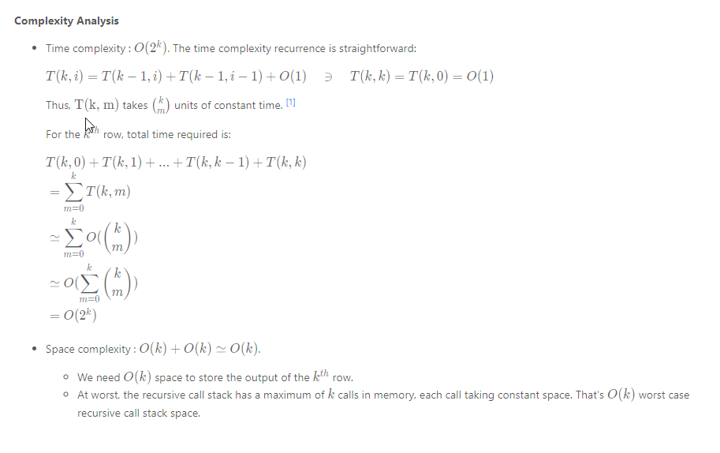

### Solution
> If you haven't attempted [118. Pascal's Triangle](https://leetcode.com/problems/pascals-triangle/), I would strongly recommend that you try that first.

**Approach 1: Brute Force Recursion**
**Intuition**

We'll utilize a nice little property of Pascal's Triangle (given in the problem description):


> In Pascal's triangle, each number is the sum of the two numbers directly above it.

[Approach 4](https://leetcode.com/problems/pascals-triangle-ii/solution/#approach-4-math-specifically-combinatorics) will expand more on why it is so.

**Algorithm**

Let's say we had a function `getNum(rowIndex, colIndex)`, which gave us the `colIndexth` number in the rowIndexth row, we could simply build the `k^{th}`
row by repeatedly calling `getNum(...)` for columns *0* to *k*.

We can formulate our intuition into the following recursion:

`getNum(rowIndex, colIndex) = getNum(rowIndex-1, colIndex-1) + getNum(rowIndex-1, colIndex)`

The recursion ends in some known base cases:

* The first row is just a single 1, i.e. `getNum(0, ...) = 1`

* The first and last number of each row is 1, i.e. `getNum(k, 0) = getNum(k, k) = 1`

```java
class Solution {
  private int getNum(int row, int col) {
    if (row == 0 || col == 0 || row == col) {
      return 1;
    }

    return getNum(row - 1, col - 1) + getNum(row - 1, col);
  }

  public List<Integer> getRow(int rowIndex) {
    List<Integer> ans = new ArrayList<>();

    for (int i = 0; i <= rowIndex; i++) {
      ans.add(getNum(rowIndex, i));
    }

    return ans;
  }
}
```

Complexity Analysis


**Approach 2: Dynamic Programming**
Intuition

In the previous approach, we end up making the same recursive calls repeatedly.


For example, to calculate `getNum(5, 3)` and `getNum(5, 4)`, we end up calling `getNum(3, 2)` thrice. To generate, the entire fifth row (0-based row indexing), we'd have to call `getNum(3, 2)` four times.

It makes sense to store the results of intermediate recursive calls for later use.

**Algorithm**

Simple memoization caches results of deep recursive calls and provides significant savings on runtime.
```java
class Solution {
  private final class RowCol {
    private int row, col;

    public RowCol(int row, int col) {
      this.row = row;
      this.col = col;
    }

    @Override
    public int hashCode() {
      int result = (int) (row ^ (row >>> 32));
      return (result << 5) - 1 + (int) (col ^ (col >>> 32)); // 31 * result == (result << 5) - 1
    }

    @Override
    public boolean equals(Object o) {
      if (this == o) return true;
      if (o == null) return false;
      if (this.getClass() != o.getClass()) return false;

      RowCol rowCol = (RowCol) o;
      return row == rowCol.row && col == rowCol.col;
    }
  }

  private Map<RowCol, Integer> cache = new HashMap<>();

  private int getNum(int row, int col) {
    RowCol rowCol = new RowCol(row, col);

    if (cache.containsKey(rowCol)) {
      return cache.get(rowCol);
    }

    int computedVal =
        (row == 0 || col == 0 || row == col) ? 1 : getNum(row - 1, col - 1) + getNum(row - 1, col);

    cache.put(rowCol, computedVal);

    return computedVal;
  }

  public List<Integer> getRow(int rowIndex) {
    List<Integer> ans = new ArrayList<>();

    for (int i = 0; i <= rowIndex; i++) {
      ans.add(getNum(rowIndex, i));
    }

    return ans;
  }
}
```


But, it is worth noting that generating a number for a particular row requires only two numbers from the previous row. Consequently, generating a row only requires numbers from the previous row.

Thus, we could reduce our memory footprint by only keeping the latest row generated, and use that to generate a new row.
```java
class Solution {
  public List<Integer> getRow(int rowIndex) {
    List<Integer> curr,
        prev =
            new ArrayList<>() {
              {
                add(1);
              }
            };

    for (int i = 1; i <= rowIndex; i++) {
      curr =
          new ArrayList<>(i + 1) {
            {
              add(1);
            }
          };

      for (int j = 1; j < i; j++) {
        curr.add(prev.get(j - 1) + prev.get(j));
      }

      curr.add(1);

      prev = curr;
    }

    return prev;
  }
}
```

The std::move() operator on vectors in C++ is an O(1)O(1) operation. [2]

Complexity Analysis


Approach 3: Memory-efficient Dynamic Programming
Intuition

Notice that in the previous approach, we have maintained the previous row in memory on the premise that we need terms from it to build the current row. This is true, but not wholly.

What we actually need, to generate a term in the current row, is just the two terms above it (present in the previous row).

Formally, in memory,

> `pascal[i][j] = pascal[i-1][j-1] + pascal[i-1][j]`

where `pascal[i][j]` is the number in ith row and jth column of Pascal's triangle.

So, trying to compute `pascal[i][j]`, only the memory regions of `pascal[i-1][j-1]` and `pascal[i-1][j]` are required to be accessed.

**Algorithm**

Let's take a step back and analyze the circumstances under which `pascal[i][j]` might be accessed. Given that we have already employed DP to save us valuable run-time, the access pattern for `pascal[i][j]` looks a bit like this:

* `WRITE pascal[i][j] (after generating it from pascal[i-1][j-1] and pascal[i-1][j])`
* `READ pascal[i][j] to generate pascal[i+1][j]`
* `READ pascal[i][j] to generate pascal[i+1][j+1]`
That's it! Once we've written out `pascal[i][j]`:

We don't ever need to modify it.
It's only read a fixed number of times, i.e. twice (thanks to DP).
Hypothetically, if we kept the the current row (in the process of being generated) and the previous row, in the same memory block, what kind of access patterns would we see (assume `pascal[j]` means the jth number in a row)?

`pascal[j]` was somehow generated in a previous instance. Currently, it holds the previous row value.

`pascal[j]` (which holds the jth number of the previous row) must be read when writing out `pascal[j]` (the jth number of the current row).

Obviously they are the same memory location, so a conflict exists: the previous row value of `pascal[j]` will be lost after the write-out.
Is that ok? If we don't need to read the previous row value of pascal[j] anymore, is there any harm in writing out the current row value in its place?
`pascal[j]` (which holds the jth number of the previous row) must be read when writing out `pascal[j+1]` (the j+1th number of the current row). These are two different memory locations, so there is no conflict.

If we managed to keep all read accesses on the previous row value of `pascal[j]`, before any write access to `pascal[j]` for the current row value, we should be good! That's possible by evaluating each row from the end, instead of the beginning. Thus, a new row value of `pascal[j+1]` must be generated before doing so for `pascal[j]`.

The following animation demonstrates the above algorithm, used to generate the 4th row of Pascal's Triangle, from an existing 3rd row:

```java
class Solution {
  public List<Integer> getRow(int rowIndex) {
    List<Integer> row =
        new ArrayList<>(rowIndex + 1) {
          {
            add(1);
          }
        };

    for (int i = 0; i < rowIndex; i++) {
      for (int j = i; j > 0; j--) {
        row.set(j, row.get(j) + row.get(j - 1));
      }
      row.add(1);
    }

    return row;
  }
}
```

Complexity Analysis


Approach 4: Math! (specifically, Combinatorics)


```java
class Solution {
  public List<Integer> getRow(int n) {
    List<Integer> row =
        new ArrayList<>() {
          {
            add(1);
          }
        };

    for (int k = 1; k <= n; k++) {
      row.add((int) ((row.get(row.size() - 1) * (long) (n - k + 1)) / k));
    }

    return row;
  }
}
```
Complexity Analysis
Time complexity : O(k). Each term is calculated once, in constant time.

Space complexity : O(k). No extra space required other than that required to hold the output.

Further Thoughts
The symmetry of a row in Pascal's triangle allows us to get away with computing just half of each row.
> Pop Quiz: Are there any computational complexity benefits of doing this?

> Pop Quiz: Can you prove why these rows are symmetrical?

This [Stack Overflow answer](https://stackoverflow.com/a/26229383/2844164) has a good explanation. See the parallel between the time complexity recurrence and [Pascal's rule](https://en.wikipedia.org/wiki/Pascal%27s_rule). ↩︎

Starting C++11, std:move() can be used to move resources across arguments or references. Since underlying representations are simply moved, and not copied, this can be a very efficient operation to transfer elements across collections or containers. See this Stack Overflow answer for more. ↩︎