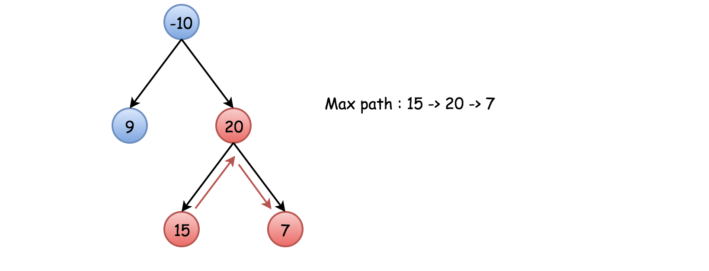

# Approach 1: Recursion

## Intuition

First of all, let's simplify the problem and implement a function max_gain(node) which takes a node as an argument and computes a maximum contribution that this node and one/zero of its subtrees could add.

`
In other words, it's a maximum gain one could have including the node (and maybe one of its subtrees) into the path.
`

Hence if one would know for sure that the max path contains root, the problem would be solved as max_gain(root). Unfortunately, the max path does not need to go through the root, and here is an example of such a tree

That means one needs to modify the above function and to check at each step what is better : to continue the current path or to start a new path with the current node as a highest node in this new path.

Algorithm

Now everything is ready to write down an algorithm.

Initiate max_sum as the smallest possible integer and call max_gain(node = root).
Implement max_gain(node) with a check to continue the old path/to start a new path:
Base case : if node is null, the max gain is 0.
Call max_gain recursively for the node children to compute max gain from the left and right subtrees : left_gain = max(max_gain(node.left), 0) and
right_gain = max(max_gain(node.right), 0).
Now check to continue the old path or to start a new path. To start a new path would cost price_newpath = node.val + left_gain + right_gain. Update max_sum if it's better to start a new path.
For the recursion return the max gain the node and one/zero of its subtrees could add to the current path : node.val + max(left_gain, right_gain).
Tree Node
