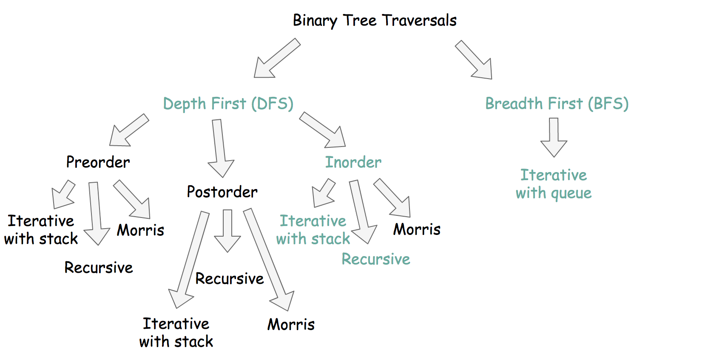
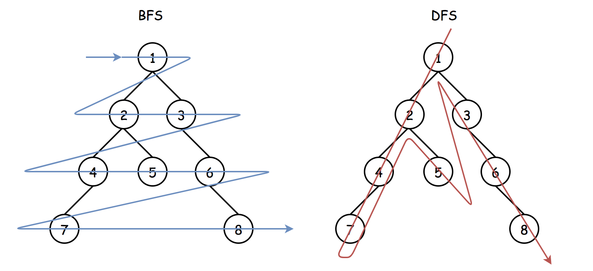

### Solution

---

#### Overview

**How to Solve**

Let's traverse both trees in parallel, and once the target node is identified in the first tree, return the corresponding node from the second tree.

**How to Traverse the Tree: DFS vs BFS**

There are two ways to traverse the tree: DFS *depth first search* and BFS *breadth first search*. Here is a small summary




Both are starting from the root and going down, both are using additional structures, what's the difference? Here is how it looks at the big scale: BFS traverses level by level, and DFS first goes to the leaves.



> Description doesn't give us any clue which traversal is better to use here. Interview-simple solutions are DFS inorder traversals.

In the Approach 1 and Approach 2 we're going to discuss recursive inorder DFS and iterative inorder DFS traversals. They both need up to O(*H*) space to keep stack, where H*H* is a tree height.

In the Approach 3, we provide a BFS solution. Normally, it's a bad idea to use BFS during the interview, unless the interviewer would push for it by adding new details into the problem description.

**Could We Solve in Constant Space?**

No. The problem could be solved in constant space using DFS Morris inorder traversal algorithm, but it modifies the tree, and that isn't allowed here.

**Follow up: Repeated Values are Allowed**

If duplicate values are not allowed, one could compare node values:

```java
if (node_o.val == target.val) {
    // TODO
}
```

Otherwise, one has to compare the nodes:

```java
if (node_o == target) {
    // TODO
}
```

---

#### Approach 1: DFS: Recursive Inorder Traversal.

Recursive inorder traversal is extremely simple: follow `Left->Node->Right` direction, *i.e.*, do the recursive call for the *left* child, then do all the business with the node (= check if the node is a target one or not), and then do the recursive call for the *right* child.


[Don't use Stack in Java, use ArrayDeque instead](https://docs.oracle.com/javase/8/docs/api/java/util/Stack.html).

```java	
class Solution {
    TreeNode ans, target;
    
    public void inorder(TreeNode o, TreeNode c) {
        if (o != null) {
            inorder(o.left, c.left);
            if (o == target) {
                ans = c;    
            }
            inorder(o.right, c.right);    
        }
    }
    
    public final TreeNode getTargetCopy(final TreeNode original, final TreeNode cloned, final TreeNode target) {
        this.target = target;
        inorder(original, cloned);
        return ans;
    }
}
```

**Complexity Analysis**

- Time complexity: O(*N*) since one has to visit each node, where N*N* is a number of nodes.
- Space complexity: up to O(*H*) to keep the recursion stack, where *H* is a tree height.

---

#### Approach 2: DFS: Iterative Inorder Traversal.

Iterative inorder traversal is straightforward: go left as far as you can, then one step right. Repeat till the end of nodes in the tree.


```java
class Solution {
    public final TreeNode getTargetCopy(final TreeNode original, final TreeNode cloned, final TreeNode target) {
        Deque<TreeNode> stack_o = new ArrayDeque();
        Deque<TreeNode> stack_c = new ArrayDeque();
        TreeNode node_o = original, node_c = cloned;

        while (!stack_o.isEmpty() || node_o != null) {
            while (node_o != null) {
                stack_o.add(node_o);
                stack_c.add(node_c);

                node_o = node_o.left;
                node_c = node_c.left;
            }
            node_o = stack_o.removeLast();
            node_c = stack_c.removeLast();
            if (node_o == target) {
                return node_c;
            }
            node_o = node_o.right;
            node_c = node_c.right;
        }
        return null;
    }
}
```

**Complexity Analysis**

- Time complexity: O(*N*) since one has to visit each node.
- Space complexity: up to O(*H*) to keep the stack, where H*H* is a tree height.

---

#### Approach 3: BFS: Iterative Traversal.

**Algorithm**

Here we implement standard BFS traversal with the queue:

- Add root into queue.
- While queue is not empty:
  - Pop out a node from queue.
  - If the node is a target, we're done.
  - Add first *left* and then *right* child node into queue

```java
class Solution {
    public final TreeNode getTargetCopy(final TreeNode original, final TreeNode cloned, final TreeNode target) {
        Deque<TreeNode> queue_o = new ArrayDeque();
        queue_o.offer(original);
        
        Deque<TreeNode> queue_c = new ArrayDeque();
        queue_c.offer(cloned);

        while (!queue_o.isEmpty()) {
            TreeNode node_o = queue_o.poll();
            TreeNode node_c = queue_c.poll();
            
            if (node_o == target) {
                return node_c;   
            }
            
            if (node_o.left != null) {
                queue_o.offer(node_o.left);
                queue_c.offer(node_c.left);
            }
            if (node_o.right != null) {
                queue_o.offer(node_o.right);
                queue_c.offer(node_c.right);
            }
        }
        return null;
    }
}
```

**Complexity Analysis**

- Time complexity: O(*N*) since one has to visit each node.
- Space complexity: up to O(*N*) to keep the queue. Let's use the last level to estimate the queue size. This level could contain up to *N*/2 tree nodes in the case of [complete binary tree](https://leetcode.com/problems/count-complete-tree-nodes/).