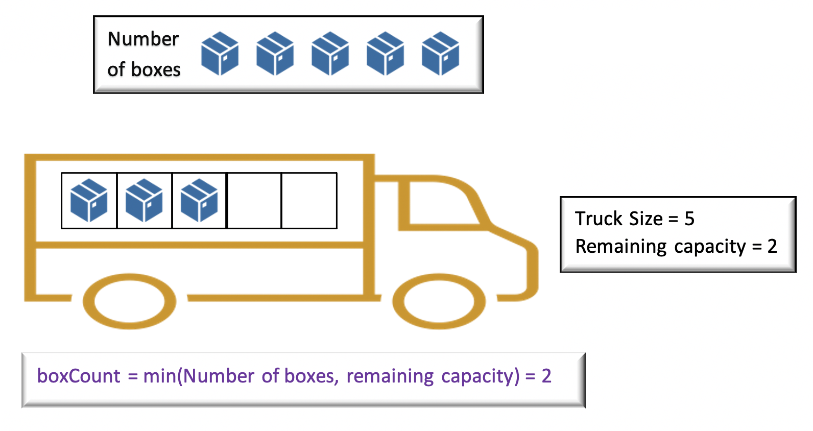
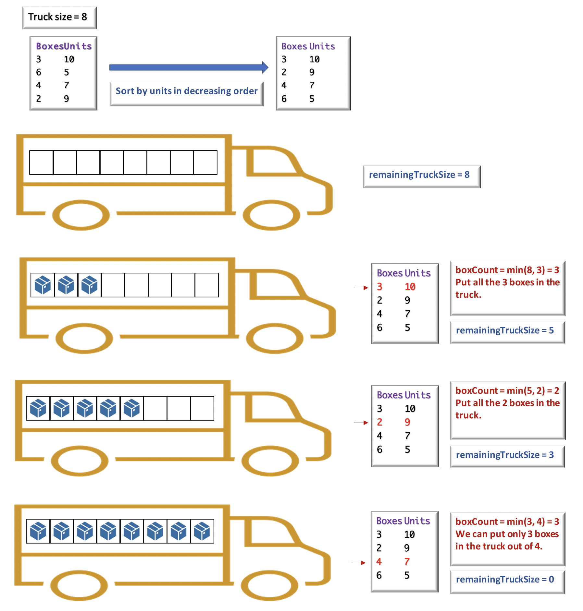

### Solution

---

#### Overview

We have to fill the truck with any box type and try to fill in the maximum number of units. The 2D array `boxTypes` has the following information on each type of box,

- Number of boxes of that type.
- Number of units inside each box of that type.

We must choose the boxes which give us maximum units.

The problem can be implemented using *Greedy Approach*. We could iteratively fill the truck by picking up the boxes having maximum units from the remaining boxes at every point. Let's look at the approach to implement the problem.

------

#### Approach 1: Brute Force

**Intuition**

We must fill the truck with maximum units. Given the 2D array `boxTypes`, we could simply traverse over each box type, find the one with maximum units and fill the truck with all the boxes of that type. Once we fill the truck with a box type, we could mark it as used, and again find the box type with maximum units from the remaining ones. This would continue until the truck is not full.

Let the box type with maximum unit be `maxUnitsBoxType`. The number of boxes that can be put in the truck using boxes of type `maxUnitsBoxType` is given by `maxUnitsBoxType[0]`.

However, we can only fill the truck until it is not full. That is, we could only put the boxes in the truck until the remaining truck size is greater than 00. Thus, if the remaining space is truck at a certain point is given by, `remainingTruckSize`, the number of boxes that can be put in the truck can be given by,

```
 boxCount =  min(maxUnitsBoxType[0], remainingTruckSize)
```



Let's understand how can we implement the above idea.

**Algorithm**

- Initially, the truck is empty, hence the remaining truck capacity that must be filled would be equal to the truck size. Initialise variable `remainingTruckSize` to `truckSize`.
- The truck will be filled with boxes one by one until it is not full. In every iteration, we must find a box with maximum units from the remaining box types. Let's use the method `findMaxUnitBox` that would return the index of a box type with maximum units given by `maxUnitBoxIndex` in the 2D array \text{boxTypes}boxTypes.
- Once, we have the `maxUnitBoxIndex`, we could find the number of boxes that we could put in the truck as a minimum of `remainingTruckSize` and the number of boxes available of a given type. Calculate the total number of units and reduce the truck's remaining capacity based on the number of boxes put in the truck.
- Also, we must mark the current box as used. One way of doing this would be to simply mark the number of units as `-1`. When `findMaxUnitBox` would indicate that all the boxes are already used and we must terminate.
- The process of filling the truck with box types would continue until the truck is not full i.e `remainingTruckSize` is greater than 00.

```java
class Solution {
    public int maximumUnits(int[][] boxTypes, int truckSize) {
        int unitCount = 0;
        int remainingTruckSize = truckSize;
        while (remainingTruckSize > 0) {
            int maxUnitBoxIndex = findMaxUnitBox(boxTypes);
            // check if all boxes are used
            if (maxUnitBoxIndex == -1)
                break;
            // find the box count that can be put in truck
            int boxCount = Math.min(remainingTruckSize, boxTypes[maxUnitBoxIndex][0]);
            unitCount += boxCount * boxTypes[maxUnitBoxIndex][1];
            remainingTruckSize -= boxCount;
            // mark box with index maxUnitBoxIndex as used
            boxTypes[maxUnitBoxIndex][1] = -1;
        }
        return unitCount;
    }

    public int findMaxUnitBox(int[][] boxTypes) {
        int maxUnitBoxIndex = -1;
        int maxUnits = 0;
        for (int i = 0; i < boxTypes.length; i++) {
            if (boxTypes[i][1] > maxUnits) {
                maxUnits = boxTypes[i][1];
                maxUnitBoxIndex = i;
            }
        }
        return maxUnitBoxIndex;
    }
}

```

**Complexity Analysis**

- Time Complexity : \mathcal{O}(n^{2})O(*n*2), where n*n* is the number of elements in array `boxTypes`. In the method `findMaxUnitBox`, we are iterating over all the elements in array `boxTypes` to find the maximum units. In the worst case, when all the boxes are added to the truck we would iterate `n` times over the array of size `n`. This would give total time complexity as \mathcal{O}(n^{2})O(*n*2).
- Space Complexity: \mathcal{O}(1)O(1), as we are using constant extra space to maintain the variables `remainingTruckSize` and `unitCount`.

------

#### Approach 2: Using Array Sort

We could simplify the process of finding the maximum units in every iteration. We could arrange the box types in a particular order such that we could get the desired box type in constant time without having to iterate over the entire array. The simple way to implement this is to sort the array `boxTypes` in decreasing order of a number of units.

Once all the elements in array `boxTypes` are sorted in that order, we know that box type at 0^{th}0*t**h* position is the one with maximum units and the one at 1^{st}1*s**t* position having the second highest number of units and so on.

**Algorithm**

- Initially, the truck is empty, hence the remaining truck capacity that must be filled would be equal to the truck size. Initialise variable `remainingTruckSize` to `truckSize`.
- Sort the array `boxTypes` in decreasing order of a number of units.
- Start picking up each box type from `boxTypes` array starting from 0^{th}0*t**h* position. The number of boxes that can be put in the truck would be the minimum of `remainingTruckSize` and the number of boxes available of the given type. Calculate the total number of units and reduce the truck's remaining capacity based on the number of boxes put in the truck.
- The process of filling the truck with box types would continue until the truck is not full i.e remainingTruckSize is greater than 00.

The following figure illustrates the approach in detail for `truckSize = 8` and `boxTypes = [[3, 10], [6, 5], [4, 7], [2, 9]]`



```java
class Solution {
    public int maximumUnits(int[][] boxTypes, int truckSize) {
        Arrays.sort(boxTypes, (a, b) -> b[1] - a[1]);
        int unitCount = 0;
        for (int[] boxType : boxTypes) {
            int boxCount = Math.min(truckSize, boxType[0]);
            unitCount += boxCount * boxType[1];
            truckSize -= boxCount;
            if (truckSize == 0)
                break;
        }
        return unitCount;
    }
}
```

**Complexity Analysis**

- Time Complexity : \mathcal{O}(n \log n)O(*n*log*n*), where n is the number of elements in array `boxTypes`.

  Sorting the array `boxTypes` of size `n` takes (n \log n)(*n*log*n*) time. Post that, we iterate over each element in array `boxTypes` and in worst case, we might end up iterating over all the elements in the array. This gives us time complexity as \mathcal{O}(n \log n) + \mathcal{O}(n) = \mathcal{O}(n \log n)O(*n*log*n*)+O(*n*)=O(*n*log*n*).

- Space Complexity: \mathcal{O}(1)O(1), as we use constant extra space.

------

#### Approach 3: Using Priority Queue

**Intuition**

There is yet another way to get the maximum units in constant time by using the Heap data structure. We could build Max Heap where the value at the root node of the heap is always the maximum value among all its children. So we could build a max heap based on the number of units.

In every iteration, we could pick up the box type which is at the root node, and remove it. After removing the root node, the next node with maximum units would become the root bode.

> This approach is not an optimization over *Approach 2* but just another way to solve the problem.

**Algorithm**

- The heap data structure can be implemented using the priority queue. We must specify that the sort order must be based on the number of units in descending order.
- Initially, the truck is empty, hence the remaining truck capacity that must be filled would be equal to the truck size. Initialise variable `remainingTruckSize` to `truckSize`.
- The element at the top of the queue is the one having maximum units. Pick that element and remove it from the queue.
- The number of boxes that can be put in the truck would be the minimum of `remainingTruckSize` and the number of boxes available of a given type. Calculate the total number of units and reduce the truck's remaining capacity based on the number of boxes put in the truck.
- The process of filling the truck with box types would continue until the truck is not full i.e remainingTruckSize is greater than 00.

```java
class Solution {
public
    int maximumUnits(int[][] boxTypes, int truckSize) {
        PriorityQueue<int[]> queue = new PriorityQueue<>((a, b)->b[1] - a[1]);
        queue.addAll(Arrays.asList(boxTypes));
        int unitCount = 0;
        while (!queue.isEmpty()) {
            int[] top = queue.poll();
            int boxCount = Math.min(truckSize, top[0]);
            unitCount += boxCount * top[1];
            truckSize -= boxCount;
            if(truckSize == 0)
                break;
        }
        return unitCount;
    }
}
```

**Complexity Analysis**

- Time Complexity : \mathcal{O}(n \log n)O(*n*log*n*), where n*n* is the number of elements in array `boxTypes`.

  We are adding all the elements of the array `boxTypes` in the priority queue, which takes \mathcal{O}(n)O(*n*) time.

  Post that, we would continue iteration until queue is not empty or remaining truck size is greater than 00. In worst case, we might end up iterating n*n* times. Also, removing elements from queue would take (\log n)(log*n*) time. This gives us time complexity as \mathcal{O}(n \log n) + \mathcal{O}(n) = \mathcal{O}(n \log n)O(*n*log*n*)+O(*n*)=O(*n*log*n*).

- Space Complexity: \mathcal{O}(n)O(*n*), as we use a queue of size n*n*.