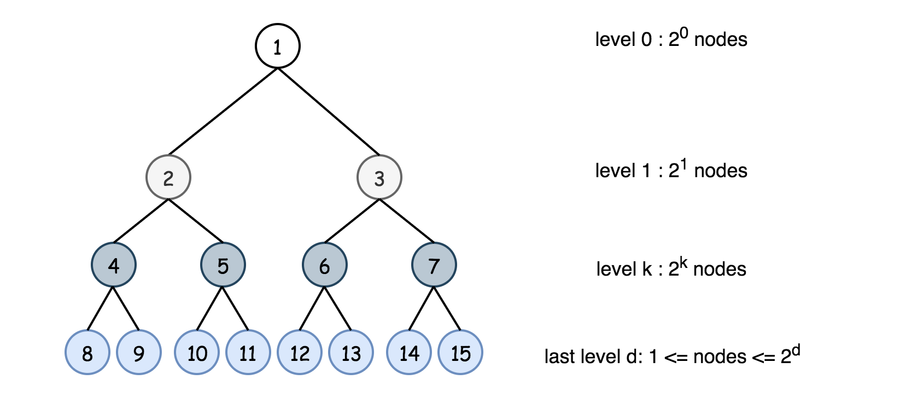
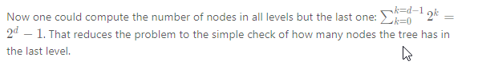
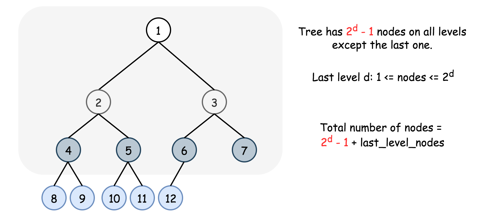
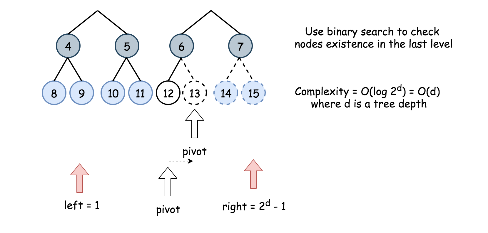
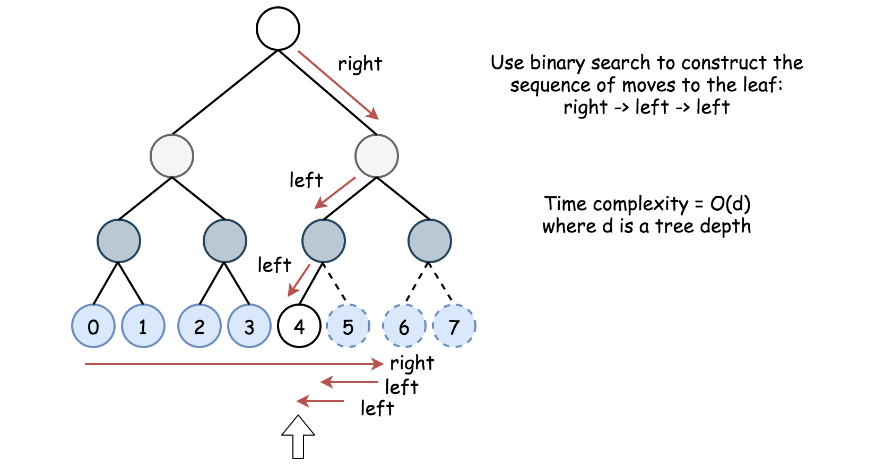

### Solution

Approach 1: Linear Time
Intuition

This problem is quite popular at Google during the last year. The naive solution here is a linear time one-liner which counts nodes recursively one by one.

**Implementation**

```java
class Solution {
  public int countNodes(TreeNode root) {
    return root != null ? 1 + countNodes(root.right) + countNodes(root.left) : 0;
  }
}
```

**Complexity Analysis**

* Time complexity : O(N).
* Space complexity : O(d) = O(logN) to keep the recursion stack, where d is a tree depth.

----

#### Approach 2: Binary search

Intuition

Approach 1 doesn't profit from the fact that the tree is a complete one.

> In a complete binary tree every level, except possibly the last, is completely filled, and all nodes in the last level are as far left as possible.

That means that complete tree has 2^k
  nodes in the kth level if the kth level is not the last one. The last level may be not filled completely, and hence in the last level the number of nodes could vary from 1 to 2^d
 , where d is a tree depth.







Now there are two questions:

1. How many nodes in the last level have to be checked?

2. What is the best time performance for such a check?

Let's start from the first question. It's a complete tree, and hence all nodes in the last level are as far left as possible. That means that instead of checking the existence of all 2^d
  possible leafs, one could use binary search and check log(2^d) = d leafs only.

  

  Let's move to the second question, and enumerate potential nodes in the last level from 0 to 2^d - 1. How to check if the node number idx exists? Let's use binary search again to reconstruct the sequence of moves from root to idx node. For example, idx = 4. idx is in the second half of nodes `0,1,2,3,4,5,6,7` and hence the first move is to the right. Then idx is in the first half of nodes `4,5,6,7` and hence the second move is to the left. The idx is in the first half of nodes `4,5` and hence the next move is to the left. The time complexity for one check is O(d).

  

  1 and 2 together result in \mathcal{O}(d)O(d) checks, each check at a price of \mathcal{O}(d)O(d). That means that the overall time complexity would be \mathcal{O}(d^2)O(d 
2
 ).

**Algorithm**

* Return 0 if the tree is empty.

* Compute the tree depth d.

* Return 1 if d == 0.

* The number of nodes in all levels but the last one is 2^d - 1. The number of nodes in the last level could vary from 1 to 2^d. Enumerate potential nodes from 0 to 2^d - 1and perform the binary search by the node index to check how many nodes are in the last level. Use the function exists(idx, d, root) to check if the node with index idx exists.

* Use binary search to implement exists(idx, d, root) as well.

* Return 2^d - 1 + the number of nodes in the last level.

```java

class Solution {
  // Return tree depth in O(d) time.
  public int computeDepth(TreeNode node) {
    int d = 0;
    while (node.left != null) {
      node = node.left;
      ++d;
    }
    return d;
  }

  // Last level nodes are enumerated from 0 to 2**d - 1 (left -> right).
  // Return True if last level node idx exists. 
  // Binary search with O(d) complexity.
  public boolean exists(int idx, int d, TreeNode node) {
    int left = 0, right = (int)Math.pow(2, d) - 1;
    int pivot;
    for(int i = 0; i < d; ++i) {
      pivot = left + (right - left) / 2;
      if (idx <= pivot) {
        node = node.left;
        right = pivot;
      }
      else {
        node = node.right;
        left = pivot + 1;
      }
    }
    return node != null;
  }

  public int countNodes(TreeNode root) {
    // if the tree is empty
    if (root == null) return 0;

    int d = computeDepth(root);
    // if the tree contains 1 node
    if (d == 0) return 1;

    // Last level nodes are enumerated from 0 to 2**d - 1 (left -> right).
    // Perform binary search to check how many nodes exist.
    int left = 1, right = (int)Math.pow(2, d) - 1;
    int pivot;
    while (left <= right) {
      pivot = left + (right - left) / 2;
      if (exists(pivot, d, root)) left = pivot + 1;
      else right = pivot - 1;
    }

    // The tree contains 2**d - 1 nodes on the first (d - 1) levels
    // and left nodes on the last level.
    return (int)Math.pow(2, d) - 1 + left;
  }
}
```
**Complexity Analysis**

* Time complexity :O(d^2) = O(log^2 N), where d is a tree depth.
* Space complexity : O(1).
