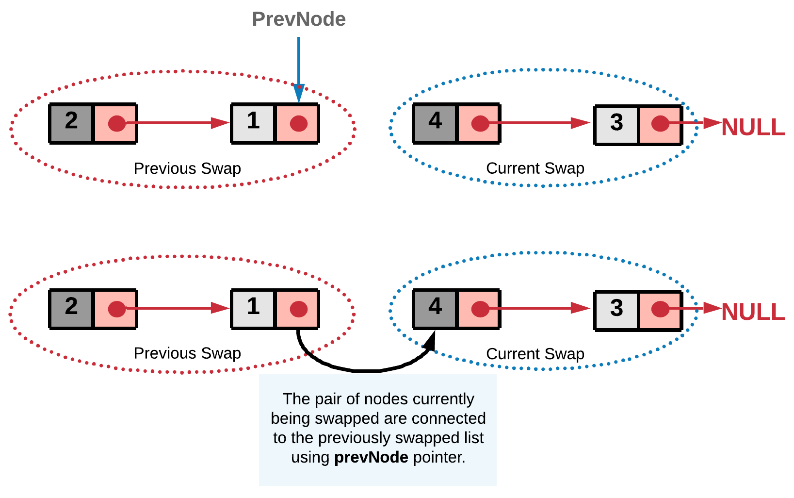

### Solution
---
#### Approach 1: Recursive Approach

**Intuition**

The problem doesn't ask for entire reversal of linked list. It's rather asking us to swap every two adjacent nodes of a linked list starting at the very first node.


The basic intuition is to reach to the end of the linked list in steps of two using recursion.


and while back tracking the nodes can be swapped.


In every function call we take out two nodes which would be swapped and the remaining nodes are passed to the next recursive call. The reason we are adopting a recursive approach here is because a sub-list of the original list would still be a linked list and hence, it would adapt to our recursive strategy. Assuming the recursion would return the swapped `remaining` list of nodes, we just swap the current two nodes and attach the remaining list we get from recursion to these two swapped pairs.


**Algorithm**

1.  Start the recursion with `head` node of the original linked list.
    
2.  Every recursion call is responsible for swapping a pair of nodes. Let's represent the two nodes to be swapped by `firstNode` and `secondNode`.
    
3.  Next recursion is made by calling the function with head of the next pair of nodes. This call would swap the next two nodes and make further recursive calls if there are nodes left in the linked list.
    
4.  Once we get the pointer to the remaining swapped list from the recursion call, we can swap the `firstNode` and `secondNode` i.e. the nodes in the current recursive call and then return the pointer to the `secondNode` since it will be the new head after swapping.

5. Once all the pairs are swapped in the backtracking step, we would eventually be returning the pointer to the head of the now `swapped` list. This head will essentially be the second node in the original linked list.
```java
/**
 * Definition for singly-linked list.
 * public class ListNode {
 *     int val;
 *     ListNode next;
 *     ListNode(int x) { val = x; }
 * }
 */
class Solution {
    public ListNode swapPairs(ListNode head) {

        // If the list has no node or has only one node left.
        if ((head == null) || (head.next == null)) {
            return head;
        }

        // Nodes to be swapped
        ListNode firstNode = head;
        ListNode secondNode = head.next;

        // Swapping
        firstNode.next  = swapPairs(secondNode.next);
        secondNode.next = firstNode;

        // Now the head is the second node
        return secondNode;
    }
}
```

**Complexity Analysis**

-   Time Complexity: O(N)O(N)O(N) where NNN is the size of the linked list.
-   Space Complexity: O(N)O(N)O(N) stack space utilized for recursion.
---
#### Approach 2: Iterative Approach

**Intuition**

The concept here is similar to the recursive approach. We break the linked list into pairs by jumping in steps of two. The only difference is, unlike recursion, we swap the nodes on the go. After swapping a pair of nodes, say `A` and `B`, we need to link the node `B` to the node that was right before `A`. To establish this linkage we save the previous node of node `A` in `prevNode`.



**Algorithm**

1.  We iterate the linked list with jumps in steps of two.
    
2.  Swap the pair of nodes as we go, before we jump to the next pair. Let's represent the two nodes to be swapped by `firstNode` and `secondNode`.
   
3. Swap the two nodes. The swap step is
 > firstNode.next = secondNode.next
 >
 > secondNode.next = firstNode


 
 4. We also need to assign the prevNode's next to the head of the swapped pair. This step would ensure the currently swapped pair is linked correctly to the end of the previously swapped list.

 >  prevNode.next = secondNode

 

 This is an iterative step, so the nodes are swapped on the go and attached to the previously swapped list. And in the end we get the final swapped list.

 ```java
 /**
 * Definition for singly-linked list.
 * public class ListNode {
 *     int val;
 *     ListNode next;
 *     ListNode(int x) { val = x; }
 * }
 */
class Solution {
    public ListNode swapPairs(ListNode head) {

        // Dummy node acts as the prevNode for the head node
        // of the list and hence stores pointer to the head node.
        ListNode dummy = new ListNode(-1);
        dummy.next = head;

        ListNode prevNode = dummy;

        while ((head != null) && (head.next != null)) {

            // Nodes to be swapped
            ListNode firstNode = head;
            ListNode secondNode = head.next;

            // Swapping
            prevNode.next = secondNode;
            firstNode.next = secondNode.next;
            secondNode.next = firstNode;

            // Reinitializing the head and prevNode for next swap
            prevNode = firstNode;
            head = firstNode.next; // jump
        }

        // Return the new head node.
        return dummy.next;
    }
}
```
 **Complexity Analysis**

-   Time Complexity : O(N)O(N)O(N) where N is the size of the linked list.
    
-   Space Complexity : O(1)O(1)O(1).