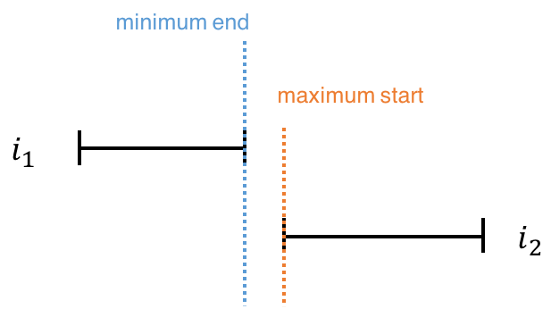
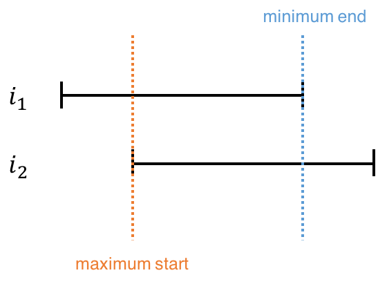

### Solution

---

#### Approach 1: Brute Force

The straight-forward solution is to compare every two meetings in the array, and see if they conflict with each other (i.e. if they overlap). Two meetings overlap if one of them starts while the other is still taking place.

```java
class Solution {
    public boolean canAttendMeetings(int[][] intervals) {
        for (int i = 0; i < intervals.length; i++) {
            for (int j = i + 1; j < intervals.length; j++) {
                if (overlap(intervals[i], intervals[j])) {
                    return false;
                }
            }
        }
        return true;
    }

    private boolean overlap(int[] interval1, int[] interval2) {
        return (interval1[0] >= interval2[0] && interval1[0] < interval2[1])
            || (interval2[0] >= interval1[0] && interval2[0] < interval1[1]);
    }
}
```

**Overlap Condition**

The overlap condition in the code above can be written in a more concise way. Consider two non-overlapping meetings. The earlier meeting ends before the later meeting begins. Therefore, the *minimum* end time of the two meetings (which is the end time of the earlier meeting) is smaller than or equal the *maximum* start time of the two meetings (which is the start time of the later meeting).






So the condition can be rewritten as follows.


```java
public static boolean overlap(int[] interval1, int[] interval2) {
    return (Math.min(interval1[1], interval2[1]) >
            Math.max(interval1[0], interval2[0]));
}
```

**Complexity Analysis**

Because we have two check every meeting with every other meeting, the total run time is O(n^2)*O*(*n*2). No additional space is used, so the space complexity is O(1)*O*(1).

---

#### Approach 2: Sorting

The idea here is to sort the meetings by starting time. Then, go through the meetings one by one and make sure that each meeting ends before the next one starts.

```java
class Solution {
    public boolean canAttendMeetings(int[][] intervals) {
        Arrays.sort(intervals, (a, b) -> Integer.compare(a[0], b[0]));
        for (int i = 0; i < intervals.length - 1; i++) {
            if (intervals[i][1] > intervals[i + 1][0]) {
                return false;
            }
        }
        return true;
    }
}
```


**Complexity Analysis**

- Time complexity : O(n \log n)*O*(*n*log*n*). The time complexity is dominated by sorting. Once the array has been sorted, only O(n)*O*(*n*) time is taken to go through the array and determine if there is any overlap.
- Space complexity : O(1)*O*(1). Since no additional space is allocated.