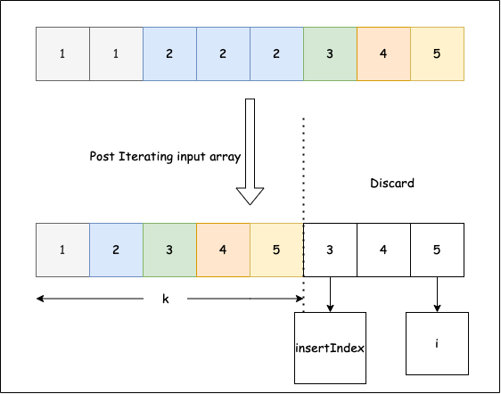

## Solution

------

#### Approach 1: Two Pointers

**Algorithm**

Since the array is already sorted, we can keep two pointers i*i* and j*j*, where i*i* is the slow-runner while j*j* is the fast-runner. As long as nums[i] = nums[j]*n**u**m**s*[*i*]=*n**u**m**s*[*j*], we increment j*j* to skip the duplicate.

When we encounter nums[j] \neq nums[i]*n**u**m**s*[*j*]\\=*n**u**m**s*[*i*], the duplicate run has ended so we must copy its value to nums[i + 1]*n**u**m**s*[*i*+1]. i*i* is then incremented and we repeat the same process again until j*j* reaches the end of array.

```java
public int removeDuplicates(int[] nums) {
    if (nums.length == 0) return 0;
    int i = 0;
    for (int j = 1; j < nums.length; j++) {
        if (nums[j] != nums[i]) {
            i++;
            nums[i] = nums[j];
        }
    }
    return i + 1;
}
```

**Complexity analysis**

- Time complextiy : O(n)*O*(*n*). Assume that n*n* is the length of array. Each of i*i* and j*j* traverses at most n*n* steps.
- Space complexity : O(1)*O*(1).

---
### Overview

The problem would have been simpler if we are allowed to use extra space.

We can create a map which stores all **unique array elements** as the key and **element frequency** as the value.

After populating our map, we get all the unique elements from our array.

We then iterate our map and push all the keys in our input array

However, without using extra space it makes it a bit tricky as we have to modify the existing input array

---

### Approach 1: Two indexes approach

#### Intuition

To solve the problem, let's look at the condition carefully,

> It is **guaranteed** that the given array is a **sorted array**.

Let `k` be the count of unique elements in our input array.

> It doesn't matter what elements we place after the first `k` elements.

From the condition, we can have a few observations here,

-   Since the array we have is sorted, all duplicate values will be one after the other.
    
-   We need to update the first `k` elements in an array with unique values and return the value of `k`.
    

Using the following intuition, let's understand how to address this problem.

-   The problem states that we need to fill the first `k` elements of an array with unique values
-   For doing so, we modify the input array in-place so that we don't use extra space
-   In order to perform in-place operations, we use the **Two indexes** approach
-   The **first index** updates the value in our input array while reading the data from the **second index**

> First Index is responsible for writing unique values in our input array, while Second Index will read the input array and pass all the distinct elements to First Index.

-   We continue the above steps until the **second index** reaches the end of an array

#### Algorithm

By analyzing the above three key observations, we can derive the following algorithm,

-   Start both indexes `(insertIndex, i)` from 1.

> `insertIndex` and `i` represents our First and second Index respectively.

-   Check if the previous element is different from the current element

> The previous element is the element just before our `i` index i.e element present at `arr[i-1]`

-   If found different then perform `arr[insertIndex] = arr[i]` and increment `insertIndex` by 1
    
-   Increment `i` index by 1 till we reach end of the array
    
    > Note: After reaching the end of the array, our **insertIndex** variable will hold the count of unique elements in our input array.
    
    
```c#
public class Solution {
    public int RemoveDuplicates(int[] nums) {
        int insertIndex = 1;
        for(int i = 1; i < nums.Length; i++){
            // We skip to next index if we see a duplicate element
            if(nums[i - 1] != nums[i]) {   
                /* Storing the unique element at insertIndex index and incrementing
                   the insertIndex by 1 */
                nums[insertIndex] = nums[i];  
                insertIndex++;
            }
        }
        return insertIndex;
    }
}
```
#### Complexity Analysis

Let NNN be the size of the input array.

-   Time Complexity: O(N)O(N)O(N), since we only have 2 pointers, and both the pointers will traverse the array at most once.
    
-   Space Complexity: O(1)O(1)O(1), since we are not using any extra space.