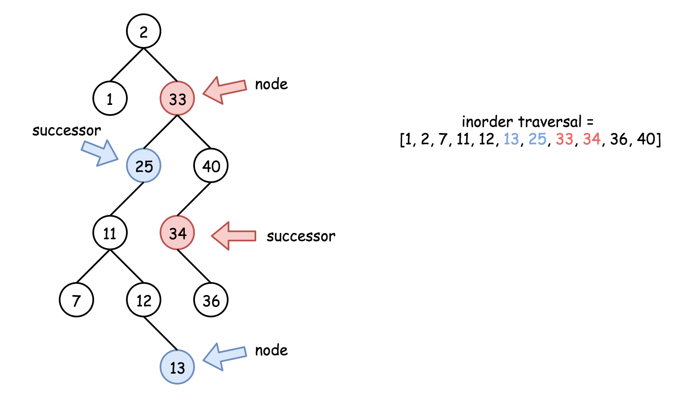
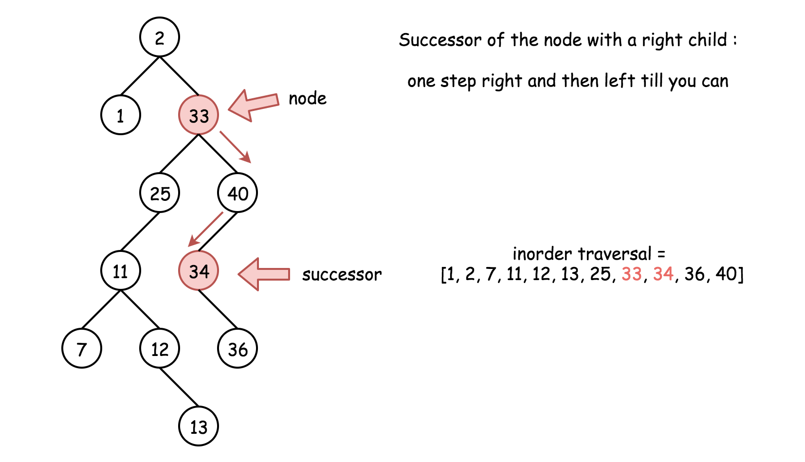
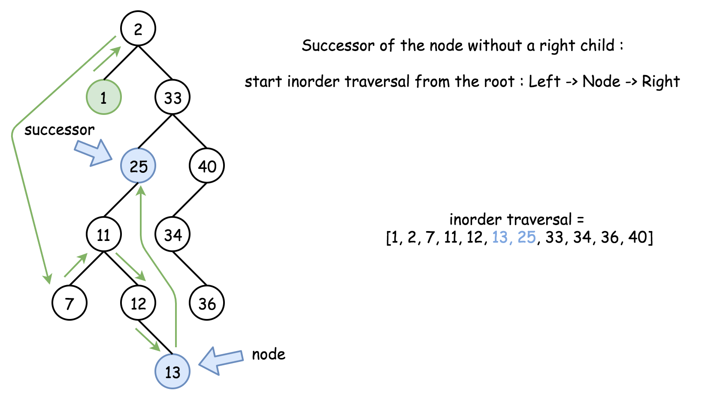

### Solution

---

#### Approach 1: Iterative Inorder Traversal

[Inorder traversal of BST is an array sorted in the ascending order](https://leetcode.com/articles/delete-node-in-a-bst/).

> Successor is the smallest node in the inorder traversal *after* the current one.

There could be two situations :

1. If the node has a right child, the successor is somewhere lower in the tree, see red nodes on the Fig. below.
2. Otherwise, the successor is somewhere upper in the tree, see blue nodes on the Fig.



Let's first check the simple case 1. To find a successor, go one step right and then left till you can.



This approach has O(*H*p*) time complexity, where Hp is a height of the node p.

Now let's consider the case 2. There is no access to the parent nodes here, and hence one has to traverse the tree starting from the root and *not* from the node.

[Inorder traversal could be implemented in three different ways: recursive, iterative and Morris](https://leetcode.com/articles/recover-binary-search-tree/). Here it's better to choose the iterative traversal in order to optimise the performance and minimize the space at the same time.

> Iterative inorder traversal is simple: go left till you can, and then one step right. Repeat till the end of nodes in the tree.

The idea is to keep just one previous node during the inorder traversal. If that previous node is equal to `p`, then the current node is a successor of `p`.



This approach has \mathcal{O}(H)O(*H*) time complexity, where H*H* is a tree height. Basically, this approach is universal and could be used for the case 1 as well. We simply don't do that because the approach 1 is faster.

**Algorithm**

- If the node has a right child, go one step right and then left till you can. Return the successor.
- Otherwise, implement iterative inorder traversal. While there are still nodes in the tree or in the stack:
  - Go left till you can, adding nodes in stack.
  - Pop out the last node. If its predecessor is equal to `p`, return that last node. Otherwise, save that node to be the predecessor in the next turn of the loop.
  - Go one step right.
- If we're here that means the successor doesn't exit. Return null.

```java
class Solution {
  public TreeNode inorderSuccessor(TreeNode root, TreeNode p) {
    // the successor is somewhere lower in the right subtree
    // successor: one step right and then left till you can
    if (p.right != null) {
      p = p.right;
      while (p.left != null) p = p.left;
      return p;
    }

    // the successor is somewhere upper in the tree
    ArrayDeque<TreeNode> stack = new ArrayDeque<>();
    int inorder = Integer.MIN_VALUE;

    // inorder traversal : left -> node -> right
    while (!stack.isEmpty() || root != null) {
      // 1. go left till you can
      while (root != null) {
        stack.push(root);
        root = root.left;
      }

      // 2. all logic around the node
      root = stack.pop();
      // if the previous node was equal to p
      // then the current node is its successor
      if (inorder == p.val) return root;
      inorder = root.val;

      // 3. go one step right
      root = root.right;
    }

    // there is no successor
    return null;
  }
}
```

**Complexity Analysis**

- Time complexity : O(*H**p*) in the best case, when node `p` has a right child. Here H_p*H**p* is a height of node `p`. O(*H*) in the worst case of no right child. Here H*H* is a tree height.
- Space complexity : O(1) in the best case, when node `p` has a right child. Otherwise, up to O(*H*) to keep the stack.