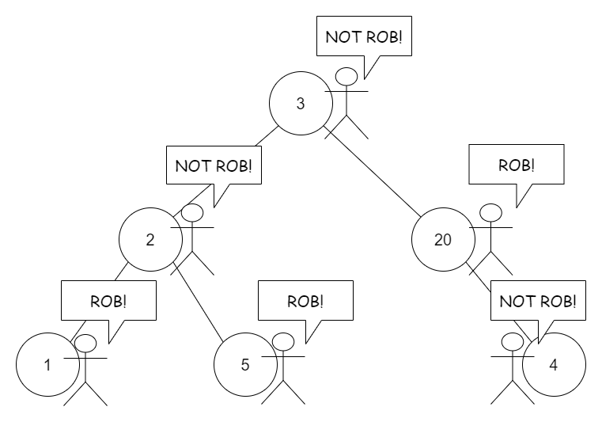
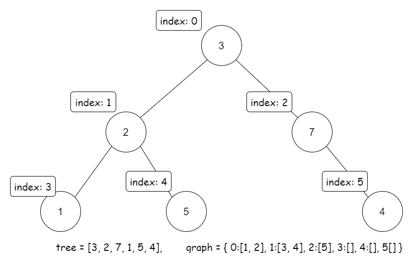
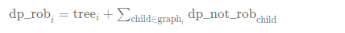
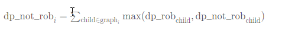
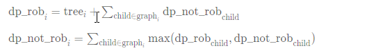

### Solution

---

### Overview

This problem is an extension of the original [House Robber Problem](https://leetcode.com/problems/house-robber/). In this problem, our poor thief does not have a straight street, but have a binary-tree-like area instead.

To help better understand the problem, below is an example robbing plan on a binary tree:



Well, it looks a bit more complicated. For problems related to the tree data structure, often we could apply the recursion. Also, due to the characteristic of this problem, the [memoization](https://en.wikipedia.org/wiki/Memoization) approach and the DP approach are available.

Below, we will discuss three approaches: *Recursion* , *Recursion with Memoization*, and *Dynamic Programming*. They are similar but have some differences. Generally, we recommend the first and the second approaches, and provide the third approach as an extension reading for interested readers.

----

#### Approach 1: Recursion

**Intuition**

In this part, we explain how to think of this approach step by step. If you are only interested in the pure algorithm, you can jump to the algorithm part.

Since the tree itself is a recursive data structure, usually recursion is used to tackle these tree-relative problems.

Now we need a recursive function, let's call it `helper` (or whatever you want to call it).

Usually, we use a node as the input to the `helper` and add other arguments if we need more information.

> The pseudo code of the common structure to solve recursive problems is as below:

```java
function helper(node, other_information) {
    // basic case, such as node is null
    if node is null:
        return things like 0 or null
    else:
        do something relates to helper(node.left) and helper(node.right)
}
function answerToProblem(root) {
    return helper(root, other_information)
}
```

> In some cases, we can use `answerToProblem` itself as the `helper` function.

OK, back to our problem. The next question is what should our `helper` function return.

Since the problem asks us to find out the maximum amount of money the thief can get, we could try using this maximum value as the return value of the `helper` function.

So `helper` receives a `node` as input, and returns the maximum amount the thief can get starting from this `node`.

Let's try writing the actual code. Well, it's a bit of trouble...

```java
function helper(node) { // return the maximum by starting from this node
    if node is null: // basic case
        return 0
    else:
        two choices: rob this node or not?
        if not rob... we have: helper(node.left) + helper(node.right)

        what if rob? we get node.val!
        what about node.left and node.right? we can not rob them.
        Hmm... maybe we need to touch node.left.left and its other siblings... troublesome!
}
```

If we need to touch the grandchildren of this node, the case becomes complicated. Well, it is not infeasible but requires extra effort and code. Often, the best practice is to only touch its children, not its grandchildren.

The ideal situation is to make `node.left` and `node.right` automatically handle the grandchildren for us.

How to do it? Well, we can let them know whether we robbed this node or not by passing this information as input, like this:

```java
    two choices: rob this node or not?

    rob = node.val + helper(node.left, parent_robbed=True)
                + helper(node.right,  parent_robbed=True)

    not_rob = helper(node.left, parent_robbed=False)
            + helper(node.right, parent_robbed=False)

    return max(rob, not_rob)
```

Cool, we also need to change the input correspondingly:

```java
function helper(node, the parent is robbed or not?) {
    // return the maximum by starting from this node
    tackle basic case...

    if the parent is robbed:
        we can not rob this node.
        return helper(node.left, False) + helper(node.right, False)

    if the parent is not robbed:
        two choices: rob this node or not?
        calculate `rob` and `not_rob`...
        return max(rob, not_rob)
}
```

Good, now we have a functioning code. But the code is still not perfect.

An obvious problem is that the `helper` is called too many times. Ideally, it should only be called as least as possible to reduce redundant calculations.

For example, when calculating `rob` and `not_rob`:

```
    rob = node.val + helper(node.left, True) + helper(node.right, True)
    not_rob = helper(node.left, False) + helper(node.right, False)
```

The `helper` is called four times. Moreover, when we call `helper(node.left, True)` and `helper(node.left, False)`, those two involve same calculations internally, such as `helper(node.left.left, False)`.

> In other words, `helper(node.left.left, False)` is called inside `helper(node.left, True)`, and also is called inside `helper(node.left, False)`. It is calculated twice! We do not want that.

What if... we can combine them together?

We return the results of `helper(node.left, True)` and `helper(node.left, False)` in a single function: `helper(node.left)`. Those two results can be stored in a two-element array.

```
function helper(node) {
    // return original [`helper(node.left, True)`, `helper(node.left, False)`]
    tackle basic case...
    left = helper(node.left)
    right = helper(node.right)
    some calculation...
    return [max_if_rob, max_if_not_rob]
}
```

In this case, we fully use the calculation results without redundant calculation.

> Also, you can reduce extra calculations by [memoization](https://en.wikipedia.org/wiki/Memoization) or by DP, which we will discuss in the following approaches.

**Algorithm**

Use a helper function which receives a node as input and returns a two-element array, where the first element represents the maximum amount of money the thief can rob if starting from this node without robbing this node, and the second element represents the maximum amount of money the thief can rob if starting from this node and robbing this node.

The basic case of the helper function should be `null` node, and in this case, it returns two zeros.

Finally, call the `helper(root)` in the main function, and return its maximum value.

```java
class Solution {
    public int[] helper(TreeNode node) {
        // return [rob this node, not rob this node]
        if (node == null) {
            return new int[] { 0, 0 };
        }
        int left[] = helper(node.left);
        int right[] = helper(node.right);
        // if we rob this node, we cannot rob its children
        int rob = node.val + left[1] + right[1];
        // else, we free to choose rob its children or not
        int notRob = Math.max(left[0], left[1]) + Math.max(right[0], right[1]);

        return new int[] { rob, notRob };
    }

    public int rob(TreeNode root) {
        int[] answer = helper(root);
        return Math.max(answer[0], answer[1]);
    }
}
```

**Complexity Analysis**

Let N*N* be the number of nodes in the binary tree.

- Time complexity: O(*N*) since we visit all nodes once.
- Space complexity: O(*N*) since we need stacks to do recursion, and the maximum depth of the recursion is the height of the tree, which is O(*N*) in the worst case and O(log(*N*)) in the best case.

---

#### Approach 2: Recursion with Memoization

**Intuition**

Recall in the later part of approach 1, we have the following `helper` function:

```
function helper(node, the parent is robbed or not?) {
    // return the maximum by starting from this node
    tackle basic case...
    if the parent is robbed:
        return helper(node.left, True) + helper(node.right, True)

    if the parent is not robbed:
        two choices: rob this node or not?
        calculate `rob` and `not_rob`...
        return max(rob, not_rob)
}
```

However, this code is not good since it involves some redundant calculations. Improvements are needed.

To avoid those redundant calculations, using memoization is an option. i.e., save the results of the functions in hash maps, and return the stored results when are called next time.

> You can also add memoization to the "grandchildren" method we mentioned in approach 1. That would be another functioning approach. There is a lot of possibilities.

**Algorithm**

Use a helper function which receives a node and a bool variable as input, and if that variable is true, it returns the maximum amount of money the thief can rob if starting from this node and robbing this node, else returns the maximum amount of money the thief can rob if starting from this node without robbing this node.

The result of this helper function would be saved in the maps, and return from the maps when are called next time.

The basic case of the helper function should be `null` node, and in this case, it returns zero.

Finally, call the `helper(root)` in the main function, and return its value.

```java
class Solution {
    HashMap<TreeNode, Integer> robResult = new HashMap<>();
    HashMap<TreeNode, Integer> notRobResult = new HashMap<>();

    public int helper(TreeNode node, boolean parentRobbed) {
        if (node == null) {
            return 0;
        }
        if (parentRobbed) {
            if (robResult.containsKey(node)) {
                return robResult.get(node);
            }
            int result = helper(node.left, false) + helper(node.right, false);
            robResult.put(node, result);
            return result;
        } else {
            if (notRobResult.containsKey(node)) {
                return notRobResult.get(node);
            }
            int rob = node.val + helper(node.left, true) + helper(node.right, true);
            int notRob = helper(node.left, false) + helper(node.right, false);
            int result = Math.max(rob, notRob);
            notRobResult.put(node, result);
            return result;
        }
    }

    public int rob(TreeNode root) {
        return helper(root, false);
    }
}
```

**Complexity Analysis**

Let N*N* be the number of nodes in the binary tree.

- Time complexity: O(*N*) since we run the `helper` function for all nodes once, and saved the results to prevent the second calculation.
- Space complexity: O(*N*) since we need two maps with the size of O(*N*) to store the results, and O(*N*) space for stacks to start recursion.

---

#### Approach 3: Dynamic Programming

**Intuition**

As we mentioned before, we could also apply the Dynamic Programming (DP) algorithm to this problem. Tree DP is a good method to tackle some tree problems.

> Technically, the memoization approach we mentioned above can also be viewed as a DP approach. However, in this approach, we use DP arrays to generalize it.

> This approach is a little hard, and you can treat it as extra reading for interested readers.

To perform a tree DP, we still need DP arrays, and by filling these arrays to get the final result.

Here we create two arrays: `dp_rob` and `dp_not_rob`.

`dp_rob[i]` represents the max money we can rob if we start from node `i` and rob this node.

`dp_not_rob[i]` represents the max money we can rob if we start from node `i` and do not rob this node.

Here comes a question: what is node `i`? We do not have an index `i` for each node.

It seems like we need to index or map the nodes in the tree to some integers.

Well, there are many available mapping methods. Of course, you can choose whatever kind of mapping you want.

Below is the mapping we use in this approach: From left to right, from up to down:


.png)

This mapping is used in many situations, such as heap and segment tree, where you store a tree in an array.

The Breadth-First Search (BFS) suffices to construct this mapping.

> In some cases, we are provided with an array of node's values and a hashmap storing the relationship between nodes. If so, we can directly perform the dp since we already have the mapping.
>
> However, in this problem, we have to use a lot of code to construct the mapping.

Also, we need to build a graph to store the relationships between those integers -- the parents and children's relationships:



OK. Now we have two questions remained: the basic cases of our DP, and the transition equations.

For the first question, the basic cases should be leaf nodes. For those leaf nodes, `dp_rob[i]` is just `node.val`, and `dp_not_rob[i]` is 0.

For the the transition equations, let's say we need to calculate `dp_rob[i]` and `dp_not_rob[i]`.

If we want to rob node `i`, then we can not rob its children. Each child provides `dp_not_rob[child]`. Therefore:



If we do not want to rob node `i`, then we can choose to rob its children or not. In this case, each child provides the maximum of `dp_rob[child]` and `dp_not_rob[child]`.

Therefore:



Note that the child's index is always larger than the parent's index in our mapping, so we should iterate the dp arrays backward.

**Algorithm**

Transform the tree from node-based into an array-based `tree` and a map `graph`.

Then create two DP arrays, where `dp_rob[i]` represents the maximum amount of money the thief can rob if starting from node `i` with robbing this node, and `dp_not_rob[i]` represents the maximum amount of money the thief can rob if starting from node `i` without robbing this node.

The transition equations is:



Finally, return the maximum of `dp_rob[0]` and `dp_not_rob[0]`.

```java
class Solution {
    public int rob(TreeNode root) {
        if (root == null) {
            return 0;
        }
        // reform tree into array-based tree
        ArrayList<Integer> tree = new ArrayList<>();
        HashMap<Integer, ArrayList<Integer>> graph = new HashMap<>();
        graph.put(-1, new ArrayList<>());
        int index = -1;
        // we use two Queue to store node and index
        Queue<TreeNode> q_node = new LinkedList<>();
        q_node.add(root);
        Queue<Integer> q_index = new LinkedList<>();
        q_index.add(index);

        while (q_node.size() > 0) {
            TreeNode node = q_node.poll();
            int parentIndex = q_index.poll();
            if (node != null) {
                index++;
                tree.add(node.val);
                graph.put(index, new ArrayList<>());
                graph.get(parentIndex).add(index);
                // push new node into Queue
                q_node.add(node.left);
                q_index.add(index);
                q_node.add(node.right);
                q_index.add(index);
            }
        }

        // represent the maximum start by node i with robbing i
        int[] dpRob = new int[index + 1];

        // represent the maximum start by node i without robbing i
        int[] dpNotRob = new int[index + 1];

        for (int i = index; i >= 0; i--) {
            ArrayList<Integer> children = graph.get(i);
            if (children == null || children.size() == 0) {
                // if is leaf
                dpRob[i] = tree.get(i);
                dpNotRob[i] = 0;
            } else {
                dpRob[i] = tree.get(i);
                for (int child : children) {
                    dpRob[i] += dpNotRob[child];
                    dpNotRob[i] += Math.max(dpRob[child], dpNotRob[child]);
                }
            }
        }

        return Math.max(dpRob[0], dpNotRob[0]);
    }
}
```

**Complexity Analysis**

Let N*N* be the number of nodes in the binary tree.

- Time complexity: O(*N*) since we visit all nodes once to form the tree-array, and then iterate two DP array, which both have length O(*N*).
- Space complexity: O(*N*) since we need an array of length O(*N*) to store the tree, and two DP arrays of length O(*N*). Also, the sizes of other data structures in code do not exceed O(*N*).