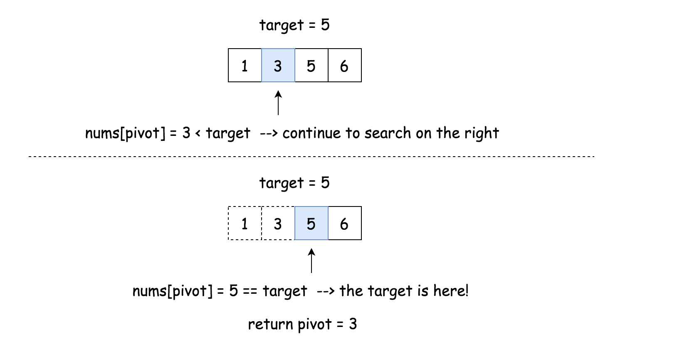
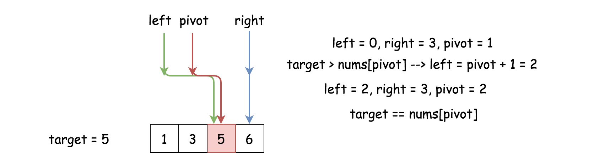
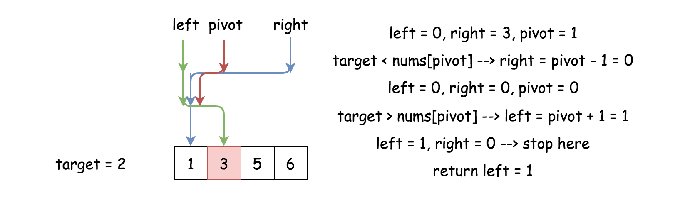

### Solution

---

#### Approach 1: Binary Search

**Intuition**

Based on the description of the problem, we can see that it could be a good match with the [binary search](https://en.wikipedia.org/wiki/Binary_search_algorithm) algorithm.

> Binary search is a search algorithm that find the position of a target value within a *sorted* array.

Usually, within binary search, we compare the target value to the middle element of the array at each iteration.

- If the target value is equal to the middle element, the job is done.
- If the target value is less than the middle element, continue to search on the left.
- If the target value is greater than the middle element, continue to search on the right.

Here we showcase a simple example on how it works.



To mark the search boundaries, one could use two pointers: `left` and `right`. Starting from `left = 0` and `right = n - 1`, we then move either of the pointers according to various situations:

- While `left <= right`:
  - Pivot index is the one in the middle: `pivot = (left + right) / 2`. The pivot also divides the original array into two subarray.
  - If the target value is equal to the pivot element: `target == nums[pivot]`, we're done.
  - If the target value is less than the pivot element `target < nums[pivot]`, continue to search on the left subarray by moving the right pointer `right = pivot - 1`.
  - If the target value is greater than the pivot element `target > nums[pivot]`, continue to search on the right subarray by moving the left pointer `left = pivot + 1`.



> What if the target value is not found?

In this case, the loop will be stopped at the moment when `right < left` and `nums[right] < target < nums[left]`. Hence, the proper position to insert the target is at the index `left`.



**Integer Overflow**

Let us now stress the fact that `pivot = (left + right) // 2` works fine for Python3, which has arbitrary precision integers, but it could cause some issues in Java and C++.

If `left + right` is greater than the maximum int value 2^{31} - 1231−1, it overflows to a negative value. In Java, it would trigger an exception of `ArrayIndexOutOfBoundsException`, and in C++ it causes an illegal write, which leads to memory corruption and unpredictable results.

Here is a simple way to fix it:

```java
pivot = left + (right - left) / 2;
```

and here is a bit more complicated but probably faster way using the bit shift operator.

```java
pivot = (right + left) >>> 1;
```

**Algorithm**

- Initialize the `left` and `right` pointers : `left = 0`, `right = n - 1`.
- While `left <= right`:
  - Compare middle element of the array `nums[pivot]` to the target value `target`.
    - If the middle element *is* the target, *i.e.* `target == nums[pivot]`: return `pivot`.
    - If the target is not here:
      - If `target < nums[pivot]`, continue to search on the left subarray. `right = pivot - 1`.
      - Else continue to search on the right subarray. `left = pivot + 1`.
- Return `left`.

```java
class Solution {
  public int searchInsert(int[] nums, int target) {
    int pivot, left = 0, right = nums.length - 1;
    while (left <= right) {
      pivot = left + (right - left) / 2;
      if (nums[pivot] == target) return pivot;
      if (target < nums[pivot]) right = pivot - 1;
      else left = pivot + 1;
    }
    return left;
  }
}
```

**Complexity Analysis**

- Time complexity : \mathcal{O}(\log N)O(log*N*).

  Let us compute the time complexity with the help of [master theorem](https://en.wikipedia.org/wiki/Master_theorem_(analysis_of_algorithms)) T(N) = aT\left(\frac{N}{b}\right) + \Theta(N^d)*T*(*N*)=*a**T*(*b**N*)+Θ(*N**d*). The equation represents dividing the problem up into a*a* subproblems of size \frac{N}{b}*b**N* in \Theta(N^d)Θ(*N**d*) time. Here at each step there is only one subproblem *i.e.* `a = 1`, its size is a half of the initial problem *i.e.* `b = 2`, and all this happens in a constant time *i.e.* `d = 0`. As a result, \log_b{a} = dlog*b**a*=*d* and hence we're dealing with [case 2](https://en.wikipedia.org/wiki/Master_theorem_(analysis_of_algorithms)#Case_2_example) that results in \mathcal{O}(n^{\log_b{a}} \log^{d + 1} N)O(*n*log*b**a*log*d*+1*N*) = \mathcal{O}(\log N)O(log*N*) time complexity.

- Space complexity : \mathcal{O}(1)O(1) since it's a constant space solution.