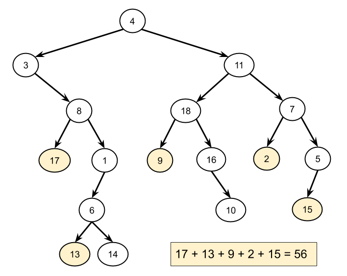
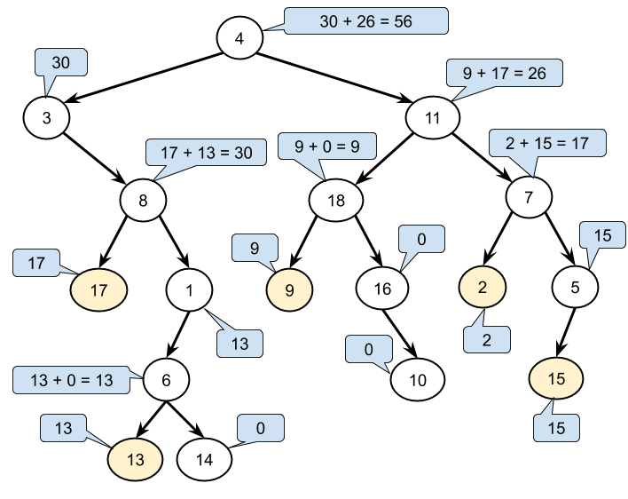

### Solution

Recall that a binary tree is made up of *linked tree nodes*, where each node has a reference to its `left child` and to its `right child`. We access the child nodes by using `root.left` and `root.right`. Tree traversal algorithms are used to explore all nodes in the tree. If you're completely confused now, we recommend checking out our [Binary Tree Explore Card](https://leetcode.com/explore/learn/card/data-structure-tree/) and then coming back to this question.

#### Approach 1: Iterative Tree Traversal (Pre-order)

**Intuition**

Here is an example of a binary tree. The left-leaf nodes are highlighted. Our task is to find all of these left-leaf nodes, add together their values, and return the final sum we get.



To get each left-leaf node's value, we need to "visit" each one. Note that because it is a sum we need, the order we visit the left-leaf nodes in doesn't matter. As such, we can pick any algorithm that visits all nodes of the tree. The simplest such algorithm is an iterative pre-order traversal (if you're not sure what this is, check out the [Binary Tree Explore Card](https://leetcode.com/explore/learn/card/data-structure-tree/134/traverse-a-tree/992/#pre-order-traversal)).

When we visit each node, we'll need to know whether or not it is a left-leaf node: this is the main challenge in this problem. Remember that once we're on a node, there is no link back up to its parent. This means that given a node, it is impossible to check whether or not it is a left node unless we have an existing reference to its parent. There are a couple of strategies for handling this problem:

1. While we're at a node, we can check if its left-child is a leaf node (instead of trying to check if the node itself is a left child).
2. When we're ready to visit the children of a node, we can pass some extra information down telling the left child that it is a left child.

The second strategy works well for the recursive implementation (Approach 2), but the first strategy is the best for the iterative, so is what we'll go with here.

Anyway, to do an iterative pre-order traversal, we start by putting the root onto a stack. Then, while the stack is non-empty, we take a node off the top, check if the node's left child is a leaf node and then add that child's value to a total if it is. Finally, we put the node's left child and right child onto the stack so that they can be visited too. Here is the algorithm in pseudocode.

```
define function sum_of_left_leaves(root):
    
    stack = a new stack
    push root to stack
    total = 0

    while the stack is non-empty:
        node = pop a node of stack
        if node.left exists and node.left is a leaf:
            total = total + node.left.value
        if node.right exists:
            push node.right to stack
        if node.left exists:
            push node.left to stack

    return total
```

Note that it doesn't matter whether we put the left or right child on the stack first. We just chose to put right and then left so that left is the next off, thus matching the standard pre-order traversal code template.

Here is an animation of this approach in action!
A pre-order traversal is a type of depth-first tree traversal. This is because it uses a stack to keep track of unvisited nodes. Alternatively, we could have used a breadth-first tree traversal; using a queue to keep track of unvisited nodes instead of a stack. This works because while the nodes are visited in a different order, this doesn't matter, as discussed above. In fact, we could have used any data structure that allowed us to put an unvisited node in and take a node out to visit.

**Algorithm**

This code uses a stack to keep track of the unvisited nodes. You could, however, replace it with a queue and the algorithm would still work (but would process the nodes in a different order). In Java, we use a Deque like a stack, instead of using Stack (Stack is deprecated).

```Java
class Solution { 
    
  private boolean isLeaf(TreeNode node) {
    return node != null && node.left == null && node.right == null;
  }

  public int sumOfLeftLeaves(TreeNode root) {

    if (root == null) {
      return 0;
    }

    int total = 0;
    Deque<TreeNode> stack = new ArrayDeque<>();
    stack.push(root);

    while (!stack.isEmpty()) {
      TreeNode subRoot = stack.pop();
      // Check if the left node is a leaf node.
      if (isLeaf(subRoot.left)) {
        total += subRoot.left.val;
      }
      // If the right node exists, put it on the stack.
      if (subRoot.right != null) {    
        stack.push(subRoot.right);
      }
      // If the left node exists, put it on the stack.
      if (subRoot.left != null) {
        stack.push(subRoot.left);
      }
    }

    return total;
  }
}
```
**Complexity Analysis**

Let N be the number of nodes in the tree.

* Time complexity : O(N).

    Each node is put onto the stack once, by its parent node. We know each node only has one parent because this is a tree. Therefore, each node is only taken off, and processed, once. Processing a node is an O(1) operation. Therefore, we get a total time complexity of O(1)=O(N).

* Space complexity : O(N).

    Remember that in complexity analysis, we're always looking at the worst case. The worst-case tree is one where we have a long "strand" of left nodes, with each having a single right node. On one of these trees, the algorithm will work its way down the left nodes first, having at most one of them on the stack at a time. However, every right node that it encounters will be placed on the stack. With half of the nodes being these right nodes, the space used is proportional to the number of nodes in the tree, giving us a space complexity of O(N)O(N).

For the problem we've been given here on LeetCode, we haven't been told whether or not the input tree is balanced (most non-leaf nodes having 2 children, thus minimizing the maximum depth). Therefore, we have to assume it is not. **However**, in an interview, you might be asked what the time and space complexity are if the input was guaranteed to be a balanced tree. If it is, balanced, then the time complexity remains the same (we still have to visit all NN nodes), but the space complexity becomes O(D), where DD is the maximum depth. This is equivalent to O(logN).


#### Approach 2: Recursive Tree Traversal (Pre-order)
**Intuition**

Another way of traversing a tree is to use recursion to visit each node. If you're not familiar with recursion on trees, check out the Binary Trees Explore Card.

Recall that recursive tree algorithms work by treating each node of the tree as the root of a subtree. The answer (i.e. the sum of left leaf node values) is then found for each subtree by finding the answers for the left and right subtrees and combining (adding) them together.



To implement a recursive function, we need to identify the base cases and recursive cases.

The base case is that this subtree is a leaf node (i.e. the subtree only contains a single node; its root node). The value we return for it depends on whether this subtree was to the left or the right of its parent. If it was to the left, we return its value. If it was to the right, we return zero.

The recursive case is that this subtree contains a left and/or right subtree (i.e. the subtree has more than just the root node in it). We call the recursive function on the left and right subtrees, add their results together and return the added result.

Like before though, we still have the problem of knowing whether or not the current subtree was to the left of its parent. With recursion though, there is a far more elegant solution than before: we can simply have an additional boolean parameter on our recursive function, specifying whether or not the subtree is a left one! Note that the top subtree is neither a left node, nor a right node, but we pass in false for it, as the purpose of the parameter is to specify whether or not it is a left subtree.

```
define function sum_of_left_leaves(root):
    return process_subtree(root, false)

define function process_subtree(subtree, is_left):
    if subtree is a leaf node:
        if is_left is true:
            return subtree.value
        else:
            return 0
    else:
        total = 0
        if subtree.left exists:
            total = total + process_subtree(subtree.left, true)
        if subtree.right exists:
            total = total + process_subtree(subtree.right, false)
        return total
```
Notice too that we don't need a global variable to keep track of the total; by returning the total for each subtree, the final total returned will be the total for the root node, which is the answer.

Here is an animation showing how it works.

Algorithm

Here is the algorithm, as we described it above.

```Java
class Solution { 
    
  public int sumOfLeftLeaves(TreeNode root) {
    if (root == null) {
      return 0;
    }
    return processSubtree(root, false);
  }
    
  private int processSubtree(TreeNode subtree, boolean isLeft) {
        
    // Base case: This is a leaf node.
    if (subtree.left == null && subtree.right == null) {
      return isLeft ? subtree.val : 0;
    }
        
    // Recursive case: We need to add and return the results of the
    // left and right subtrees.
    int total = 0;
    if (subtree.left != null) {
      total += processSubtree(subtree.left, true);
    }
    if (subtree.right != null) {
      total += processSubtree(subtree.right, false);
    }
    return total;
  }
}
```

We can simplify the code a bit by defining an additional base case: if the subtree is empty (null), then `0` should be returned. This means we no longer need to do null-checks in three separate places. This is a pattern you will see a lot for recursive tree algorithms.

```java
class Solution { 
    
  public int sumOfLeftLeaves(TreeNode root) {
    return processSubtree(root, false);
  }
    
  private int processSubtree(TreeNode subtree, boolean isLeft) {
    
    // Base case: This is an empty subtree.
    if (subtree == null) {
      return 0;
    }
    
    // Base case: This is a leaf node.
    if (subtree.left == null && subtree.right == null) {
      return isLeft ? subtree.val : 0;
    }
    
    // Recursive case: We need to add and return the results of the
    // left and right subtrees.
    return processSubtree(subtree.left, true) + processSubtree(subtree.right, false);
  }
}
```

Complexity Analysis

Let NN be the number of nodes.

* Time complexity : O(N).

    The code within the recursive function is all O(1)O(1). The function is called exactly once for each of the NN nodes. Therefore, the total time complexity of the algorithm is O(N)O(N).

* Space complexity : O(N).

    In the worst case, the tree consists of nodes that form a single deep strand. In this case, the runtime-stack will have NN calls to processSubtree(...) on it at the same time, giving a worst-case space complexity of O(N).


#### Approach 3: Morris Tree Traversal (Pre-order)
**Intuition**

Note that this approach is quite advanced. Feel free to skip it if you're just starting out!

All of the algorithms we've looked at so far had a time complexity of O(N), and a space complexity of O(N).

We know it is impossible to reduce the time complexity any further, as we need to visit each node to access all the nodes.

The space complexity might initially seem impossible to reduce, as when a node has two children, we need to explore one immediately, and keep track of the other for exploration afterward (often, we explore the left subtree first, and keep track of the right subtree for later). Going down the tree, we can end up with many of these child nodes awaiting exploration. However, there is a tree traversal algorithm that requires O(N) time and only O(1) space: Morris Tree Traversal.

This traversal algorithm works by temporarily modifying the input tree so that before we explore a left subtree, we find the subtree root's in-order predecessor (which will never have a right child), and make its right link point back up to the root. Then we explore the left subtree. When we're done exploring the left subtree, the link back up to the root will then allow us to explore the right subtree. When we follow the link back up, we also remove it so that the input tree is restored. In this way, we can no longer need an auxiliary data structure to keep track of the right subtrees.

Given that this algorithm modifies the input tree, will we still be able to identify which nodes are left-leaves? As it turns out we still can. Whenever we reach a node for the first time, we know we haven't yet looked at its left subtree, and so have not modified it. Therefore, we can simply check if the left child is a leaf node, in the same way we did before.

For more information on this algorithm, check out [Approach 2 in the Preorder Traversal Solution Article](https://leetcode.com/problems/binary-tree-preorder-traversal/solution/).

```Java
class Solution {
  public int sumOfLeftLeaves(TreeNode root) {
    int totalSum = 0;
    TreeNode currentNode = root;
    while (currentNode != null) {
      // If there is no left child, we can simply explore the right subtree
      // without needing to worry about keeping track of currentNode's other
      // child.
      if (currentNode.left == null) {
        currentNode = currentNode.right;
      } else {
        TreeNode previous = currentNode.left;
        // Check if this left node is a leaf node.
        if (previous.left == null && previous.right == null) {
          totalSum += previous.val;
        }
        // Find the inorder predecessor for currentNode.
        while (previous.right != null && !previous.right.equals(currentNode)) {
          previous = previous.right;
        }
        // We've not yet visited the inorder predecessor. This means that we 
        // still need to explore currentNode's left subtree. Before doing this,
        // we will put a link back so that we can get back to the right subtree
        // when we need to.
        if (previous.right == null) {
          previous.right = currentNode;
          currentNode = currentNode.left;
        }
        // We have already visited the inorder predecessor. This means that we
        // need to remove the link we added, and then move onto the right
        // subtree and explore it.
        else {
          previous.right = null;
          currentNode = currentNode.right;
        }
      }
    }
    return totalSum;
  }
}
```

**Complexity Analysis**

* Time complexity : O(N).

    Each node is visited at least once; with some nodes visited twice to remove the added links and move back up to the subtree root. However, no node is visited more than twice, so our time complexity is O(N).

* Space complexity : O(1).

    We are only using constant extra space.

    Note that while the input is modified, it is restored after the algorithm has finished running. The downside of this is that it is not thread-safe. Any other thread that needs to access the tree will have to wait until this algorithm has finished running. For applications that must support concurrent access, this is almost certainly not worth it given the availability of thread-safe alternatives.


