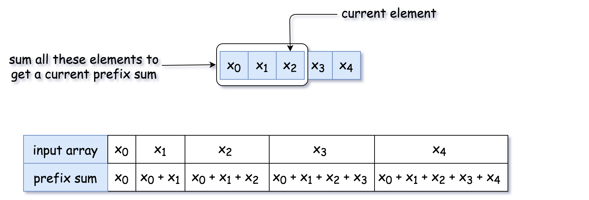
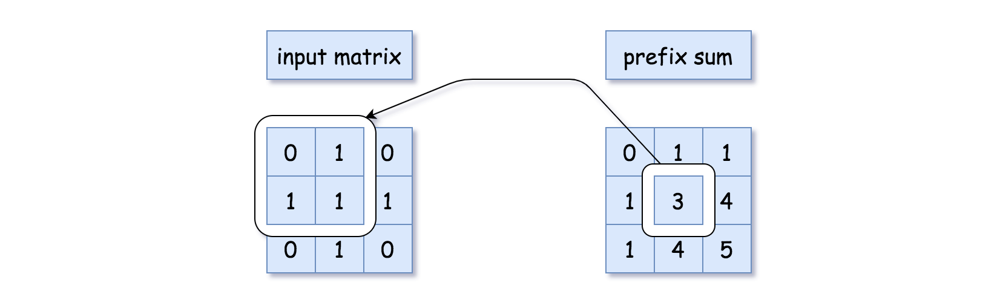
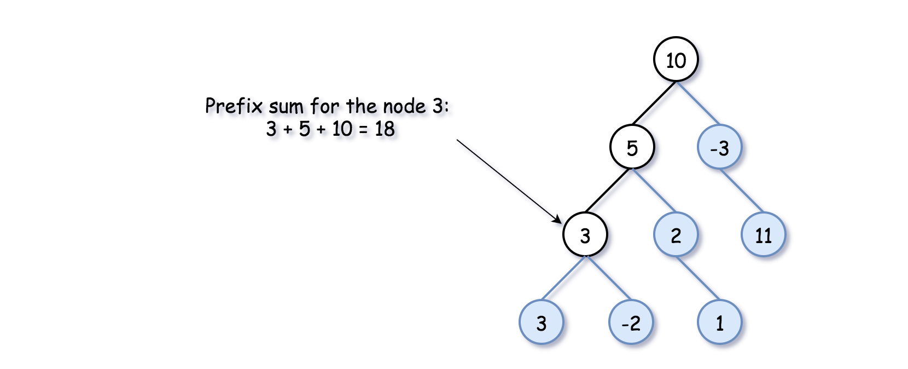
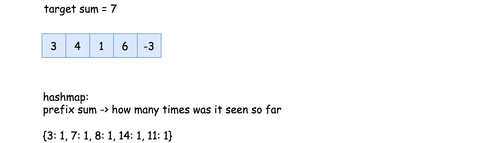
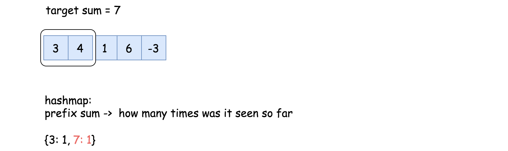
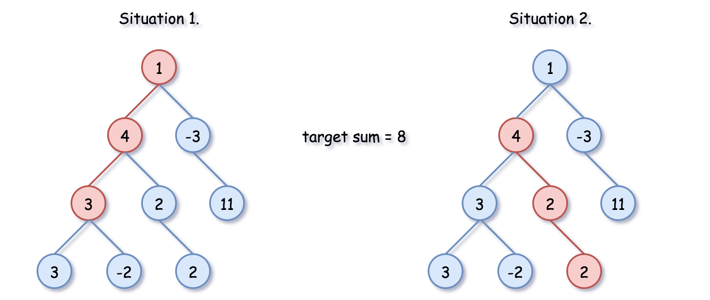

# Prefix Sum Technology

In this article, we're going to discuss simple but powerful prefix sum technique: one pass + linear time complexity.

Prefix sum is a sum of the current value with all previous elements starting from the beginning of the structure.

It could be defined for 1D arrays (sum the current value with all the previous integers),

for 2D arrays (sum of the current value with the integers above or on the left)

or for the binary trees (sum the values of the current node
and all parent nodes),



##### Prefix Sum: How to Use: Number of Continuous Subarrays that Sum to Target

You might want to use the prefix sum technique for the problems like "Find a number of continuous subarrays/submatrices/tree paths that sum to target".

Before going to the current problem with the tree, let's check the idea on a simpler example Find a number of continuous subarrays that sum to target.

* Use a variable to track the current prefix sum and a hashmap "prefix sum -> how many times was it seen so far".


* Parse the input structure and count the requested subarrays/submatrices/tree paths along the way with the help of that hashmap. How to count?

There could be two situations. In situation 1, the subarray with the target sum starts from the beginning of the array. That means that the current prefix sum is equal to the target sum, and we increase the counter by 1.




In situation 2, the subarray with the target sum starts somewhere in the middle. That means we should add to the counter the number of times we have seen the prefix sum `curr_sum - target` so far: `count += h[curr_sum - target]`.

The logic is simple: the current prefix sum is `curr_sum`, and some elements before the prefix sum was `curr_sum - target`. All the elements in between sum up to `curr_sum - (curr_sum - target) = target`.

### Solution for Number of Continuous Subarrays that Sum to Target

```Java
public class Solution {
    public int subarraySum(int[] nums, int k) {
        int count = 0, currSum = 0;
        HashMap<Integer, Integer> h = new HashMap();
        
        for (int num : nums) {
            // current prefix sum
            currSum += num;
            
            // situation 1:  
            // continuous subarray starts 
            // from the beginning of the array
            if (currSum == k)
                count++;
            
            // situation 2:
            // number of times the curr_sum − k has occured already, 
            // determines the number of times a subarray with sum k 
            // has occured upto the current index
            count += h.getOrDefault(currSum - k, 0);
            
            // add the current sum
            h.put(currSum, h.getOrDefault(currSum, 0) + 1);    
        }
                
        return count;
    }
}
```

# Solution for 437

Now let's reuse the same algorithm and the same code for the case of the binary tree.

There is just one thing that is particular for the binary tree. There are two ways to go forward - to the left and to the right. To keep parent->child direction, we shouldn't blend prefix sums from the left and right subtrees in one hashmap.

### algorithm

* Let's initialize tree paths counter `count = 0`, and the hashmap h "prefix sum -> how many times was it seen so far".

* One could parse the tree using recursive preorder traversal: node -> left -> right: preorder(node: TreeNode, curr_sum: int) -> None. This function takes two arguments: a tree node and a prefix sum before that node. To start the recursion chain, one should call preorder(root, 0).

    * The first thing is to update the current prefix sum by adding the value of the current node: `curr_sum += node.val`.

    * Now one could update the counter. One should consider two situations.
     
      In situation 1, the tree path with the target sum starts from the root. That means the current prefix sum is equal to the target sum curr_sum == k, so one should increase the counter by 1: count += 1.
      
      In situation 2, the tree path with the target sum starts somewhere downwards. That means we should add to the counter the number of times we have seen the prefix sum `curr_sum - target` so far: `count += h[curr_sum - target]`.
      
      The logic is simple: the current prefix sum is `curr_sum`, and several elements before the prefix sum was `curr_sum - target`. All the elements in between sum up to `curr_sum - (curr_sum - target) = target`.

    * Now it's time to update the hashmap: `h[curr_sum] += 1`.

    * Let's parse left and right subtrees: `preorder(node.left, curr_sum)`, `preorder(node.right, curr_sum)`.

    * Now the current subtree is processed. It's time to remove the current prefix sum from the hashmap, in order not to blend the parallel   subtrees: `h[curr_sum] -= 1`.

* Now the preorder traversal is done, and the counter is updated. Return it.



##### Java Solution
```Java
class Solution {
    int count = 0;
    int k;
    HashMap<Integer, Integer> h = new HashMap();
    
    public void preorder(TreeNode node, int currSum) {
        if (node == null)
            return;
        
        // current prefix sum
        currSum += node.val;

        // here is the sum we're looking for
        if (currSum == k)
            count++;
        
        // number of times the curr_sum − k has occured already, 
        // determines the number of times a path with sum k 
        // has occured upto the current node
        count += h.getOrDefault(currSum - k, 0);
        
        // add the current sum into hashmap
        // to use it during the child nodes processing
        h.put(currSum, h.getOrDefault(currSum, 0) + 1);

        // process left subtree
        preorder(node.left, currSum);
        // process right subtree
        preorder(node.right, currSum);

        // remove the current sum from the hashmap
        // in order not to use it during 
        // the parallel subtree processing
        h.put(currSum, h.get(currSum) - 1);
    }    
            
    public int pathSum(TreeNode root, int sum) {
        k = sum;
        preorder(root, 0);
        return count;
    }
}
```