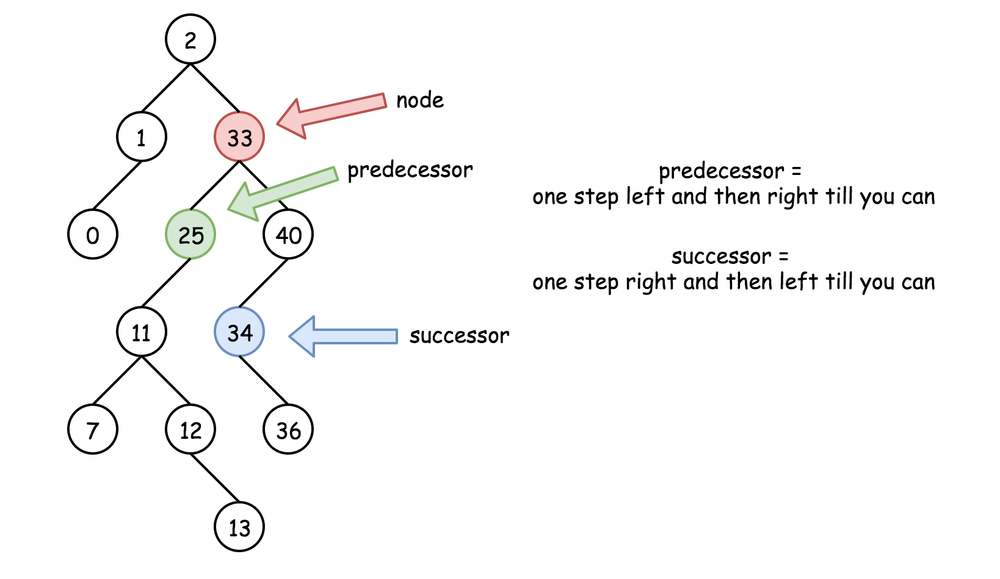

### Solution

---

#### Three facts to know about BST

Here is list of facts which are better to know before the interview.

> Inorder traversal of BST is an array sorted in the ascending order.

To compute inorder traversal follow the direction `Left -> Node -> Right`.

```java
public LinkedList<Integer> inorder(TreeNode root, LinkedList<Integer> arr) {
  if (root == null) return arr;
  inorder(root.left, arr);
  arr.add(root.val);
  inorder(root.right, arr);
  return arr;
}  
```


> Successor = "after node", i.e. the next node, or **the smallest node *after* the current one**.

It's also the *next* node in the inorder traversal. To find a successor, go to the right once and then as many times to the left as you could.

```java
public int successor(TreeNode root) {
  root = root.right;
  while (root.left != null) root = root.left;
  return root;
} 
```

> Predecessor = "before node", i.e. the previous node, or **the largest node *before* the current one**.

It's also the *previous* node in the inorder traversal. To find a predecessor, go to the left once and then as many times to the right as you could.

```java
public int predecessor(TreeNode root) {
  root = root.left;
  while (root.right != null) root = root.right;
  return root;
} 
```



#### Approach 1: Recursion

**Intuition**

There are three possible situations here :

- Node is a leaf, and one could delete it straightforward : `node = null`.


- Node is not a leaf and has a right child. Then the node could be replaced by its *successor* which is somewhere lower in the right subtree. Then one could proceed down recursively to delete the successor.


- Node is not a leaf, has no right child and has a left child. That means that its *successor* is somewhere upper in the tree but we don't want to go back. Let's use the *predecessor* here which is somewhere lower in the left subtree. The node could be replaced by its *predecessor* and then one could proceed down recursively to delete the predecessor.


**Algorithm**

- If `key > root.val` then delete the node to delete is in the right subtree `root.right = deleteNode(root.right, key)`.
- If `key < root.val` then delete the node to delete is in the left subtree `root.left = deleteNode(root.left, key)`.
- If `key == root.val` then the node to delete is right here. Let's do it :
  - If the node is a leaf, the delete process is straightforward : `root = null`.
  - If the node is not a leaf and has the right child, then replace the node value by a successor value `root.val = successor.val`, and then recursively delete the successor in the right subtree `root.right = deleteNode(root.right, root.val)`.
  - If the node is not a leaf and has only the left child, then replace the node value by a predecessor value `root.val = predecessor.val`, and then recursively delete the predecessor in the left subtree `root.left = deleteNode(root.left, root.val)`.
- Return `root`.


```java
class Solution {
  /*
  One step right and then always left
  */
  public int successor(TreeNode root) {
    root = root.right;
    while (root.left != null) root = root.left;
    return root.val;
  }

  /*
  One step left and then always right
  */
  public int predecessor(TreeNode root) {
    root = root.left;
    while (root.right != null) root = root.right;
    return root.val;
  }

  public TreeNode deleteNode(TreeNode root, int key) {
    if (root == null) return null;

    // delete from the right subtree
    if (key > root.val) root.right = deleteNode(root.right, key);
    // delete from the left subtree
    else if (key < root.val) root.left = deleteNode(root.left, key);
    // delete the current node
    else {
      // the node is a leaf
      if (root.left == null && root.right == null) root = null;
      // the node is not a leaf and has a right child
      else if (root.right != null) {
        root.val = successor(root);
        root.right = deleteNode(root.right, root.val);
      }
      // the node is not a leaf, has no right child, and has a left child    
      else {
        root.val = predecessor(root);
        root.left = deleteNode(root.left, root.val);
      }
    }
    return root;
  }
}
```

**Complexity Analysis**

- Time complexity : \mathcal{O}(\log N)O(log*N*). During the algorithm execution we go down the tree all the time - on the left or on the right, first to search the node to delete (\mathcal{O}(H_1)O(*H*1) time complexity as already [discussed](https://leetcode.com/articles/insert-into-a-bst/)) and then to actually delete it. H_1*H*1 is a tree height from the root to the node to delete. Delete process takes \mathcal{O}(H_2)O(*H*2) time, where H_2*H*2 is a tree height from the root to delete to the leafs. That in total results in \mathcal{O}(H_1 + H_2) = \mathcal{O}(H)O(*H*1+*H*2)=O(*H*) time complexity, where H*H* is a tree height, equal to \log Nlog*N* in the case of the balanced tree.
- Space complexity : \mathcal{O}(H)O(*H*) to keep the recursion stack, where H*H* is a tree height. H = \log N*H*=log*N* for the balanced tree.