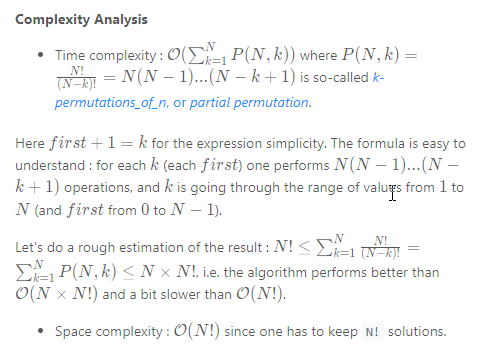

### Solution

---

#### Approach 1: Backtracking

[Backtracking](https://en.wikipedia.org/wiki/Backtracking) is an algorithm for finding all solutions by exploring all potential candidates. If the solution candidate turns to be *not* a solution (or at least not the *last* one), backtracking algorithm discards it by making some changes on the previous step, *i.e.* *backtracks* and then try again.

Here is a backtrack function which takes the index of the first integer to consider as an argument `backtrack(first)`.

- If the first integer to consider has index `n` that means that the current permutation is done.

- Iterate over the integers from index

   

  ```
  first
  ```

   

  to index

   

  ```
  n - 1
  ```

  .

  - Place `i`-th integer first in the permutation, i.e. `swap(nums[first], nums[i])`.
  - Proceed to create all permutations which starts from `i`-th integer : `backtrack(first + 1)`.
  - Now backtrack, i.e. `swap(nums[first], nums[i])` back.

  

```java
class Solution {
  public void backtrack(int n,
                        ArrayList<Integer> nums,
                        List<List<Integer>> output,
                        int first) {
    // if all integers are used up
    if (first == n)
      output.add(new ArrayList<Integer>(nums));
    for (int i = first; i < n; i++) {
      // place i-th integer first 
      // in the current permutation
      Collections.swap(nums, first, i);
      // use next integers to complete the permutations
      backtrack(n, nums, output, first + 1);
      // backtrack
      Collections.swap(nums, first, i);
    }
  }

  public List<List<Integer>> permute(int[] nums) {
    // init output list
    List<List<Integer>> output = new LinkedList();

    // convert nums into list since the output is a list of lists
    ArrayList<Integer> nums_lst = new ArrayList<Integer>();
    for (int num : nums)
      nums_lst.add(num);

    int n = nums.length;
    backtrack(n, nums_lst, output, 0);
    return output;
  }
}
```

