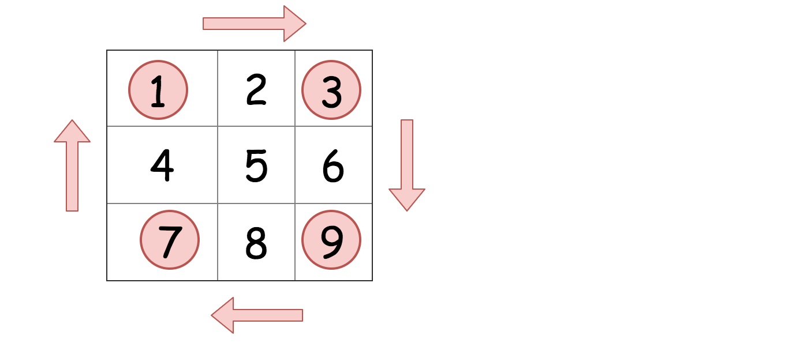

## Solution

------

#### Approach 1: Rotate Groups of Four Cells

**Intuition**

Observe how the cells move in groups when we rotate the image.



We can iterate over each group of four cells and rotate them.

**Implementation**

Here is a visualization of the algorithm in action.

```java
class Solution {
    public void rotate(int[][] matrix) {
        int n = matrix.length;
        for (int i = 0; i < (n + 1) / 2; i ++) {
            for (int j = 0; j < n / 2; j++) {
                int temp = matrix[n - 1 - j][i];
                matrix[n - 1 - j][i] = matrix[n - 1 - i][n - j - 1];
                matrix[n - 1 - i][n - j - 1] = matrix[j][n - 1 -i];
                matrix[j][n - 1 - i] = matrix[i][j];
                matrix[i][j] = temp;
            }
        }
    }
}
```

**Complexity Analysis**

Let M*M* be the number of cells in the matrix.

- Time complexity : \mathcal{O}(M)O(*M*), as each cell is getting read once and written once.
- Space complexity : \mathcal{O}(1)O(1) because we do not use any other additional data structures.


------

#### Approach 2: Reverse on Diagonal and then Reverse Left to Right

**Intuition**

The most elegant solution for rotating the matrix is to firstly reverse the matrix around the main diagonal, and then reverse it from left to right. These operations are called **transpose** and **reflect** in linear algebra.

Here is a visualization to help you see why this works.

> **Bonus Question:** What would happen if you reflect and *then* transpose? Would you still get the correct answer?

Even though this approach does twice as many reads and writes as approach 1, most people would consider it a better approach because the code is simpler, and it is built with standard matrix operations that can be found in any matrix library.

**Implementation**

```java
class Solution {
    public void rotate(int[][] matrix) {
        transpose(matrix);
        reflect(matrix);
    }
    
    public void transpose(int[][] matrix) {
        int n = matrix.length;
        for (int i = 0; i < n; i++) {
            for (int j = i + 1; j < n; j++) {
                int tmp = matrix[j][i];
                matrix[j][i] = matrix[i][j];
                matrix[i][j] = tmp;
            }
        }
    }
    
    public void reflect(int[][] matrix) {
        int n = matrix.length;
        for (int i = 0; i < n; i++) {
            for (int j = 0; j < n / 2; j++) {
                int tmp = matrix[i][j];
                matrix[i][j] = matrix[i][n - j - 1];
                matrix[i][n - j - 1] = tmp;
            }
        }
    }
}
```

**Complexity Analysis**

Let M*M* be the number of cells in the grid.

- Time complexity : \mathcal{O}(M)O(*M*). We perform two steps; transposing the matrix, and then reversing each row. Transposing the matrix has a cost of \mathcal{O}(M)O(*M*) because we're moving the value of each cell once. Reversing each row also has a cost of \mathcal{O}(M)O(*M*), because again we're moving the value of each cell once.
- Space complexity : \mathcal{O}(1)O(1) because we do not use any other additional data structures.


> **Bonus Question:** If you're not too confident with matrices and linear algebra, get some more practice by also coding a method that transposes the matrix on the *other* diagonal, and another that reflects from top to bottom. You can test your functions by printing out the matrix before and after each operation. Finally, use your functions to find *three more solutions to this problem*. Each solution uses two matrix operations.


> **Interview Tip**: Terrified of being asked this question in an interview? Many people are: it can be intimidating due to the fiddly logic. Unfortunately, if you do a lot of interviewing, the probability of seeing it at least once is high, and some people have claimed to have seen it multiple times! This is one of the few questions where I recommend practicing until you can confidently code it and explain it without thinking too much.