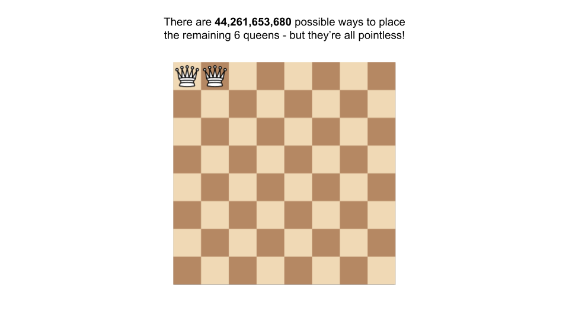

## Solution

------

#### Overview

A brute force solution would involve generating all possible board states with N queens. There are N^2*N*2 possible squares to place the first queen, N^2 - 1*N*2−1 to place the second and so on. This leads to a time complexity of O(N^{2N})*O*(*N*2*N*), which is far too slow. The actual number of solutions is **far** fewer than the number of possible board states, so we should aim to minimize our consideration of invalid board states.

Imagine if we tried to generate all board states by placing queens down one by one. For 8 queens on a normal chessboard, let's say we place the first queen on the top left (index `(0, 0)`, or, if you are familiar with Chess, `a8`). Then, we place the second queen to its right (index `(0, 1)`, or `b8`).




There are 62 * 61 * ... * 57 = **44,261,653,680** possible ways to place the remaining 6 queens, but we already know that every single one of them is invalid, because the first 2 queens can attack each other.


------

#### Approach: Backtracking

**Intuition**

We can still follow the strategy of generating board states, but we should never place a queen on a square that another queen can attack. This is a perfect problem for backtracking - place the queens one by one, and when all possibilities are exhausted, backtrack by removing a queen and placing it elsewhere.

> If you're not familiar with backtracking, check out the backtracking section of our [Recursion II Explore Card](https://leetcode.com/explore/learn/card/recursion-ii/472/backtracking/).

Given a board state, and a possible placement for a queen, we need a smart way to determine whether or not that placement will put the queen under attack. A queen can be attacked if another queen is on the same row, column, diagonal, or anti-diagonal.

Recall that to implement backtracking, we implement a `backtrack` function that makes some changes to the state, calls itself again, and then when that call returns it undoes those changes (this last part is why it's called "backtracking").

Each time our `backtrack` function is called, we can encode the state in the following manner:

- To make sure that we only place 1 queen per **row**, we will pass an integer argument `row` into `backtrack`, and will only place one queen during each call. Whenever we place a queen, we'll move onto the next row by calling `backtrack` again with the parameter value `row + 1`.
- To make sure we only place 1 queen per **column**, we will use a set. Whenever we place a queen, we can add the column index to this set.

The diagonals are a little trickier - but they have a property that we can use to our advantage.

- For each square on a given **diagonal**, the difference between the row and column indices `(row - col)` will be constant. Think about the diagonal that starts from `(0, 0)` - the i^{th}*i**t**h* square has the coordinates `(i, i)`, so the difference is always 0.


- For each square on a given **anti-diagonal**, the sum of the row and column indexes `(row + col)` will be constant. If you were to start at the highest square in an anti-diagonal and move downwards, the row index increments by 1 `(row + 1)`, and the column index decrements by 1 `(col - 1)`. These cancel each other out.


Every time we place a queen, we should calculate the diagonal and the anti-diagonal value it belongs to. In the same way we use a set to keep track of which columns have been used, we should also have a set to keep track of which diagonals and anti-diagonals have been used. Then, we can add the values for this queen to the corresponding sets.

**Algorithm**

We'll create a recursive function `backtrack` that takes a few arguments to maintain the board state. The first parameter is the row we're going to place a queen on next, and then we will have 3 sets that track which columns, diagonals, and anti-diagonals have already had queens placed on them. Additionally, we will store the actual board so that when we find a valid solution, we can include it in our answer. The function will work as follows:

1. If the current row we are considering is equal to `n`, then we have a solution. Add the current board state to a list of solutions, and return. We'll make use of a small helper function to get our board into the correct output format.
2. Iterate through the columns of the current row. At each column, we will attempt to place a queen at the square `(row, col)` - remember we are considering the current row through the function arguments.
   - Calculate the diagonal and anti-diagonal that the square belongs to. If a queen has not been placed in the column, diagonal, or anti-diagonal, then we can place a queen in this column, in the current row.
   - If we can't place the queen, skip this column (move on and try the next column).
3. If we were able to place a queen, then add the queen to the board and update our 3 sets (`cols`, `diagonals`, and `antiDiagonals`), and call the function again, but with `row + 1`.
4. The function call made in step 3 explores all valid board states with the queen we placed in step 2. Since we're done exploring that path, backtrack by removing the queen from the square - this includes removing the values we added to our sets on top of removing the `"Q"` from the board.

```java
class Solution {
    private int size;
    private List<List<String>> solutions = new ArrayList<List<String>>();
    
    public List<List<String>> solveNQueens(int n) {
        size = n;
        char emptyBoard[][] = new char[size][size];
        for (int i = 0; i < n; i++) {
            for (int j = 0; j < n; j++) {
                emptyBoard[i][j] = '.';
            }
        }

        backtrack(0, new HashSet<>(), new HashSet<>(), new HashSet<>(), emptyBoard);
        return solutions;
    }
    
    // Making use of a helper function to get the
    // solutions in the correct output format
    private List<String> createBoard(char[][] state) {
        List<String> board = new ArrayList<String>();
        for (int row = 0; row < size; row++) {
            String current_row = new String(state[row]);
            board.add(current_row);
        }
        
        return board;
    }
    
    private void backtrack(int row, Set<Integer> diagonals, Set<Integer> antiDiagonals, Set<Integer> cols, char[][] state) {
        // Base case - N queens have been placed
        if (row == size) {
            solutions.add(createBoard(state));
            return;
        }
        
        for (int col = 0; col < size; col++) {
            int currDiagonal = row - col;
            int currAntiDiagonal = row + col;
            // If the queen is not placeable
            if (cols.contains(col) || diagonals.contains(currDiagonal) || antiDiagonals.contains(currAntiDiagonal)) {
                continue;    
            }
            
            // "Add" the queen to the board
            cols.add(col);
            diagonals.add(currDiagonal);
            antiDiagonals.add(currAntiDiagonal);
            state[row][col] = 'Q';

            // Move on to the next row with the updated board state
            backtrack(row + 1, diagonals, antiDiagonals, cols, state);

            // "Remove" the queen from the board since we have already
            // explored all valid paths using the above function call
            cols.remove(col);
            diagonals.remove(currDiagonal);
            antiDiagonals.remove(currAntiDiagonal);
            state[row][col] = '.';
        }
    }
}
```

**Complexity Analysis**

Given N*N* as the number of queens (which is the same as the width and height of the board),

- Time complexity: O(N!)*O*(*N*!)

  Unlike the brute force approach, we will only place queens on squares that aren't under attack. For the first queen, we have N*N* options. For the next queen, we won't attempt to place it in the same column as the first queen, and there must be at least one square attacked diagonally by the first queen as well. Thus, the maximum number of squares we can consider for the second queen is N - 2*N*−2. For the third queen, we won't attempt to place it in 2 columns already occupied by the first 2 queens, and there must be at least two squares attacked diagonally from the first 2 queens. Thus, the maximum number of squares we can consider for the third queen is N - 4*N*−4. This pattern continues, resulting in an approximate time complexity of N!*N*!.

  While it costs O(N^2)*O*(*N*2) to build each valid solution, the amount of valid solutions S(N)*S*(*N*) does not grow nearly as fast as N!*N*!, so O(N! + S(N) * N^2) = O(N!)*O*(*N*!+*S*(*N*)∗*N*2)=*O*(*N*!)

- Space complexity: O(N^2)*O*(*N*2)

  Extra memory used includes the 3 sets used to store board state, as well as the recursion call stack. All of this scales linearly with the number of queens. However, to keep the board state costs O(N^2)*O*(*N*2), since the board is of size `N * N`. Space used for the output does not count towards space complexity.