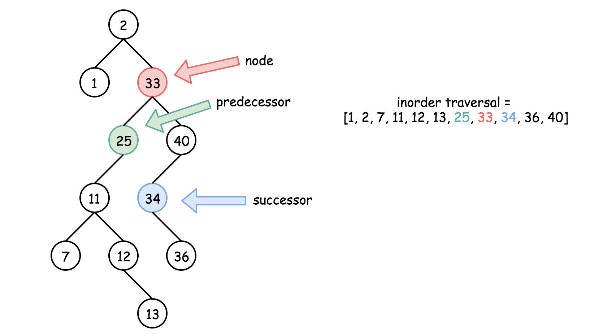
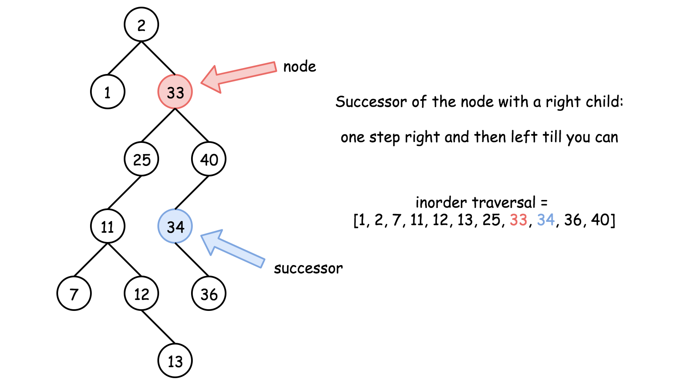
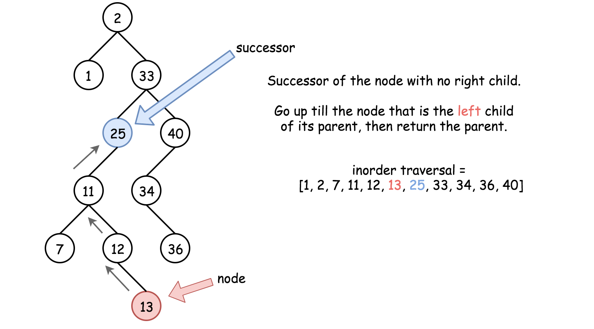
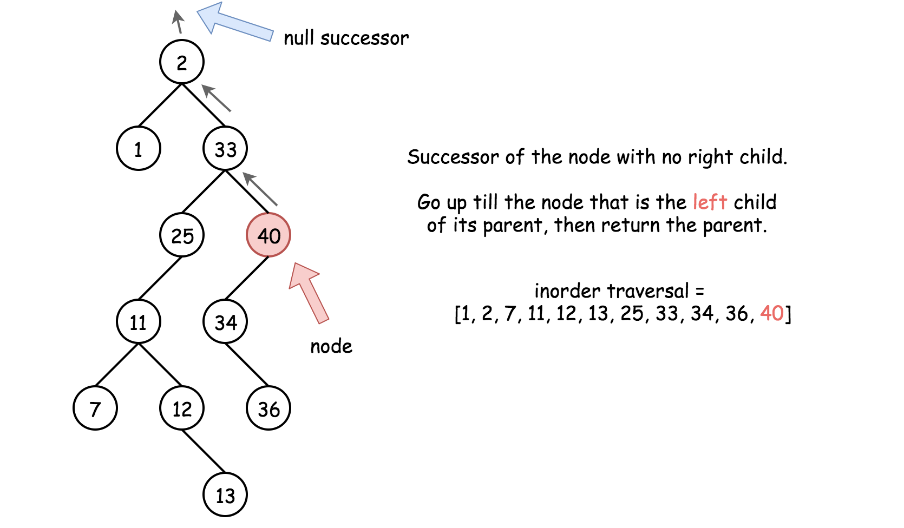

## Solution

------

#### Successor and Predecessor

> Successor = "after node", i.e. the next node in the inorder traversal, or the smallest node *after* the current one.

> Predecessor = "before node", i.e. the previous node in the inorder traversal, or the largest node *before* the current one.



#### Approach 1: Iteration

**Intuition**

There are two possible situations here :

- Node has a right child, and hence its successor is somewhere lower in the tree. To find the successor, go to the right once and then as many times to the left as you could.



- Node has no right child, then its successor is somewhere upper in the tree. To find the successor, go up till the node that is *left* child of its parent. The answer is the parent. Beware that there could be no successor (= null successor) in such a situation.





**Algorithm**

1. If the node has a right child, and hence its successor is somewhere lower in the tree. Go to the right once and then as many times to the left as you could. Return the node you end up with.

2. Node has no right child, and hence its successor is somewhere upper in the tree. Go up till the node that is *left* child of its parent. The answer is the parent.

   

```java
class Solution {
  public Node inorderSuccessor(Node x) {
    // the successor is somewhere lower in the right subtree
    if (x.right != null) {
      x = x.right;
      while (x.left != null) x = x.left;
      return x;
    }

    // the successor is somewhere upper in the tree
    while (x.parent != null && x == x.parent.right) x = x.parent;
    return x.parent;
  }
}
```

**Complexity Analysis**

- Time complexity : \mathcal{O}(H)O(*H*), where H*H* is the height of the tree. That means \mathcal{O}(\log N)O(log*N*) in the average case, and \mathcal{O}(N)O(*N*) in the worst case, where N*N* is the number of nodes in the tree.
- Space complexity : \mathcal{O}(1)O(1), since no additional space is allocated during the calculation.