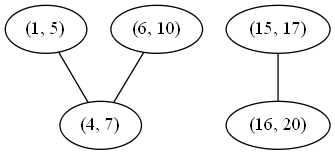

### Solution

---

#### Approach 1: Connected Components

**Intuition**

If we draw a graph (with intervals as nodes) that contains undirected edges between all pairs of intervals that overlap, then all intervals in each *connected component* of the graph can be merged into a single interval.

**Algorithm**

With the above intuition in mind, we can represent the graph as an adjacency list, inserting directed edges in both directions to simulate undirected edges. Then, to determine which connected component each node is it, we perform graph traversals from arbitrary unvisited nodes until all nodes have been visited. To do this efficiently, we store visited nodes in a `Set`, allowing for constant time containment checks and insertion. Finally, we consider each connected component, merging all of its intervals by constructing a new `Interval` with `start` equal to the minimum start among them and `end` equal to the maximum end.

This algorithm is correct simply because it is basically the brute force solution. We compare every interval to every other interval, so we know exactly which intervals overlap. The reason for the connected component search is that two intervals may not directly overlap, but might overlap indirectly via a third interval. See the example below to see this more clearly.



Although (1, 5) and (6, 10) do not directly overlap, either would overlap with the other if first merged with (4, 7). There are two connected components, so if we merge their nodes, we expect to get the following two merged intervals:

(1, 10), (15, 20)

```java
class Solution {
    private Map<int[], List<int[]>> graph;
    private Map<Integer, List<int[]>> nodesInComp;
    private Set<int[]> visited;

    // return whether two intervals overlap (inclusive)
    private boolean overlap(int[] a, int[] b) {
        return a[0] <= b[1] && b[0] <= a[1];
    }

    // build a graph where an undirected edge between intervals u and v exists
    // iff u and v overlap.
    private void buildGraph(int[][] intervals) {
        graph = new HashMap<>();
        for (int[] interval : intervals) {
            graph.put(interval, new LinkedList<>());
        }

        for (int[] interval1 : intervals) {
            for (int[] interval2 : intervals) {
                if (overlap(interval1, interval2)) {
                    graph.get(interval1).add(interval2);
                    graph.get(interval2).add(interval1);
                }
            }
        }
    }

    // merges all of the nodes in this connected component into one interval.
    private int[] mergeNodes(List<int[]> nodes) {
        int minStart = nodes.get(0)[0];
        for (int[] node : nodes) {
            minStart = Math.min(minStart, node[0]);
        }

        int maxEnd = nodes.get(0)[1];
        for (int[] node : nodes) {
            maxEnd = Math.max(maxEnd, node[1]);
        }

        return new int[] {minStart, maxEnd};
    }

    // use depth-first search to mark all nodes in the same connected component
    // with the same integer.
    private void markComponentDFS(int[] start, int compNumber) {
        Stack<int[]> stack = new Stack<>();
        stack.add(start);

        while (!stack.isEmpty()) {
            int[] node = stack.pop();
            if (!visited.contains(node)) {
                visited.add(node);

                if (nodesInComp.get(compNumber) == null) {
                    nodesInComp.put(compNumber, new LinkedList<>());
                }
                nodesInComp.get(compNumber).add(node);

                for (int[] child : graph.get(node)) {
                    stack.add(child);
                }
            }
        }
    }

    // gets the connected components of the interval overlap graph.
    private void buildComponents(int[][] intervals) {
        nodesInComp = new HashMap<>();
        visited = new HashSet<>();
        int compNumber = 0;

        for (int[] interval : intervals) {
            if (!visited.contains(interval)) {
                markComponentDFS(interval, compNumber);
                compNumber++;
            }
        }
    }

    public int[][] merge(int[][] intervals) {
        buildGraph(intervals);
        buildComponents(intervals);

        // for each component, merge all intervals into one interval.
        List<int[]> merged = new LinkedList<>();
        for (int comp = 0; comp < nodesInComp.size(); comp++) {
            merged.add(mergeNodes(nodesInComp.get(comp)));
        }

        return merged.toArray(new int[merged.size()][]);
    }
}
```


**Complexity Analysis**

- Time complexity : O(n^2)*O*(*n*2)

  Building the graph costs O(V + E) = O(V) + O(E) = O(n) + O(n^2) = O(n^2)*O*(*V*+*E*)=*O*(*V*)+*O*(*E*)=*O*(*n*)+*O*(*n*2)=*O*(*n*2) time, as in the worst case all intervals are mutually overlapping. Traversing the graph has the same cost (although it might appear higher at first) because our `visited` set guarantees that each node will be visited exactly once. Finally, because each node is part of exactly one component, the merge step costs O(V) = O(n)*O*(*V*)=*O*(*n*) time. This all adds up as follows:

  O(n^2) + O(n^2) + O(n) = O(n^2)*O*(*n*2)+*O*(*n*2)+*O*(*n*)=*O*(*n*2)

- Space complexity : O(n^2)*O*(*n*2)

  As previously mentioned, in the worst case, all intervals are mutually overlapping, so there will be an edge for every pair of intervals. Therefore, the memory footprint is quadratic in the input size.

---

#### Approach 2: Sorting

**Intuition**

If we sort the intervals by their `start` value, then each set of intervals that can be merged will appear as a contiguous "run" in the sorted list.

**Algorithm**

First, we sort the list as described. Then, we insert the first interval into our `merged` list and continue considering each interval in turn as follows: If the current interval begins *after* the previous interval ends, then they do not overlap and we can append the current interval to `merged`. Otherwise, they do overlap, and we merge them by updating the `end` of the previous interval if it is less than the `end` of the current interval.

A simple proof by contradiction shows that this algorithm always produces the correct answer. First, suppose that the algorithm at some point fails to merge two intervals that should be merged. This would imply that there exists some triple of indices i*i*, j*j*, and k*k* in a list of intervals \text{ints}ints such that i < j < k*i*<*j*<*k* and (\text{ints[i]}ints[i], \text{ints[k]}ints[k]) can be merged, but neither (\text{ints[i]}ints[i], \text{ints[j]}ints[j]) nor (\text{ints[j]}ints[j], \text{ints[k]}ints[k]) can be merged. From this scenario follow several inequalities:

\begin{aligned} \text{ints[i].end} < \text{ints[j].start} \\ \text{ints[j].end} < \text{ints[k].start} \\ \text{ints[i].end} \geq \text{ints[k].start} \\ \end{aligned}ints[i].end<ints[j].startints[j].end<ints[k].startints[i].end≥ints[k].start

We can chain these inequalities (along with the following inequality, implied by the well-formedness of the intervals: \text{ints[j].start} \leq \text{ints[j].end}ints[j].start≤ints[j].end) to demonstrate a contradiction:

\begin{aligned} \text{ints[i].end} < \text{ints[j].start} \leq \text{ints[j].end} < \text{ints[k].start} \\ \text{ints[i].end} \geq \text{ints[k].start} \end{aligned}ints[i].end<ints[j].start≤ints[j].end<ints[k].startints[i].end≥ints[k].start

Therefore, all mergeable intervals must occur in a contiguous run of the sorted list.


```java
class Solution {
    public int[][] merge(int[][] intervals) {
        Arrays.sort(intervals, (a, b) -> Integer.compare(a[0], b[0]));
        LinkedList<int[]> merged = new LinkedList<>();
        for (int[] interval : intervals) {
            // if the list of merged intervals is empty or if the current
            // interval does not overlap with the previous, simply append it.
            if (merged.isEmpty() || merged.getLast()[1] < interval[0]) {
                merged.add(interval);
            }
            // otherwise, there is overlap, so we merge the current and previous
            // intervals.
            else {
                merged.getLast()[1] = Math.max(merged.getLast()[1], interval[1]);
            }
        }
        return merged.toArray(new int[merged.size()][]);
    }
}
```

**Complexity Analysis**

- Time complexity : O(n\log{}n)*O*(*n*log*n*)

  Other than the `sort` invocation, we do a simple linear scan of the list, so the runtime is dominated by the O(n\log{}n)*O*(*n*log*n*) complexity of sorting.

- Space complexity : O(\log N)*O*(log*N*) (or O(n)*O*(*n*))

  If we can sort `intervals` in place, we do not need more than constant additional space, although the sorting itself takes O(\log n)*O*(log*n*) space. Otherwise, we must allocate linear space to store a copy of `intervals` and sort that.

---

Follow up


## Facebook Follow-Up


**Question**: How do you add intervals and merge them for a large stream of intervals? (Facebook Follow-up Question)


Inspired by https://leetcode.com/problems/merge-intervals/discuss/21452/Share-my-interval-tree-solution-no-sorting


We need to have two functions for the tree (`add` interval and `query` tree).


##### Implementation Details


`TreeNode` - On top of the left child, right child, start boundary, and end boundary, we have a **`middle` field** that determines whether a new interval goes to the left child, right right or merged with the current node.


`add` - If the new interval touches or crosses the `middle` of the current node, we update the current node. Otherwise, we put the new interval into the left subtree or right subtree.


- Why do we use `middle` for comparison and not `start` or `end` boundaries?
  The reason is that we can use merge-sort technique to `query` the merged intervals result when the left subtree does not overlap with the right subtree.


`query` - Use merge-sort technique by retrieving the merged intervals of the left subtree (i.e. `left_intervals`) and those of the right subtree (i.e. `right_intervals`). Because of the implementation of `add`, we can guarantee that


- if there's an interval in the `left_intervals` that overlaps with the current node, then we know that all the intervals after that interval overlaps with the current node.
- The first few intervals or zero intervals in the `right_intervals` overlap with the current node.


Here's the visualization:


```
left_res = [ (intervals that do not overlap), (intervals that overlap with current node) ]
right_res = [ (intervals that overlap with current node), (intervals that do not overlap) ]
```

##### Code

```python
class TreeNode:
    def __init__(self, start, end, middle):
        self.start = start
        self.end = end
        self.middle = middle
        self.left = self.right = None

class Solution:
    def __init__(self):
        self.root = None
    
    def merge(self, intervals: List[List[int]]) -> List[List[int]]:
        if not intervals:
            return []
        
        for start, end in intervals:
            if not self.root:
                self.root = TreeNode(start, end, (start + end) // 2)
            else:
                self.add(self.root, start, end)
        
        return self.query(self.root)
    
    
    def add(self, node, start, end):     
        if end < node.middle:
            if node.left:
                self.add(node.left, start, end)
            else:
                node.left = TreeNode(start, end, (start + end) // 2)
        
        elif start > node.middle:
            if node.right:
                self.add(node.right, start, end)
            else:
                node.right = TreeNode(start, end, (start + end) // 2)
        
        else:
            node.start = min(node.start, start)
            node.end = max(node.end, end)
    
    def query(self, node):
        if not node:
            return []
        
        # merge-sort divide and conquer
        left_intervals = self.query(node.left)
        right_intervals = self.query(node.right)
        res = []
        
        inserted = False
        
        for lres in left_intervals:
            if lres[1] < node.start:
                res.append(lres)
            else:
                res.append([min(lres[0], node.start), node.end])
                inserted = True
                break
        
        if not inserted:
            res.append([node.start, node.end])
        
        for rres in right_intervals:
            if rres[0] <= node.end:
                res[-1][1] = max(node.end, rres[1])
            else:
                res.append(rres)
        
        return res
```

