#### Solution

---

#### Overview

This is a really useful problem to work on since this is a part of the general umbrella of problems which are like *Serialize and Deserialize some data structure*. This is important if we want to save a tree (a custom object with some special properties and fields) to a file, a database, or as a string someplace essentially. In this problem we are given a string representation of a tree i.e. we are given the serialized version of the tree and we have to deserialize it and return the `TreeNode` object representing the root of the tree (since the rest of the tree is trackable via the root).

A tree (or a graph) has a recursive structure to it i.e. *a subtree is a tree in itself*. Similarly, we expect the string representation of a tree to also have some kind of a recursive structure and that is what will be used to reconstruct our tree. Let's first take a look at this recursive structure in the string.


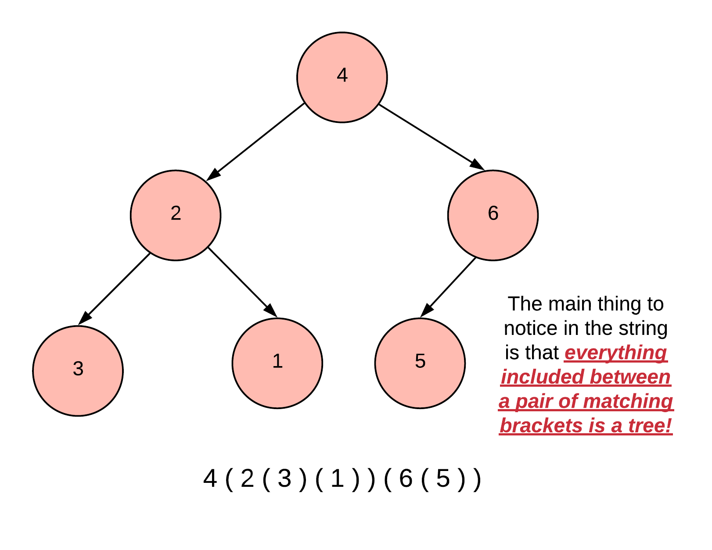

Let's look at the subtrees along with their counterparts in the string. Note that we assume the entire string is also enclosed between a pair of brackets thus representing the entire tree.

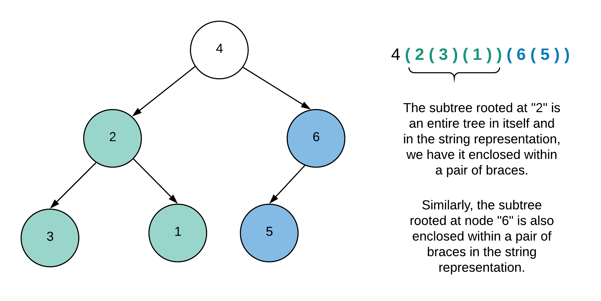

So we can see the recursive build-up of the string and we are going to leverage that property to come up with a solution. Since this problem involves a recursive property, we will look at a solution based on recursion, and then, we will convert that solution to one using a stack as opposed to the memory stack used in the recursive approach.


------

#### Approach 1: Recursion

**Intuition**

The idea here is very simple. An opening bracket represents the start of a new tree (subtree really). Thus, whenever we encounter a new opening bracket, we make a new recursion call. A recursion call to our function will essentially return the root of a properly built tree with all the required `TreeNode` objects and proper connections set up between them. Thus, making a new recursive call upon encountering an opening bracket is essentially calling our function to build the subtree and return the root node.

We know when to make a new recursive call, but, when do we stop really? We stop when we encounter a closing bracket. That's because a closing bracket will be the end of *the most recent* subtree that we're building in our recursion. We assume that a particular closing bracket matches with the *nearest* opening bracket we would have encountered previously when we made the recursive call. Let's put all this information into an algorithm with steps.

**Algorithm**

1. Let's define a couple of internal functions that we will be using along the way. The first one is called `getNumber` and it returns the integer number/value that the current `TreeNode` is supposed to have. It takes the string and the current index as inputs. We iterate until we no longer encounter a digit or we reach the end of the string. We stick all the digits together and get a number. Also, we take care of the sign `-` in case one exists in the beginning which would indicate a negative value for the node.
2. The next function we define is our recursive function called `str2treeInternal` which does all the heavy lifting for us. It also takes the string and the index of the current character as inputs and returns a pair of the `TreeNode` representation of the current subtree and also the index of the next character to be processed in the string. This index manipulation is important because we don't want to parse the string twice to figure out the boundaries for the children subtrees.
3. Whenever the function `str2treeInternal` is called, we expect that the current subtree will all its children and descendants will be constructed and returned. There are 4 steps we take inside this function of ours.
   1. Firstly we check for the termination condition i.e. if there are no more characters left in the string to process.

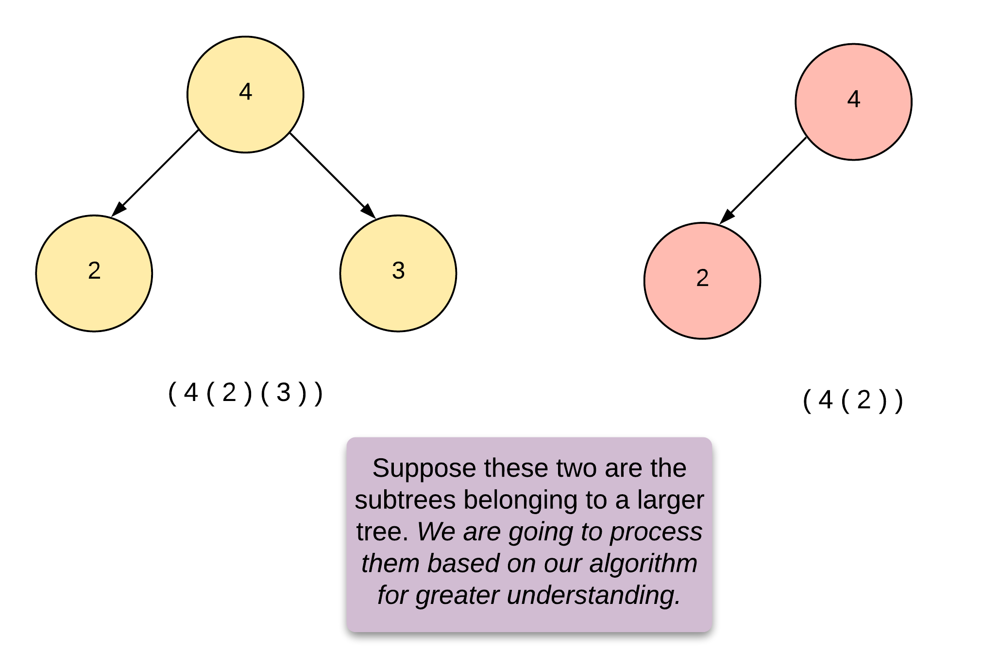

*Figure 3. Sample subtrees which we will consider for the algorithm.*

1. Next, we get the value for the root node of this tree. This is an invariant here. We will never find any brackets before we get the value for the root node.

   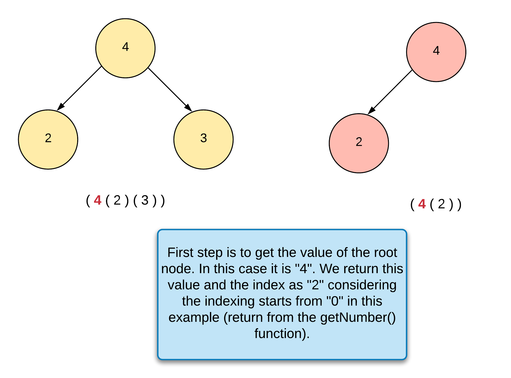

1. Once we have the value, we form the root node.

2. Then, we check for an opening bracket (make sure to check for the end of string conditions always). If there is one, we make a recursive call and use the node returned as the left child of the current node.

   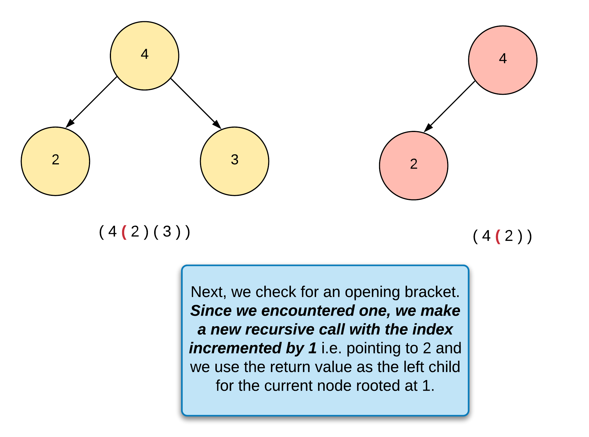

3. Finally, we check if there's another opening bracket. If there is one, then it represents our right child and we again make a recursive call to construct that and make the right connection.

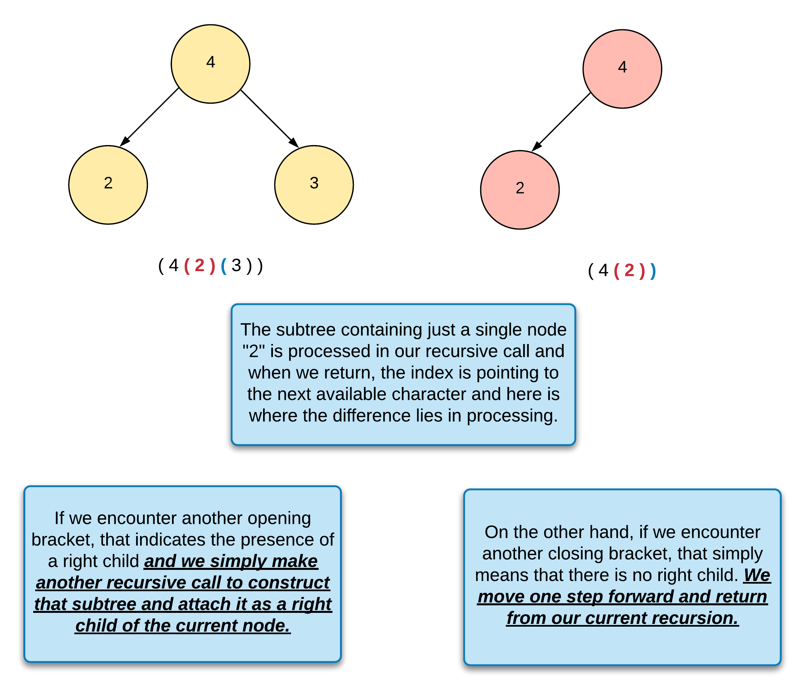

1. We return the construct root node and also the correct index. For the index, we check if it points to a closing bracket, we move one step forward. Else, we stay at the current spot and let the caller function decide how to proceed/process.

```java
class Solution {
    public TreeNode str2tree(String s) {
        return this.str2treeInternal(s, 0).getKey();
    }
    
    public Pair<Integer, Integer> getNumber(String s, int index) {
        
        boolean isNegative = false;
        
        // A negative number
        if (s.charAt(index) == '-') {
            isNegative = true;
            index++;
        }
            
        int number = 0;
        while (index < s.length() && Character.isDigit(s.charAt(index))) {
            number = number * 10 + (s.charAt(index) - '0');
            index++;
        }
        
        return new Pair<Integer, Integer>(isNegative ? -number : number, index);
    } 
    
    public Pair<TreeNode, Integer> str2treeInternal(String s, int index) {
        
        if (index == s.length()) {
            return new Pair<TreeNode, Integer>(null, index);
        }
        
        // Start of the tree will always contain a number representing
        // the root of the tree. So we calculate that first.
        Pair<Integer, Integer> numberData = this.getNumber(s, index);
        int value = numberData.getKey();
        index = numberData.getValue();
        
        TreeNode node = new TreeNode(value);
        Pair<TreeNode, Integer> data;
        
        // Next, if there is any data left, we check for the first subtree
        // which according to the problem statement will always be the left child.
        if (index < s.length() && s.charAt(index) == '(') {
            data = this.str2treeInternal(s, index + 1);
            node.left = data.getKey();
            index = data.getValue();
        }
            
        
        // Indicates a right child
        if (node.left != null && index < s.length() && s.charAt(index) == '(') {
            data = this.str2treeInternal(s, index + 1);
            node.right = data.getKey();
            index = data.getValue();
        }
            
        
        return new Pair<TreeNode, Integer>(node, index < s.length() && s.charAt(index) == ')' ? index + 1 : index);
    }
}
```

**Complexity Analysis**

- Time Complexity: O(N)*O*(*N*) where N*N* represents the number of characters in the string representation. This is because each character is processed exactly once and we need to process the entire string to form our tree.
- Space Complexity: O(H)*O*(*H*) where H*H* represents the height of the tree. We don't have any information about if the tree is balanced or not and so, in the worst case when the tree would be skewed left (can't be right according to the problem), we will have a recursion stack consisting of N*N* calls and hence, the overall space complexity can be O(N)*O*(*N*);

---

#### Approach 2: Stack

**Intuition**

The main problem with a recursive solution is the stack limitation. We might run into stack-overflow problems if the tree is too tall and the system's stack is low on resources. Hence, we prefer to use our own stack and that is the variation which we will explore in this solution. The overall idea remains the same as the previous approach and for that matter, even the complexities remain the same. The only thing that changes is a recursive vs iterative approach.

The algorithm presented here is completely based on the recursive solution before. The only thing we need to take care of are the different states a particular *function call/node* can be in during recursion. Notably, there are 3 different states that we need to account for. We won't be using these three states in the code directly but it is important to understand these three possibilities to understand the overall algorithm.

1. *NOT_STARTED* ~ This is the initial state that a node is in. Before we even process the left or the right children. In this state, we simply form the value of the root node and then check for the presence of the left child. If the left child exists, we make a recursive call and the returned value is used as the left child.
2. *LEFT_DONE* ~ In this state, we are processing our root node given the fact that we're done processing its left subtree. So, the `index` would be used to check for the presence of a right child and if one exists, we make another recursive call to process the same.
3. *RIGHT_DONE* ~ This is the final state of any node where we are done processing the left and the right children and don't need to do anything more.

**Algorithm**

1. Let's define a function called `getNumber` which returns the integer number/value that the current `TreeNode` is supposed to have. It takes the string and the current index as inputs. We iterate until we no longer encounter a digit or we reach the end of the string. We stick all the digits together and get a number. Also, we take care of the sign `-` in case one exists in the beginning which would indicate a negative value for the node.

2. We use a `stack` for our implementation and it would contain a pair of the node itself and the state it is in. The state can be one of the three described before.

3. Initially, we push the `root node` (a new `TreeNode` essentially) into the stack. *Note:* that the state of this node is `NOT_STARTED`.

4. We iterate over the characters in our string one by one and we do the following at each step:

   1. Pop the node. This will be the root node that we currently process i.e. not the global root node of the tree but rather the root of the current subtree.

   2. If the current character pointed to by the `index` is a digit or the `-` character,

      1. that means we have a node that we haven't started processing yet i.e. the `NOT_STARTED` state. So the first thing we do is to call the `getNumber` function to get the value for the node and set `node.val` to this value. *Note:* the `getNumber` function progresses the `index`.

      2. Then, we check for the presence of a left child. We simply check if there are more characters left in the string and the one we have to process now is an opening bracket. If it is, then we do two things:

         - We add the current node back to the queue. At this point, the state of this node would be `LEFT_DONE`. Again, we don't need the state information anywhere in the code except for reasoning about the algorithm itself.

         - Then, we assign `node.left` to a new `TreeNode` and also add it to the queue.

           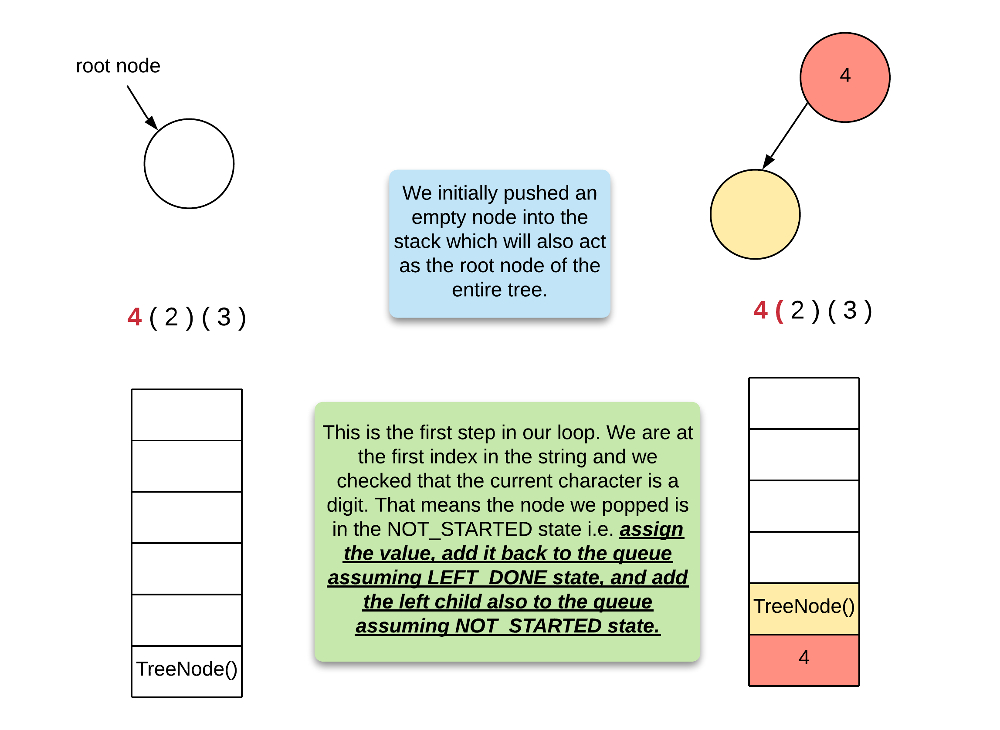

           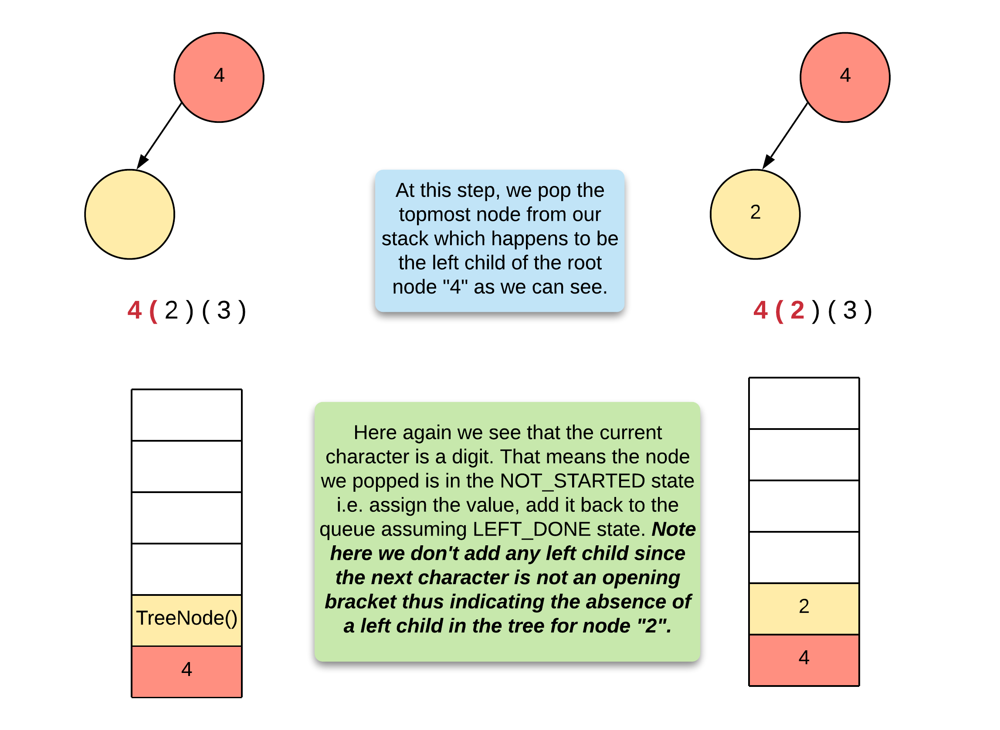

           ​			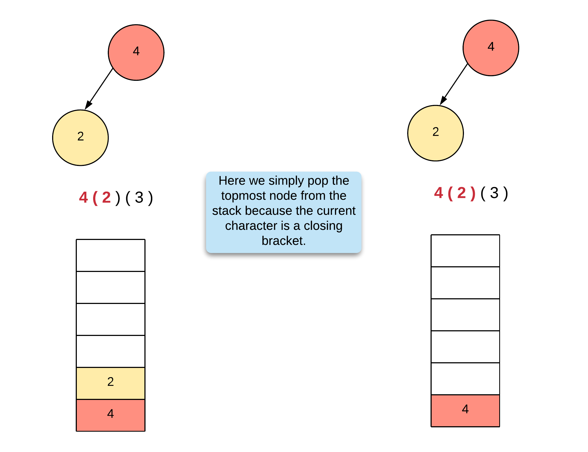

If the current character is the left bracket i.e. `(`,

1. we check for the presence of a right child because we know that the value of the node is already set in the previous step and also, the left child is properly processed at this point.

2. We check if the current character, if there is one left, is an opening bracket. If it is one then we do the following:

   - We add the current node back to the queue assuming its state to be `LEFT_DONE`.

   - Then, we assign `node.right` to a new `TreeNode` and also add it to the queue.

     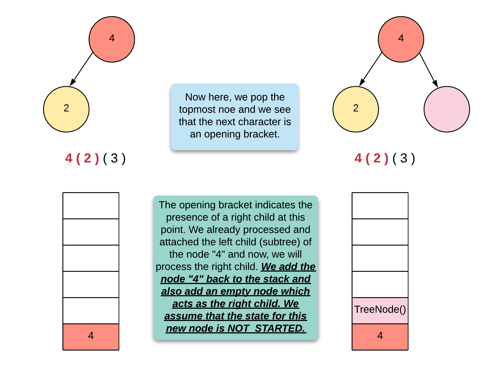

We don't do anything if the current character is a closing bracket except for popping the nodes which we already did in step `4.1` here.

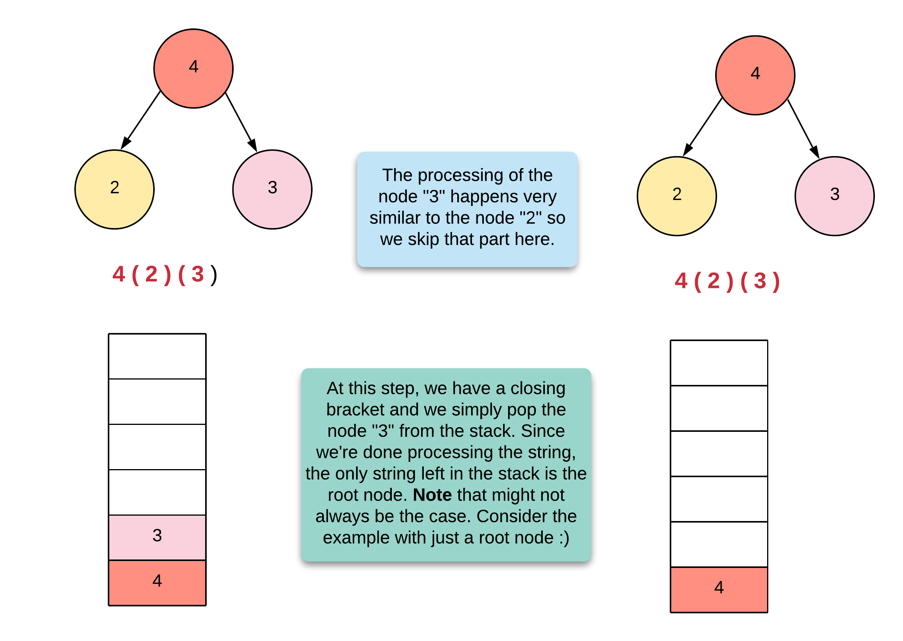

```java
class Solution {
    public TreeNode str2tree(String s) {
        
        if (s.isEmpty()) {
            return null;
        }
        
        TreeNode root = new TreeNode();
        Stack<TreeNode> stack = new Stack<TreeNode>(); 
        stack.add(root);
        
        for (int index = 0; index < s.length();) {
            
            TreeNode node = stack.pop();
            
            // NOT_STARTED
            if (Character.isDigit(s.charAt(index)) || s.charAt(index) == '-') {
                
                Pair<Integer, Integer> numberData = this.getNumber(s, index);
                int value = numberData.getKey();
                index = numberData.getValue();
                
                node.val = value;
                
                // Next, if there is any data left, we check for the first subtree
                // which according to the problem statement will always be the left child.
                if (index < s.length() && s.charAt(index) == '(') {
                    
                    stack.add(node);

                    node.left = new TreeNode();
                    stack.add(node.left);
                }
            } else if (s.charAt(index) == '(' && node.left != null) { // LEFT_DONE
                
                stack.add(node);

                node.right = new TreeNode();
                stack.add(node.right);
            }
            
            ++index;
        }
        
        return stack.empty() ? root : stack.pop();
        
    }
    
    public Pair<Integer, Integer> getNumber(String s, int index) {
        
        boolean isNegative = false;
        
        // A negative number
        if (s.charAt(index) == '-') {
            isNegative = true;
            index++;
        }
            
        int number = 0;
        while (index < s.length() && Character.isDigit(s.charAt(index))) {
            number = number * 10 + (s.charAt(index) - '0');
            index++;
        }
        
        return new Pair<Integer, Integer>(isNegative ? -number : number, index);
    } 
}
```

**Complexity Analysis**

The complexity is the same as the previous solution with the only exception that we are now using our own stack instead of relying on the system's stack.

- Time Complexity: O(N)*O*(*N*) where N*N* represents the number of characters in the string representation. This is because each character is processed exactly once and we need to process the entire string so as to form our tree.
- Space Complexity: O(H)*O*(*H*) where H*H* represents the height of the tree. We don't have any information about if the tree is balanced or not and so, in the worst case when the tree would be skewed left (can't be right according to the problem), we will have a recursion stack consisting of N*N* calls and hence, the overall space complexity can be O(N)*O*(*N*);