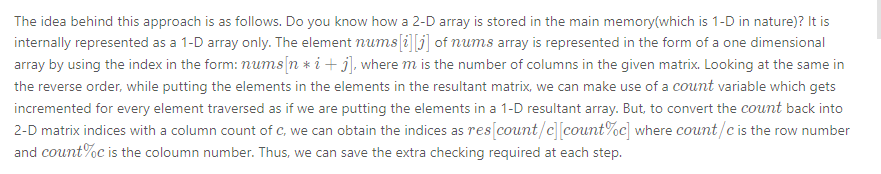

## Solution

------

#### Approach 1: Using Queue

**Algorithm**

The simplest method is to extract all the elements of the given matrix by reading the elements in a row-wise fashion. In this implementation, we use a queue to put the extracted elements. Then, we can take out the elements of the queue formed in a serial order and arrange the elements in the resultant required matrix in a row-by-row order again.

The formation of the resultant matrix won't be possible if the number of elements in the original matrix isn't equal to the number of elements in the resultant matrix.

```java
class Solution {
    public int[][] matrixReshape(int[][] nums, int r, int c) {
        int[][] res = new int[r][c];
        if (nums.length == 0 || r * c != nums.length * nums[0].length)
            return nums;
        Queue<Integer> queue = new LinkedList();
        for (int i = 0; i < nums.length; i++) {
            for (int j = 0; j < nums[0].length; j++) {
                queue.add(nums[i][j]);
            }
        }
        for (int i = 0; i < r; i++) {
            for (int j = 0; j < c; j++) {
                res[i][j] = queue.remove();
            }
        }
        return res;
    }
}
```

**Complexity Analysis**

- Time complexity : O(m \cdot n)*O*(*m*⋅*n*). We traverse over m \cdot n*m*⋅*n* elements twice. Here, m*m* and n*n* refer to the number of rows and columns of the given matrix respectively.

- Space complexity : O(m \cdot n)*O*(*m*⋅*n*). The queue formed will be of size m \cdot n*m*⋅*n*.

  

------

#### Approach 2: Without Using Extra Space

**Algorithm**

Instead of unnecessarily using the queue as in the brute force approach, we can keep putting the numbers in the resultant matrix directly while iterating over the given matrix in a row-by-row order. While putting the numbers in the resultant array, we fix a particular row and keep on incrementing the column numbers only till we reach the end of the required columns indicated by c*c*. At this moment, we update the row index by incrementing it and reset the column index to start from 0 again. Thus, we can save the space consumed by the queue for storing the data that just needs to be copied into a new array.

```java
public class Solution {
    public int[][] matrixReshape(int[][] nums, int r, int c) {
        int[][] res = new int[r][c];
        if (nums.length == 0 || r * c != nums.length * nums[0].length)
            return nums;
        int rows = 0, cols = 0;
        for (int i = 0; i < nums.length; i++) {
            for (int j = 0; j < nums[0].length; j++) {
                res[rows][cols] = nums[i][j];
                cols++;
                if (cols == c) {
                    rows++;
                    cols = 0;
                }
            }
        }
        return res;
    }
}
```

**Complexity Analysis**

- Time complexity : O(m \cdot n)*O*(*m*⋅*n*). We traverse the entire matrix of size m \cdot n*m*⋅*n* once only. Here, m*m* and n*n* refers to the number of rows and columns in the given matrix.

- Space complexity : O(m \cdot n)*O*(*m*⋅*n*). The resultant matrix of size m \cdot n*m*⋅*n* is used.

  

------

#### Approach 3: Using division and modulus

**Algorithm**

In the last approach, we needed to keep a track of when we reached the end of columns for the resultant matrix and needed to update the current row and column number for putting the extracted elements by checking the current indices every time. Instead of doing these limit checks at every step, we can make use of maths to help ease the situation.



```java
public class Solution {
    public int[][] matrixReshape(int[][] nums, int r, int c) {
        int[][] res = new int[r][c];
        if (nums.length == 0 || r * c != nums.length * nums[0].length)
            return nums;
        int count = 0;
        for (int i = 0; i < nums.length; i++) {
            for (int j = 0; j < nums[0].length; j++) {
                res[count / c][count % c] = nums[i][j];
                count++;
            }
        }
        return res;
    }
}
```

**Complexity Analysis**

- Time complexity :O*(*m*⋅*n). We traverse the entire matrix of size *m*⋅n once only. Here, m and n refers to the number of rows and columns in the given matrix.
- Space complexity : *O*(*m*⋅*n*). The resultant matrix of size m*⋅*n is used.

