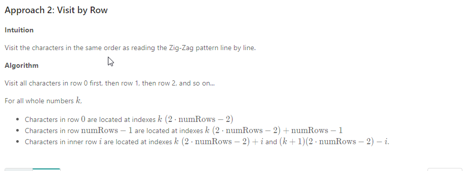

### Solution

**Approach 1: Sort by Row**
Intuition

By iterating through the string from left to right, we can easily determine which row in the Zig-Zag pattern that a character belongs to.

Algorithm

We can use \text{min}( \text{numRows}, \text{len}(s))min(numRows,len(s)) lists to represent the non-empty rows of the Zig-Zag Pattern.

Iterate through ss from left to right, appending each character to the appropriate row. The appropriate row can be tracked using two variables: the current row and the current direction.

The current direction changes only when we moved up to the topmost row or moved down to the bottommost row.

```java
class Solution {
    public String convert(String s, int numRows) {

        if (numRows == 1) return s;

        List<StringBuilder> rows = new ArrayList<>();
        for (int i = 0; i < Math.min(numRows, s.length()); i++)
            rows.add(new StringBuilder());

        int curRow = 0;
        boolean goingDown = false;

        for (char c : s.toCharArray()) {
            rows.get(curRow).append(c);
            if (curRow == 0 || curRow == numRows - 1) goingDown = !goingDown;
            curRow += goingDown ? 1 : -1;
        }

        StringBuilder ret = new StringBuilder();
        for (StringBuilder row : rows) ret.append(row);
        return ret.toString();
    }
}
```



```java
class Solution {
    public String convert(String s, int numRows) {

        if (numRows == 1) return s;

        StringBuilder ret = new StringBuilder();
        int n = s.length();
        int cycleLen = 2 * numRows - 2;

        for (int i = 0; i < numRows; i++) {
            for (int j = 0; j + i < n; j += cycleLen) {
                ret.append(s.charAt(j + i));
                if (i != 0 && i != numRows - 1 && j + cycleLen - i < n)
                    ret.append(s.charAt(j + cycleLen - i));
            }
        }
        return ret.toString();
    }
}
```
Complexity Analysis

Time Complexity: O(n)O(n), where n == \text{len}(s)n==len(s). Each index is visited once.
Space Complexity: O(n)O(n). For the cpp implementation, O(1)O(1) if return string is not considered extra space.