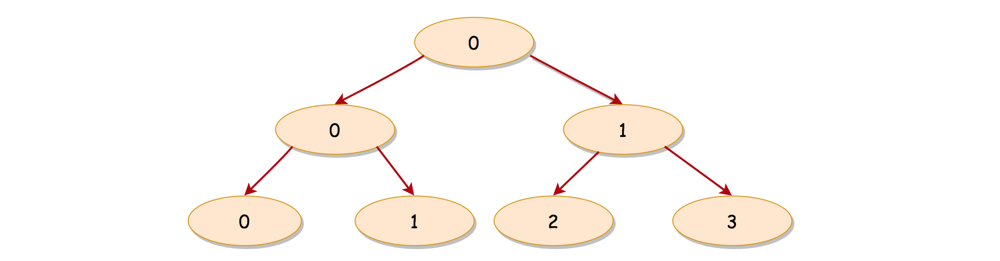

### Solution

---

#### Overview

The problem defines the concept of ***width\*** for the binary tree. In essence, it is about binary tree traversal, since we need to traverse the tree in order to measure its width.

As one would probably know, the common strategies to traverse a binary tree are Breadth-First Search (*a.k.a.* BFS) and Depth-First Search (*a.k.a.* DFS). Furthermore, the DFS strategy can be distinguished as *preorder* DFS, *inorder* DFS and *postorder* DFS, depending on the relative order of visit among the node itself and its child nodes.

If one is not familiar with the concepts of BFS and DFS, we have an Explore card called [Queue & Stack](https://leetcode.com/explore/learn/card/queue-stack/) where we cover the [BFS traversal](https://leetcode.com/explore/learn/card/queue-stack/231/practical-application-queue/) as well as the [DFS traversal](https://leetcode.com/explore/learn/card/queue-stack/232/practical-application-stack/). Hence, in this article, we won't repeat ourselves on these concepts.

**Intuition**

> The key to solve the problem though lie on how we **index** the nodes that are on the same level.

Suppose that the indices for the first and the last nodes of one particular level are C_1*C*1 and C_n*C**n* respectively, we could then calculate the *width* of this level as C_n - C_i + 1*C**n*−*C**i*+1.

Now, let us try to come up with a schema to index the nodes, so that the problem can be solved easily with the above formula.

As we know, for a *full* binary tree, the number of nodes double at each level, since each parent node has two child nodes. Naturally, the range of our node index would double as well.

> If the index of a parent node is C_i*C**i*, accordingly we can define the index of its ***left\*** child node as 2\cdot C_i2⋅*C**i* and the index of its ***right\*** child node as 2 \cdot C_i + 12⋅*C**i*+1.

In the following graph, we show an example of how the index works for a full binary tree, where on each node we label its index rather than its value.



With the above indexing schema, we manage to assign a unique index for each node on the same level, and in addition there is no *gap* among all the indices if it is a full binary tree.

For a non-full binary tree, the relationship between the indices of a parent and its child node still holds.

Now that we have an indexing schema, all we need to do is to assign an index for each node in the tree. Once it is done, we can calculate the *width* for each level, and finally we could return the maximal value among them as the solution.

Voila. This is the key insight to solve the problem. With this hint, we believe that one could definitely come up with some solutions.

As a spoiler alert, we will cover how to implement different solutions with BFS and DFS traversal strategies in the remaining sections.

------

#### Approach 1: BFS Traversal

**Intuition**

Naturally, one might resort to the BFS traversal. After all, the width is measured among the nodes on the same level. So let us get down to the BFS traversal first.

There are several ways to implement the BFS traversal. Almost all of them share a common point, *i.e.* using the `queue` data structure to maintain the order of visits.

In brief, we push the nodes into the queue level by level. As a result, the priorities of visiting would roll out from top to down and from left to right, due to the FIFO (First-In First-Out) principle of the queue data structure, *i.e.* the element that enters the queue first would exit first as well.


In the above graph, we show an example of BFS traversal on a full binary tree where we indicate the *global* order of visiting along with each node.

**Algorithm**

Here are a few steps to implement a solution with the BFS traversal.

- First of all, we create a `queue` data structure, which would be used to hold elements of tuple as `(node, col_index)`, where the `node` is the tree node and the `col_index` is the corresponding index that is assigned to the node based on our indexing schema. Also, we define a global variable called `max_width` which holds the maximal width that we've seen so far.
- Then we append the root node along with its index 0, to kick off the BFS traversal.
- The BFS traversal is basically an iteration over the elements of queue. We visit the nodes *level by level* until there are no more elements in the queue.
  - At the end of each level, we use the indices of the first and the last elements on the same level, in order to obtain the width of the level.
- At the end of BFS traversal, we then return the maximal width that we've seen over all levels.

```java
/**
 * Definition for a binary tree node.
 * public class TreeNode {
 *     int val;
 *     TreeNode left;
 *     TreeNode right;
 *     TreeNode(int x) { val = x; }
 * }
 */
class Solution {
    public int widthOfBinaryTree(TreeNode root) {
        if (root == null)
            return 0;

        // queue of elements [(node, col_index)]
        LinkedList<Pair<TreeNode, Integer>> queue = new LinkedList<>();
        Integer maxWidth = 0;

        queue.addLast(new Pair<>(root, 0));
        while (queue.size() > 0) {
            Pair<TreeNode, Integer> head = queue.getFirst();

            // iterate through the current level
            Integer currLevelSize = queue.size();
            Pair<TreeNode, Integer> elem = null;
            for (int i = 0; i < currLevelSize; ++i) {
                elem = queue.removeFirst();
                TreeNode node = elem.getKey();
                if (node.left != null)
                    queue.addLast(new Pair<>(node.left, 2 * elem.getValue()));
                if (node.right != null)
                    queue.addLast(new Pair<>(node.right, 2 * elem.getValue() + 1));
            }

            // calculate the length of the current level,
            //   by comparing the first and last col_index.
            maxWidth = Math.max(maxWidth, elem.getValue() - head.getValue() + 1);
        }

        return maxWidth;
    }
}
```

**Note:** in the above implementation, we use the `size` of the queue as a delimiter to determine the boundary between each levels.

One could also use a specific dummy element as a marker to separate nodes of different levels in the queue.

**Complexity Analysis**

Let N*N* be the total number of nodes in the input tree.

- Time Complexity: \mathcal{O}(N)O(*N*)
  - We visit each node once and only once. And at each visit, it takes a constant time to process.
- Space Complexity: \mathcal{O}(N)O(*N*)
  - We used a queue to maintain the nodes along with its indices, which is the main memory consumption of the algorithm.
  - Due to the nature of BFS, at any given moment, the queue holds no more than *two levels* of nodes. In the worst case, a level in a full binary tree contains at most half of the total nodes (*i.e.* \frac{N}{2}2*N*), *i.e.* this is also the level where the leaf nodes reside.
  - Hence, the overall space complexity of the algorithm is \mathcal{O}(N)O(*N*).

---

#### Approach 2: DFS Traversal

**Intuition**

Although it is definitely more intuitive to implement a solution with BFS traversal, it is not impossible to do it with DFS.

It might sound twisted, but we don't need to visit the nodes strictly in the order of BFS. All we need is to compare the indices between the first and the last elements of the same level.

> We could build a table that records the indices of nodes grouped by level. Then we could scan the indices level by level to obtain the ***maximal\*** difference among them, which is also the width of the level.

With the above idea, as we can see, any traversal will do, including the BFS and DFS.

> Better yet, we don't need to keep the indices of the entire level, but the first and the last index.

We could use the table to keep **only** the index of the first element for each level, *i.e.* `depth -> first_col_index`, which we illustrate in the following graph.


Along with the traversal, we could compare the index of every node with the corresponding first index of its level (*i.e.* `first_col_index`).

Rather than keeping all the indices in the table, we save time and space by keeping only the index of the first element per level.

**Algorithm**

The tricky part is how we can obtain the index for the first element of each level.

As we discussed before, we use a table with `depth` of the node as the key and the index of the first element for that depth (level) as the value.

> If we can make sure that we visit the first element of a level before the rest of elements on that level, we then can easily populate the table along with the traversal.

In fact, a DFS traversal can assure the above priority that we desire. Even better, it could be either *preorder*, *inorder* or *postorder* DFS traversal, as long as we ***prioritize\*** the visit of the left child node over the right child node.

> Although in principle DFS prioritizes depth over breadth, it could also ensure the *level-wise* priority. By visiting the left node before the right child node in DFS traversal, we can ensure that the nodes that lean more to the left got visited earlier.

We showcase a **preorder DFS** traversal, with an example in the following graph:


We label each node with a number that indicates the *global* order of visit. As one can see, the nodes at the same level do get visited from left to right. For instance, on the second level, the first node would be visited at the step 2, while the next node at the same level would be visited at the step 5.

We give some sample implementations of DFS in the following.

```java	
class Solution {
    private Integer maxWidth = 0;
    private HashMap<Integer, Integer> firstColIndexTable;

    protected void DFS(TreeNode node, Integer depth, Integer colIndex) {
        if (node == null)
            return;
        // initialize the value, for the first seen colIndex per level
        if (!firstColIndexTable.containsKey(depth)) {
            firstColIndexTable.put(depth, colIndex);
        }
        Integer firstColIndex = firstColIndexTable.get(depth);

        maxWidth = Math.max(this.maxWidth, colIndex - firstColIndex + 1);

        // Preorder DFS. Note: it is important to put the priority on the left child
        DFS(node.left, depth + 1, 2 * colIndex);
        DFS(node.right, depth + 1, 2 * colIndex + 1);
    }

    public int widthOfBinaryTree(TreeNode root) {
        // table contains the first col_index for each level
        this.firstColIndexTable = new HashMap<Integer, Integer>();

        // start from depth = 0, and colIndex = 0
        DFS(root, 0, 0);

        return this.maxWidth;
    }
}
```

**Complexity Analysis**

Let N*N* be the total number of nodes in the input tree.

- Time Complexity: \mathcal{O}(N)O(*N*).
  - Similar to the BFS traversal, we visit each node once and only once in DFS traversal. And each visit takes a constant time to process as well.
- Space Complexity: \mathcal{O}(N)O(*N*)
  - Unlike the BFS traversal, we used an additional table to keep the index for the first element per level. In the worst case where the tree is extremely skewed, there could be as many levels as the number of nodes. As a result, the space complexity of the table would be \mathcal{O}(N)O(*N*).
  - Since we implement DFS traversal with recursion which would incur some additional memory consumption in the function call stack, we need to take this into account for the space complexity.
  - The consumption of function stack is proportional to the depth of recursion. Again, in the same worst case above, where the tree is extremely skewed, the depth of the recursion would be equal to the number of nodes in the tree. Therefore, the space complexity of the function stack would be \mathcal{O}(N)O(*N*).
  - To sum up, the overall space complexity of the algorithm is \mathcal{O}(N) + \mathcal{O}(N) = \mathcal{O}(N)O(*N*)+O(*N*)=O(*N*).