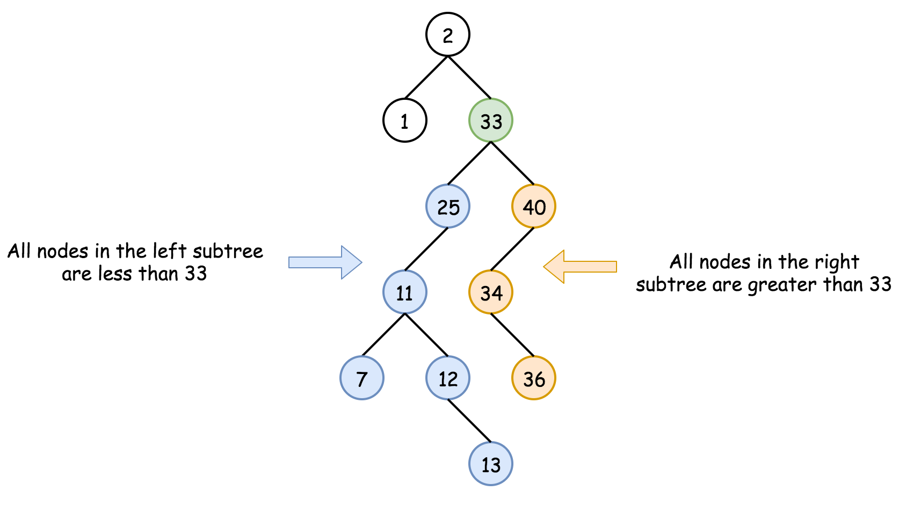
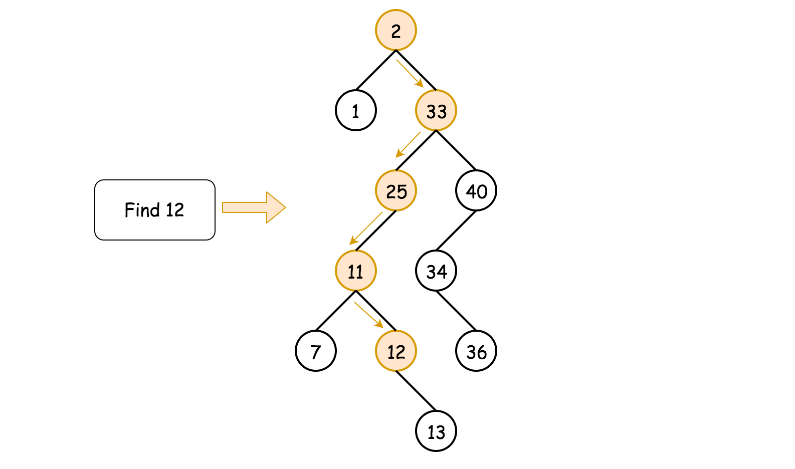

### Solution

**Binary Search Tree**
Binary Search Tree is a binary tree where the key in each node

- is greater than any key stored in the left sub-tree,
- and less than any key stored in the right sub-tree.

here is the example



Such data structure provides the following operations in a logarithmic time:

- Search
- [Insert](https://leetcode.com/articles/insert-into-a-bst/)
- [Delete](https://leetcode.com/articles/delete-node-in-a-bst/)

**Approach 1 Recursion**

The recursion implementation is very straightforward:

- If the tree is empty `root == null`or the value to find is here `val == root.val` - return root.
- If `val < root.val`- go to search into the left subtree `searchBST(root.left, val)`.
- If `val > root.val` - go to search into the right subtree `searchBST(root.right, val)`.
- Return root



```C#
namespace Solution {
    public class LeetCode700Node {
        public int val;
        public LeetCode700Node left;
        public LeetCode700Node right;
        public LeetCode700Node (int val = 0, LeetCode700Node left = null, LeetCode700Node right = null) {
            this.val = val;
            this.left = left;
            this.right = right;
        }

    }
    public class LeetCode700 {
        public static LeetCode700Node SearchBST (LeetCode700Node root, int val) {
            if (root == null || root.val == val) return root;

            return root.val > val ? SearchBST (root.left, val) : SearchBST (root.right, val);
        }
    }
}
```
