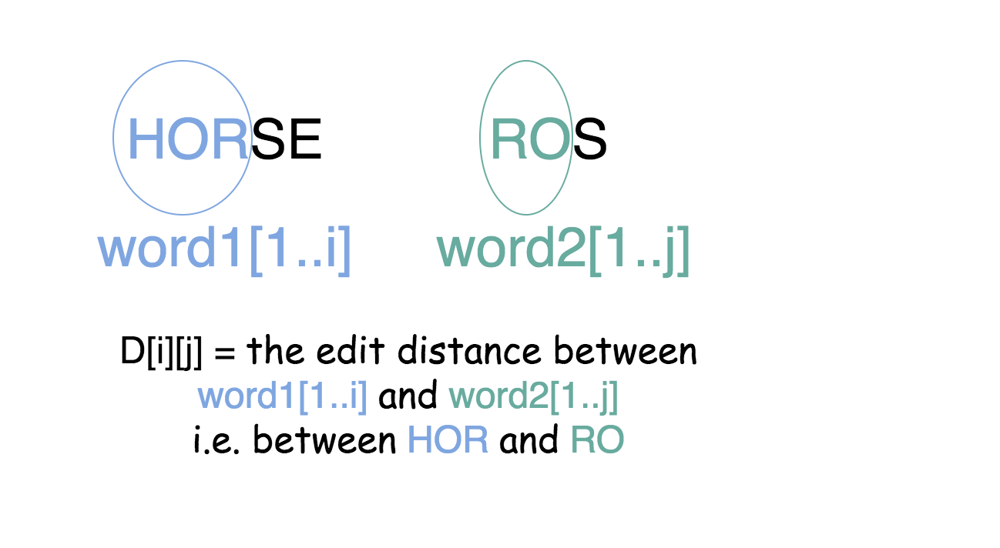
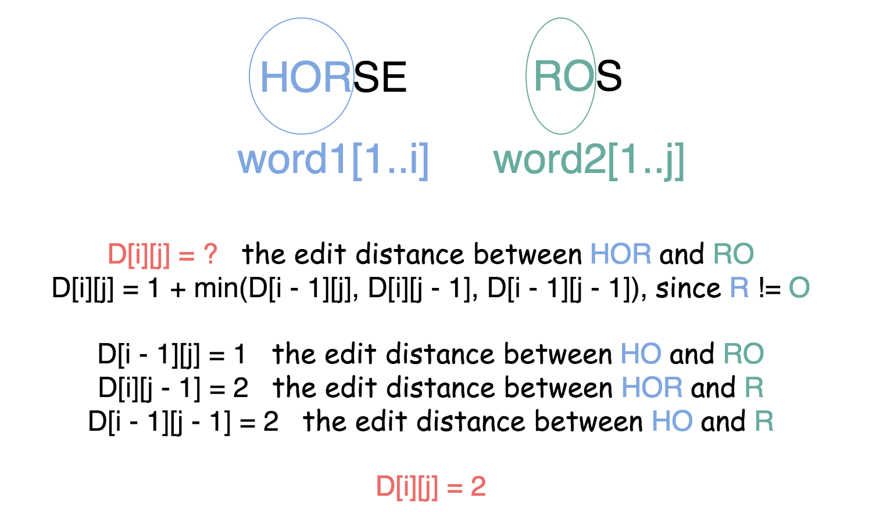

## Solution

------

#### Intuition

The edit distance algorithm is very popular among the data scientists. It's one of the basic algorithms used for evaluation of machine translation and speech recognition.

The naive approach would be to check for all possible edit sequences and choose the shortest one in-between. That would result in an exponential complexity and it's an overkill since we actually don't need to have all possible edit sequences but just the shortest one.


------

#### Approach 1: Dynamic Programming

The idea would be to reduce the problem to simple ones. For example, there are two words, `horse` and `ros` and we want to compute an edit distance `D` for them. One could notice that it seems to be more simple for short words and so it would be logical to relate an edit distance `D[n][m]` with the lengths `n` and `m` of input words.

Let's go further and introduce an edit distance `D[i][j]` which is an edit distance between the first `i` characters of `word1` and the first `j` characters of `word2`.



It turns out that one could compute `D[i][j]`, knowing `D[i - 1][j]`, `D[i][j - 1]` and `D[i - 1][j - 1]`.

> There is just one more character to add into one or both strings and the formula is quite obvious.

If the last character is the same, *i.e.* `word1[i] = word2[j]` then

D[i][j] = 1 + \min(D[i - 1][j], D[i][j - 1], D[i - 1][j - 1] - 1)*D*[*i*][*j*]=1+min(*D*[*i*−1][*j*],*D*[*i*][*j*−1],*D*[*i*−1][*j*−1]−1)

and if not, *i.e.* `word1[i] != word2[j]` we have to take into account the replacement of the last character during the conversion.

D[i][j] = 1 + \min(D[i - 1][j], D[i][j - 1], D[i - 1][j - 1])*D*[*i*][*j*]=1+min(*D*[*i*−1][*j*],*D*[*i*][*j*−1],*D*[*i*−1][*j*−1])

So each step of the computation would be done based on the previous computation, as follows:



The obvious base case is an edit distance between the empty string and non-empty string that means `D[i][0] = i` and `D[0][j] = j`.

Now we have everything to actually proceed to the computations

```java
class Solution {
  public int minDistance(String word1, String word2) {
    int n = word1.length();
    int m = word2.length();

    // if one of the strings is empty
    if (n * m == 0)
      return n + m;

    // array to store the convertion history
    int [][] d = new int[n + 1][m + 1];

    // init boundaries
    for (int i = 0; i < n + 1; i++) {
      d[i][0] = i;
    }
    for (int j = 0; j < m + 1; j++) {
      d[0][j] = j;
    }

    // DP compute 
    for (int i = 1; i < n + 1; i++) {
      for (int j = 1; j < m + 1; j++) {
        int left = d[i - 1][j] + 1;
        int down = d[i][j - 1] + 1;
        int left_down = d[i - 1][j - 1];
        if (word1.charAt(i - 1) != word2.charAt(j - 1))
          left_down += 1;
        d[i][j] = Math.min(left, Math.min(down, left_down));

      }
    }
    return d[n][m];
  }
}
```

**Complexity Analysis**

- Time complexity : \mathcal{O}(m n)O(*m**n*) as it follows quite straightforward for the inserted loops.
- Space complexity : \mathcal{O}(m n)O(*m**n*) since at each step we keep the results of all previous computations.