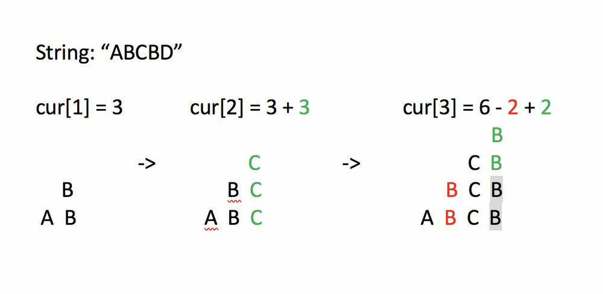

### Solution

---

In each loop, We caculate `cur[i]`, which represent the sum of Uniq() for all substrings whose last char is S.charAt(i).


For example,
`S = 'ABCBD'`
When i = 2, `cur[2] = Uniq('ABC') + Uniq('BC') + Uniq('C')`
When i = 3, `cur[3] = Uniq('ABCB') + Uniq('BCB') + Uniq('CB') + Uniq('B')`


Notice, we append char 'B' into each previous substrings. Only in substrings 'CB' and 'B', the char 'B' can be identified as uniq. The contribution of 'B' from cur[2] to cur[3] is `i - showLastPosition['B']`. At the same time, in substrings 'ABCB', 'BCB', the char 'B' can‘t’ be identified as uniq any more, the previous contribution of 'B' should be removed.


So we have`'cur[i] = cur[i - 1] - contribution[S.charAt(i)] + (i - showLastPosition[S.charAt(i)])`
Then the new `contribution[S.charAt(i)] = i - showLastPosition[S.charAt(i)]`


The final result is the sum of all `cur[i]`.


Thanks [@wangzi6147](https://discuss.leetcode.com/user/wangzi6147) for this picture:



This is my code. I didn't do mod operation, but it still pass : )


```java
    public int uniqueLetterString(String S) {
        
        int res = 0;
        if (S == null || S.length() == 0)
            return res;    
        int[] showLastPosition = new int[128];
        int[] contribution = new int[128];
        int cur = 0;
        for (int i = 0; i < S.length(); i++) {
            char x = S.charAt(i);
            cur -= contribution[x]; 
            contribution[x] = (i - (showLastPosition[x] - 1));
            cur += contribution[x]; 
            showLastPosition[x] = i + 1;
            res += cur;
        }   
        return res;
    }
```


The showLastPosition[x] represent the last showing positon of char x befor i. (The initial showLastPosition[x] for all chars should be '-1'. For convenience, I shift it to '0'. It may cause some confusion, notice I update "showLastPosition[x] = i + 1" for each loop.)


----

I found this solution here to be most intuitive for me and created the C# version with some additional explanations that helped me understand this better: https://leetcode.com/problems/count-unique-characters-of-all-substrings-of-a-given-string/discuss/129021/O(N)-Java-Solution-DP-Clear-and-easy-to-Understand


The gist behind the DP here is


- At each index i of the string, the solution will be the unique characters of all the substrings ending in current character s[i]
- `contributions` helps keep track of how many substrings ending in s[i] have s[i] as a unique value
- `lastPosition` is meant to keep track of when did the s[i] value last appear, this is so that we can calculate the appropriate `contributions` value for current s[i], since any substring that already previously had this character can no longer have this character as unique, hence `contributions[cIdx] = i + 1 - lastPosition[cIdx]`.
- For the value inside of lastPosition, we use i + 1 since i starts at 0 for the first character and will collide with the default int array value which is also 0. Therefore, 0 in the int array `lastPosition` will mean that the value has not yet appeared in our iteration, while any value X that is greater than 0, will represent the Xth character in the string (aka the X-1 index character).

```java
public class Solution {
    public int UniqueLetterString(string s) {
        int[] contributions = new int[26];
        int[] lastPosition = new int[26];
        int result = 0;
        
        if (s == null || s.Length == 0) return result;
        
        int curr = 0;
        for(int i = 0; i < s.Length; i++)
        {
            int cIdx = s[i] - 'A';
            curr -= contributions[cIdx];
            contributions[cIdx] = i + 1 - lastPosition[cIdx];
            curr += contributions[cIdx];
            lastPosition[cIdx] = i + 1; // the reason why we do plus 1 is because 0 means hasn't shown up before
            result += curr;
        }
        
        return result;
    }
}
```