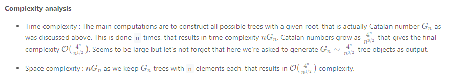

### Solution

Tree definition

First of all, here is the definition of the TreeNode which we would use.
```java
// Definition for a binary tree node.
public class TreeNode {
  int val;
  TreeNode left;
  TreeNode right;

  TreeNode(int x) {
    val = x;
  }
}
```

### Approach 1: Recursion
First of all let's count how many trees do we have to construct. As you could check [in this article](https://leetcode.com/articles/unique-binary-search-trees/), the number of possible BST is actually a [Catalan number](https://en.wikipedia.org/wiki/Catalan_number).

Let's follow the logic from the above article, this time not to count but to actually construct the trees.

**Algorithm**

Let's pick up number `i` out of the sequence `1 ..n `and use it as the root of the current tree. Then there are `i - 1 `elements available for the construction of the left subtree and `n - i` elements available for the right subtree. As we already discussed that results in `G(i - 1)` different left subtrees and `G(n - i)` different right subtrees, where `G` is a Catalan number.


Now let's repeat the step above for the sequence `1 ... i - 1` to construct all left subtrees, and then for the sequence` i + 1 ... n `to construct all right subtrees.

This way we have a root i and two lists for the possible left and right subtrees. The final step is to loop over both lists to link left and right subtrees to the root.

```java
class Solution {
  public LinkedList<TreeNode> generate_trees(int start, int end) {
    LinkedList<TreeNode> all_trees = new LinkedList<TreeNode>();
    if (start > end) {
      all_trees.add(null);
      return all_trees;
    }

    // pick up a root
    for (int i = start; i <= end; i++) {
      // all possible left subtrees if i is choosen to be a root
      LinkedList<TreeNode> left_trees = generate_trees(start, i - 1);

      // all possible right subtrees if i is choosen to be a root
      LinkedList<TreeNode> right_trees = generate_trees(i + 1, end);

      // connect left and right trees to the root i
      for (TreeNode l : left_trees) {
        for (TreeNode r : right_trees) {
          TreeNode current_tree = new TreeNode(i);
          current_tree.left = l;
          current_tree.right = r;
          all_trees.add(current_tree);
        }
      }
    }
    return all_trees;
  }

  public List<TreeNode> generateTrees(int n) {
    if (n == 0) {
      return new LinkedList<TreeNode>();
    }
    return generate_trees(1, n);
  }
}
```

