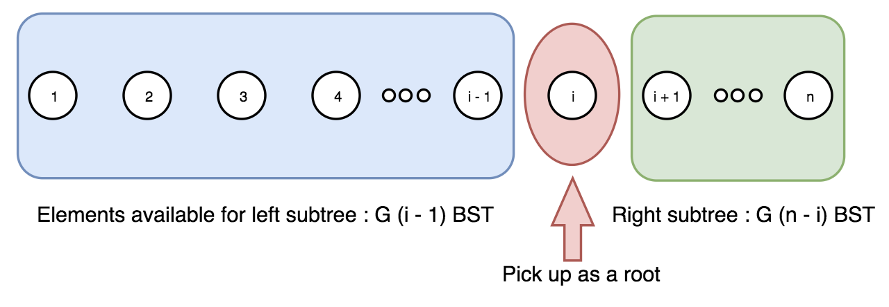

### Solution

#### Approach 1: Dynamic Programming
**Intuition**

The problem can be solved in a dynamic programming way.

Given a sorted sequence `1 ... n`, to construct a Binary Search Tree (BST) out of the sequence, we could enumerate each number i in the sequence, and use the number as the root, then, the subsequence `1 ... (i-1)` on its left side would lay on the left branch of the root, and similarly the right subsequence `(i+1) ... n` lay on the right branch of the root. We then can construct the subtree from the subsequence recursively. Through the above approach, we could be assured that the BST that we construct are all unique, since they start from unique roots.

As we can see, the problem can be reduced into problems with smaller sizes, instead of recursively (also repeatedly) solve the subproblems, we can store the solution of subproblems and reuse them later, i.e. the dynamic programming way.

**Algorithm**

The problem is to calculate the number of unique BST. To do so, we can define two functions:

* G(n): the number of unique BST for a sequence of length n.

* F(i,n): the number of unique BST, where the number i is served as the root of BST (1≤i≤n).

As we can see,

> G(n) is actually the desired function we need in order to solve the problem.





```Java
public class Solution {
  public int numTrees(int n) {
    int[] G = new int[n + 1];
    G[0] = 1;
    G[1] = 1;

    for (int i = 2; i <= n; ++i) {
      for (int j = 1; j <= i; ++j) {
        G[i] += G[j - 1] * G[i - j];
      }
    }
    return G[n];
  }
}
```


---


```Java
class Solution {
  public int numTrees(int n) {
    // Note: we should use long here instead of int, otherwise overflow
    long C = 1;
    for (int i = 0; i < n; ++i) {
      C = C * 2 * (2 * i + 1) / (i + 2);
    }
    return (int) C;
  }
}
```

**Complexity Analysis**

* Time complexity : O(N), as one can see, there is one single loop in the algorithm.
* Space complexity : O(1), we use only one variable to store all the intermediate results and the final one.