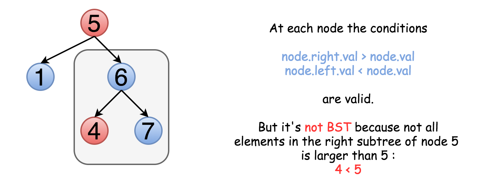

#### Solution 

**Tree definition**
First of all, here is the definition of the `TreeNode` which we would use.

```Java
// Definition for a binary tree node.
public class TreeNode {
  int val;
  TreeNode left;
  TreeNode right;

  TreeNode(int x) {
    val = x;
  }
}
```

**Intuition**
On the first sight, the problem is trivial. Let's traverse the tree and check at each step if `node.right.val > node.val` and `node.left.val < node.val`. This approach would even work for some trees


The problem is this approach will not work for all cases. Not only the right child should be larger than the node but all the elements in the right subtree. Here is an example :



That means one should keep both upper and lower limits for each node while traversing the tree, and compare the node value not with children values but with these limits.

---

#### Approach 1: Recursion
The idea above could be implemented as a recursion. One compares the node value with its upper and lower limits if they are available. Then one repeats the same step recursively for left and right subtrees.

```Java
class Solution {
  public boolean helper(TreeNode node, Integer lower, Integer upper) {
    if (node == null) return true;

    int val = node.val;
    if (lower != null && val <= lower) return false;
    if (upper != null && val >= upper) return false;

    if (! helper(node.right, val, upper)) return false;
    if (! helper(node.left, lower, val)) return false;
    return true;
  }

  public boolean isValidBST(TreeNode root) {
    return helper(root, null, null);
  }
}
```

**Complexity Analysis**

* Time complexity : O(N) since we visit each node exactly once.
* Space complexity : O(N) since we keep up to the entire tree.

---
#### Approach 2: Iteration

The above recursion could be converted into iteration, with the help of stack. DFS would be better than BFS since it works faster here.

```Java
class Solution {
  LinkedList<TreeNode> stack = new LinkedList();
  LinkedList<Integer> uppers = new LinkedList(),
          lowers = new LinkedList();

  public void update(TreeNode root, Integer lower, Integer upper) {
    stack.add(root);
    lowers.add(lower);
    uppers.add(upper);
  }

  public boolean isValidBST(TreeNode root) {
    Integer lower = null, upper = null, val;
    update(root, lower, upper);

    while (!stack.isEmpty()) {
      root = stack.poll();
      lower = lowers.poll();
      upper = uppers.poll();

      if (root == null) continue;
      val = root.val;
      if (lower != null && val <= lower) return false;
      if (upper != null && val >= upper) return false;
      update(root.right, val, upper);
      update(root.left, lower, val);
    }
    return true;
  }
}
```

**Complexity Analysis**

* Time complexity : O(N) since we visit each node exactly once.
* Space complexity : O(N) since we keep up to the entire tree.

---

#### Approach 3: Inorder traversal
**Algorithm**

Let's use the order of nodes in the inorder traversal `Left -> Node -> Right`.


Here the nodes are enumerated in the order you visit them, and you could follow `1-2-3-4-5` to compare different strategies.

`Left -> Node -> Right` order of inorder traversal means for BST that each element should be smaller than the next one.

Hence the algorithm with O(N) time complexity and O(N) space complexity could be simple:

* Compute inorder traversal list `inorder`.

* Check if each element in `inorder` is smaller than the next one.


> Do we need to keep the whole inorder traversal list?

Actually, no. The last added inorder element is enough to ensure at each step that the tree is BST (or not). Hence one could merge both steps into one and reduce the used space.

```java
class Solution {
  public boolean isValidBST(TreeNode root) {
    Stack<TreeNode> stack = new Stack();
    double inorder = - Double.MAX_VALUE;

    while (!stack.isEmpty() || root != null) {
      while (root != null) {
        stack.push(root);
        root = root.left;
      }
      root = stack.pop();
      // If next element in inorder traversal
      // is smaller than the previous one
      // that's not BST.
      if (root.val <= inorder) return false;
      inorder = root.val;
      root = root.right;
    }
    return true;
  }
}
```

**Complexity Analysis**

* Time complexity : O(N) in the worst case when the tree is BST or the "bad" element is a rightmost leaf.

* Space complexity : O(N) to keep stack.
