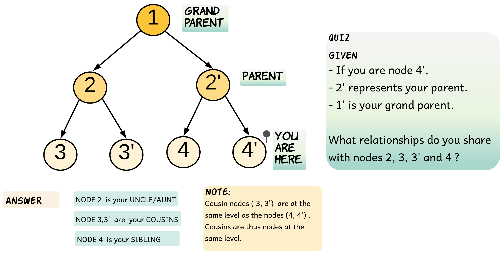
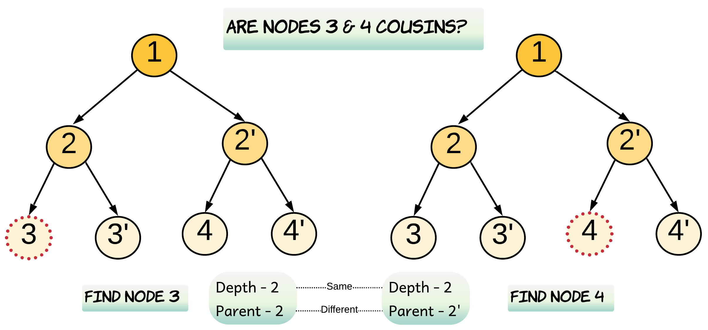
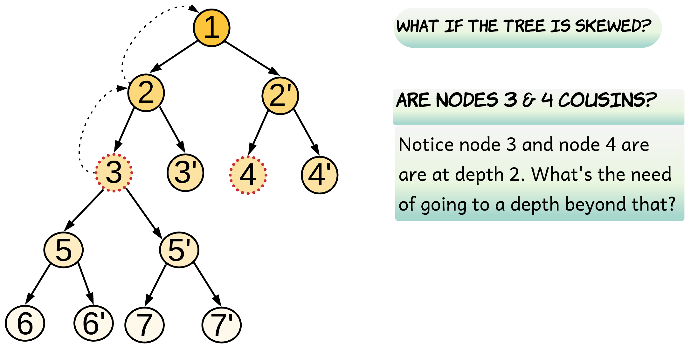
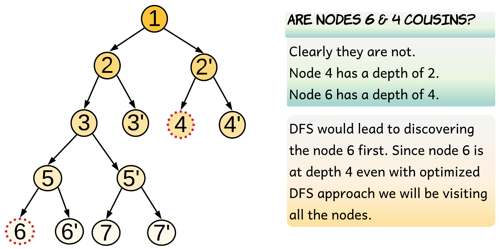
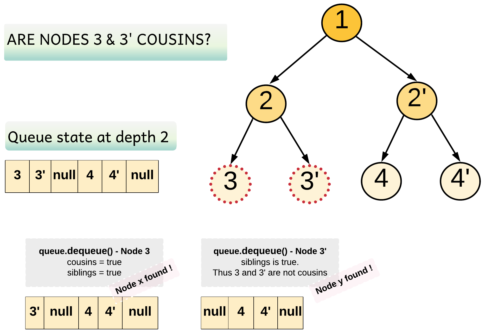
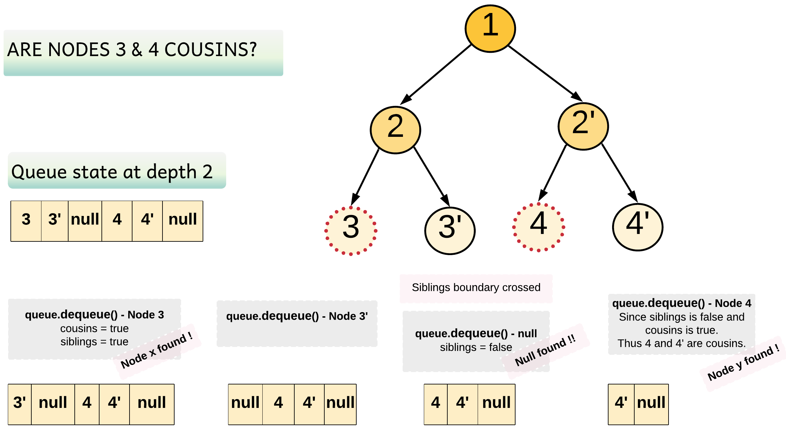

#### Solution

Let's first take a quiz and see how good your aptitude is. This quiz is mainly to help you understand the question better. If you understand the question well, then just hop on to the approaches.



Let me admit this, I was really bad at visualizing family trees and hence would perform badly in family tree questions.

The best I could do was draw a family tree and visualize it and then come to some conclusion. That's why this aptitude question was thrown at you and that explanation was needed :P

This was an easy one. What if we are given a family tree with a depth of 25 and now the same question is posed? Maybe you can answer this question only if it involves your cousins, or maybe not.

----

#### Approach 1: Depth First Search with Branch Pruning

**Intuition**

We can do a depth-first traversal and find the depth and parent for each node. Once we know the depth and parent for each node we can easily find out if they are cousins. Let's look at the pseudo-code for this before we try to optimize it a bit.

```
// This pseudo-code recursively traverses the tree and
// records the depth and parent for each node.
function dfs(node, parentNode = None) {
	if (node != null) {
		depth[node.val] = 1 + depth[parentNode.val]
		parent[node.val] = parentNode
		dfs(node.left, node)
		dfs(node.right, node)
	}
}
```

The above pseudo-code would give us the depth and parent for each node. To find out whether or not `x` and `y` are cousins is just one step away.

```
// If x and y are at same depth but have different parents.
depth[x] == depth[y] and parent[x] != parent[y]
```



Now let's see if this brute-force recursive approach can be optimized for some scenarios.

> If Node x or Node y is lying very shallow in the tree, then does it make any sense to iterate down the entire tree?

In the above example, `Node 3` and `Node 4` are both cousins and hence at the same depth. What if we find one of the nodes very early on during the traversal? How would that help us?



The diagram above shows that we encounter `Node 3` very early on. This would help us to restrict our search space for the other node i.e. `Node 4`. For the second node, we do not need to go beyond the depth at which the first node was found, thus saving traversal of the subtree below node 3.

We can search for the desired nodes in the tree recursively. Whenever either of the given nodes is found, we record its parent and depth.

**Algorithm**

     
    
    1. Start traversing the tree from the root node. Look for `Node x` and `Node y`.
    2.  Record the depth when the first node i.e. either of `x` or `y` is found and return `true`.

    3. Once one of the nodes is discovered, for every other recursive call after this discovery, we return `false` if the current depth is more than the recorded depth. This basically means we didn't find the other node at the same depth and there is no point going beyond. This step of pruning helps to speed up the recursion by reducing the number of recursive calls.
    4. Return true when the other node is discovered and has the same depth as the recorded depth.
    5. Recurse the left and the right subtree of the current node. If both left and right recursions return true and the current node is not their immediate parent, then `Node x` and `Node y` are cousins. Thus, isCousin is set to value true.


```Java
/**
 * Definition for a binary tree node.
 * public class TreeNode {
 *     int val;
 *     TreeNode left;
 *     TreeNode right;
 *     TreeNode(int x) { val = x; }
 * }
 */
class Solution {

    // To save the depth of the first node.
    int recordedDepth = -1;
    boolean isCousin = false;

    private boolean dfs(TreeNode node, int depth, int x, int y) {

        if (node == null) {
            return false;
        }

        // Don't go beyond the depth restricted by the first node found.
        if (this.recordedDepth != -1 && depth > this.recordedDepth) {
            return false;
        }

        if (node.val == x || node.val == y) {
            if (this.recordedDepth == -1) {
                // Save depth for the first node found.
                this.recordedDepth = depth;
            }
            // Return true, if the second node is found at the same depth.
            return this.recordedDepth == depth;
        }

        boolean left = dfs(node.left, depth + 1, x, y);
        boolean right = dfs(node.right, depth + 1, x, y);

        // this.recordedDepth != depth + 1 would ensure node x and y are not
        // immediate child nodes, otherwise they would become siblings.
        if (left && right && this.recordedDepth != depth + 1) {
            this.isCousin = true;
        }
        return left || right;
    }
    public boolean isCousins(TreeNode root, int x, int y) {

        // Recurse the tree to find x and y
        dfs(root, 0, x, y);
        return this.isCousin;
    }
}
```

Complexity Analysis

* Time Complexity: O(N), where NN is the number of nodes in the binary tree. In the worst case, we might have to visit all the nodes of the binary tree.

    Let's look into one such scenario. When both Node x and Node y are the leaf nodes and at the last level of the tree, the algorithm has no reasons to prune the recursion. It can only come to a conclusion once it visits both the nodes. If one of these nodes is the last node to be discovered the algorithm inevitably goes through each and every node in the tree.

* Space Complexity: O(N). This is because the maximum amount of space utilized by the recursion stack would be NN, as the height of a skewed binary tree could be, at worst, NN. For a left skewed or a right skewed binary tree, where the desired nodes are lying at the maximum depth possible, the algorithm would have to maintain a recursion stack of the height of the tree.

----
#### Approach 2: Breadth First Search with Early Stopping

I will repeat my question
> If Node x or Node y is lying very shallow in the tree, then does it make any sense to iterate down the entire tree?



Since this problem is about finding cousins, i.e. nodes lying at the same level/depth, it seems more natural to do a level order traversal of the tree.

If we do a level order traversal for the aforementioned example, we would only traverse until depth 2. At depth 2, we discover `Node 4`, but we do not find `Node 6` at the same level. Hence we can just stop our traversal and conclude that the nodes are not cousins.

Note, if the nodes are cousins, we would find both the nodes at the same depth. However, this is also true for siblings. We need to figure out how to determine when two nodes are siblings. One way to find out that they are siblings is when we are adding the nodes to the queue. If `Node x` and `Node y` are left and right children of a node, this would mean that they are siblings. Therefore, we would return `false`.

There is a cleaner implementation for the level order traversal for this problem, though. For each node, we can add a delimiter to the queue after its children are added. These delimiters help us define boundaries for each parent and the siblings that are confined within those. This implementation was shared by @votrubac. You can refer to his C++ implementation in the [discussion section](https://leetcode.com/problems/cousins-in-binary-tree/discuss/238624/C++-level-order-traversal)

**Algorithm**

  1. Do a level order traversal of the tree using a queue.

  2. For every node that is popped off the queue, check if the node is either Node x or Node y. If it is, then for the first time, set both siblings and cousins flags as true. The flags are set as true to mark the possibility of siblings or cousins.

  3. To distinguish siblings from cousins, we insert markers in the queue. After inserting the children for each node, we also insert a null marker. This marker defines a boundary for each set of siblings and hence helps us to differentiate a pair of siblings from cousins.

  4. Whenever we encounter the null marker during our traversal, we set the siblings flag to false. This is because the marker marks the end of the siblings territory.

  5. The second time we encounter a node which is equal to Node x or Node y we will have clarity about whether or not we are still within the siblings boundary. If we are within the siblings boundary, i.e. if the siblings flag is still true, then we return false. Otherwise, we return true.



In the above diagram, `Node 3` and `Node 3'` are children of the same parent. Hence the `siblings` flag remains `true`.



Clearly, `Node 3` and `Node 4` have different parents. Hence, we do encounter a `null` marker after `Node 3'`. The `null` marker marks the end of siblings for `Node 3`, and hence when `Node 4` is found, we know it is the cousin of `Node 3`.

```Java
/**
 * Definition for a binary tree node.
 * public class TreeNode {
 *     int val;
 *     TreeNode left;
 *     TreeNode right;
 *     TreeNode(int x) { val = x; }
 * }
 */
class Solution {

    public boolean isCousins(TreeNode root, int x, int y) {

        // Queue for BFS
        Queue <TreeNode> queue = new LinkedList <> ();
        queue.add(root);

        while (!queue.isEmpty()) {
            boolean siblings = false;
            boolean cousins = false;

            int nodesAtDepth = queue.size();

            for (int i = 0; i < nodesAtDepth; i++) {
                // FIFO
                TreeNode node = queue.remove();

                // Encountered the marker.
                // Siblings should be set to false as we are crossing the boundary.
                if (node == null) {
                    siblings = false;
                } else {
                    if (node.val == x || node.val == y) {
                        // Set both the siblings and cousins flag to true
                        // for a potential first sibling/cousin found.
                        if (!cousins) {
                            siblings = cousins = true;
                        } else {
                            // If the siblings flag is still true this means we are still
                            // within the siblings boundary and hence the nodes are not cousins.
                            return !siblings;
                        }
                    }

                    if (node.left != null) queue.add(node.left);
                    if (node.right != null) queue.add(node.right);
                    // Adding the null marker for the siblings
                    queue.add(null);
                }
            }
            // After the end of a level if `cousins` is set to true
            // This means we found only one node at this level
            if (cousins) return false;
        }
        return false;
    }
}
```

**Complexity Analysis**

* Time Complexity: O(N)O(N), where NN is the number of nodes in the binary tree. In the worst case, we might have to visit all the nodes of the binary tree. Similar to approach 1 this approach would also have a complexity of O(N)O(N) when the Node x and Node y are present at the last level of the binary tree. The algorithm would follow the standard BFS approach and end up in checking each node before discovering the desired nodes.

* Space Complexity: O(N)O(N). In the worst case, we need to store all the nodes of the last level in the queue. The last level of a binary tree can have a maximum of \frac{N}{2} 
2
N
​	
  nodes. Not to forget we would also need space for \frac{N}{4} 
4
N
​	
  null markers, one for each pair of siblings. That results in a space complexity of O(\frac{3N}{4})O( 
4
3N
​	
 ) = O(N)O(N) (You are right Big-O notation doesn't care about constants).
